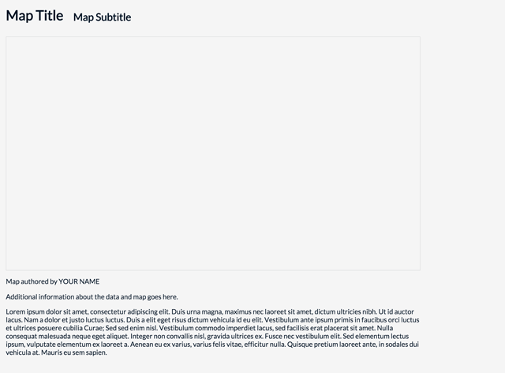
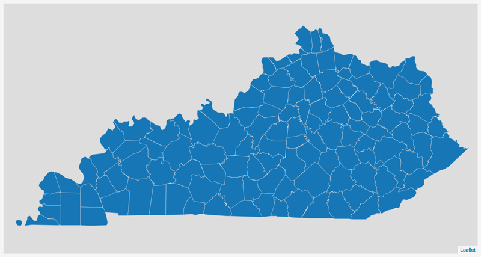

#Lesson 01: Creating a Dynamically Drawn Choropleth Map

This lesson will instruct you how to create a dynamically generated choropleth map in Leaflet with an accompanying legend. It also explains how to use the JQuery JavaScript library to load an external data file using AJAX.

To begin, read the [lab 01 instructions](lab-01/lab-01.md). You'll be modifying the index file within the *lab-01/lab-01-data/* directory as you follow along with the instructions in this lesson.

##TOC

* The local development environment: editor, browser, and developer tools, Git, & QGIS
* Starting with an HTML template file
* Using JQuery
* Dynamic loading data using JQuery's AJAX request
* Drawing data to the map
    * Choropleth mapping in Leaflet
    * Classifying data and coloring the map
*Scripting a Dynamic Legend for a Choropleth Map

##The local development environment: editor, browser, and developer tools, Git, & QGIS

Within 672 we learned how to set up our local development environment (MAP672 module 02). This environment comprises various software applications operating within our local machine (though occasionally making use of web-based resources well). Let's briefly rehearse setting up this local development environment, and consider a couple quick variations.

Essentially, to create a custom web map we need software components on our machine:

1. a text-editor (such as [Brackets](http://brackets.io/))
2. a modern web browser (preferably an updated version of Chrome or Firefox) with web developer tool capabilities
3. a local web server (built into the Brackets application, otherwise see [Setting Up a Web Server](http://chimera.labs.oreilly.com/books/1230000000345/ch04.html#_setting_up_a_web_server))

With these 3 minimal pieces of software, we can add JavaScript code and data to make a map. It's that simple. If you recall, our basic process for map development is:

1. enable a local web server (Brackets does this for us when we "Live Preview")
2. open web browser and development tools (e.g., the JavaScript Console)
3. write code and save  chances to the file
4. refresh browser to test code 
5. repeat steps 3 and 4 indefinitely until the application is finished

Of course, there are various other tools we may want to use. Most likely we'll want to have a GIS software application such as QGIS installed for quickly visualizing and manipulating our data, as well as preparing it for integration into a web map (exporting it into a GeoJSON format).

##Starting with an HTML template file

We want to start with a basic HTML document before we begin web scripting with JavaScript. Open the *index.html* file included within the *lab-01-data* directory in Brackets. Also, Live Preview the page within your web browser. You should see the minimally styled web page familiar to you from MAP672. 

  
**Figure 01.** The minimally-styled starter HTML template

Let's quickly review and think about how the CSS and HTML are working together to produce this layout.

Visually we notice that the `header` div HTML element, the `map` id div HTML element, and the `footer` div HTML element are all vertically aligned to the left of the page. As you change the size of your browser, you'll notice that they all retain the same distance from the left side of the window (20px). Furthermore, the size of the `map` id div element (here simply visible with a thing gray border) is stuck at certain width, and making your browser window too narrow begins to cut off the map on the right side. 

This is what's known as a "fixed width" layout. It's an older model for building a web page, and while it allows us to design a page with a great deal of specificity in terms of where elements sit in relation to each other, it's not ideal for the variety of screen and devices we increasingly need to think about. Let's now modify some of these style rules to make this page more of a "fluid" layout.

To better visualize these three elements, first add a background property to each and distinct color for its value. We'll just do this temporarily so we can better see their extent on the page. For instance, I've added the following properties to the CSS rules:

```css
 header {
    width: 960px;
    margin: 10px 20px 10px 20px;
    background: blue;
}
#map {
    width: 960px;
    height: 540px;
    margin: 10px 20px 10px 20px;
    background: whitesmoke;
    border: 2px solid #dddedf;
    background: yellow;
}
footer {
    width: 960px;
    margin: 10px 20px 10px 20px;
    background: green;
}
```

This produces this hideous color scheme for our page:

  
**Figure 02.** Header, map, and footer elements with a background color.

With this we can better view what's known as the "CSS Box Model." That is, we can see the edges of the elements' borders and get a better sense of the margin outside of these borders, as well as any padding inside the element between the border and other elements such as paragraph text within the element. Read more about [The CSS Box Model](http://www.w3schools.com/css/css_boxmodel.asp).

Next let's modify the width and margin properties of these elements to make a fluid layout. Instead of using pixels for the value, we're going to use percentages instead. These percentages will be in relation to the elements' parent node (which in this case is simply the body of the document).

Begin by changing the value of the `header` element's width to be `80%` instead of `960px`. Note that if you have enough screen space to view both your Brackets' editor and your web browser, Brackets automatically updates these style rules without refreshing the page. Depending on the width of your screen, you'll see that the left side of the header element is no longer aligned with the elements below it.

  
**Figure 03.** With of the header element now a percentage.

Furthermore, if we change the size of our browser window, we'll see the width of this header element expand and collapse in proportion to the width of the window. 

  
**Figure 04.** Width percentage changes with browser window size.

Also try adjusting the value of of this percentage to see the width change to a different percentage value.

  
**Figure 05.** Width percentage changes with browser window size.

Let's change this percentage back to `80%` and then do the same thing for the other two elements (the `map` div element and the `footer` element). Now, when we resize our browser window, all three elements are aligned on both the right and left, and they resize proportionally.

  
**Figure 06.** Resizing the browser window with percentage width layout.

Let's now say instead of having those elements locked to the left size of the window, we want them centered within the webpage. How do we achieve this with CSS? To do this we'll change the values of our `margin` property, or the amount of space between the border of and element and the other elements around it. Right now they're all "pushing" 20px away from that left side. Modify your CSS rule definitions to make both the left and right values `auto`.  [Read about writing margin shorthand for CSS margin values](http://www.w3schools.com/cssref/pr_margin.asp).

The CSS rule for the header element is now:

```css
header {
    width: 80%;
    margin: 10px auto 10px auto;
    background: blue;
}
```

If you refresh your browser and then again adjust its width, you should see the header element now centered within the window:

  
**Figure 07.** Header margin left and right set to auto centers the element.

Go ahead and apply the same margin rule values to the other elements.

```css
header {
    width: 80%;
    margin: 10px auto 10px auto;
    background: blue;
}
#map {
    width: 80%;
    height: 540px;
    margin: 10px auto 10px auto;
    background: whitesmoke;
    border: 2px solid #dddedf;
    background: yellow;
}
footer {
    width: 80%;
    margin: 10px auto 10px auto;
    background: green;
}
```

All three of these elements should now be aligned and fluidly adjusting to width of the browser.

  
**Figure 08.** Header margin left and right set to auto centers the element.

We've now converted our layout from a fixed width layout to a fluid layout! We can go ahead and remove the background colors before proceeding.

##Using JQuery

[JQuery](https://jquery.com/), like Leaflet, is a library written in JavaScript intended to simplify web programming. It's particularly efficient at selecting and modifying DOM/HTML elements, dynamically applying style rules to these elements, and handling user interaction events. Read more about JQuery: [https://jquery.com/](https://jquery.com/).

We load JQuery in the same way as we did with Leaflet, using the `<script src=" …` in the head of the document. While we could easily save JQuery to a local file, we can also use the version hosted on a remote server. This approach to loading popular, commonly used JavaScript libraries such as JQuery, is known as a Content Delivery Network, or CDN. In the head of our web document, we include the path to the most recent version of JQuery, along with Leaflet:

```javascript
<script src="https://code.jquery.com/jquery-1.12.2.min.js"></script>
<script src="http://cdn.leafletjs.com/leaflet/v0.7.7/leaflet.js"></script>
```

That's it! Now we have the full power of JQuery at our disposal. We'll be playing more with JQuery in subsequent modules. For now, we'll simply point out that JQuery has a common way of accessing all its methods. Remember how we access Leaflet's methods using the capital letter `L`? With JQuery, we can simply write `jQuery` or, for shorthand and more commonly, the dollar sign symbol `$`. While we won't go into this much now, a simple example of using JQuery would be to select our `<h1>` element within our web document, and dynamically change it's content (within our `<script></script>` tags).

```javascript
jQuery("h1").html("Housing Ownership in Kentucky");
 ```
 or

```javascript
$("h1").html("Housing Ownership in Kentucky");
```

The result, when we refresh our web browser, is that JQuery has selected the h1 tag and dynamically updated the content:

  
**Figure 09.** Dynamically updated h1 content

JQuery offers many exciting possibilities for enriching a user experience, and even an extended [JQuery user interface](https://jqueryui.com/) library. For now, we're simply going to use it to dynamically load some data into our document for use with our Leaflet map.

##Dynamic loading data using JQuery's AJAX request

In MAP672 we loaded an external GeoJSON file into our script at runtime by treating that file as a JavaScript file and using the HTML `src` attribute (e.g., `<script src="power-plants.js"></script>`). Moving forward, we'll be using a different approach to get our data into our maps: a technique known as **asynchronous JavaScript and XML (AJAX)**.

AJAX is kind of a techie buzz word and involves several different web technologies such as JavaScript, the Document Object Module (DOM), and server requests (XMLHttpRequests). Ironically, it often does not involve XML (eXtensible Markup Language). The important thing to understand for now is that an AJAX request occurs after the page has loaded and allows a web application (such as our map) to load data or files without refreshing the page.

AJAX is slick in this way, and allows for a more seamless user experience as information is loaded and updated within a page without it being overly obvious. Google Maps, for instance, pioneered this technique when it introduced its tile-based slippy maps in 2005. Only the tiles being displayed in the current viewport are loaded, which drastically increases the page load time. As the user pans or zooms around the map, new tiles are loaded on the fly using AJAX. For further reading on AJAX, see Garrett's now classic explanation written way back in 2005 ([http://www.adaptivepath.com/ideas/ajax-new-approach-web-applications/](http://www.adaptivepath.com/ideas/ajax-new-approach-web-applications/)).

Take note that within this lab's data directory (*lab-01-data/*), there is a file named *ky_counties_housing.json*, which contains both geometry information for Kentucky counties and information about housing units in Kentucky collected in the 2010 census, aggregated to these county levels. You can examine the data contained within this text-based GeoJSON file within a text editor:

  
**Figure 10.** GeoJSON data of Kentucky housing.

Note that beyond the latitude and longitude coordinates eroded for each county, there are also several data attributes with both string and numerical type values (e.g., `"NAME": "Ohio", "TOTAL": "10219", "OCCUPIED": "9176", "VACANT": "1043"`). The meanings of these data attributes are noted within the *ky_counties_housing.txt*.

Rather than load this file as JavaScript, like we did with the power plants data in MAP672, we want to use our JavaScript to request this file after the page as loaded and make it available to us to use within the Leaflet map. 

To do so, let's begin by writing JavaScript within our `<script></script>` tags toward the bottom of the starter template included within the *lab-01-data/* data directory. Note that, as usual, we're first creating a Leaflet map using the `var map = L.map('map')` constructor, as well as passing it some options.  This time we'll omit the slippy map tiles, as well as remove the Leaflet *zoomControl*, effectively disabling the pan/zoom functionality of the map using the following Leaflet map options:

```javascript
var options = {
    center: [37.8, -85.8],
    zoom: 7.4,
    zoomControl: false
}
var map = L.map('map', options);
```

We've centered the map on Kentucky. Note that we've chosen a zoom level of 7.4. When using map raster tiles, we're restricted to discreet zoom levels of whole integers, because the tile server providers only create tiles a these levels. However, without the tiles, we can use Leaflet to zoom to various levels at more discrete intervals. Also note that we've removed the default zoom controls for now using `zoomControl: false`.

Next let's load the *ky_counties_housing.json* file into the document. While JQuery has methods for loading data of various formats into the document ([http://api.jquery.com/category/ajax/](http://api.jquery.com/category/ajax/)), we see that there is one designed particularly for loading JSON-encoded data ([http://api.jquery.com/jquery.getjson/](http://api.jquery.com/jquery.getjson/)), the `getJSON()` method.

We access JQuery's  `getJSON()` method using dot notation (in the same way we access all of Leaflet's methods). The method passes two arguments, the first being a string containing the URL of the file we're requesting (here a file named *ky_counties_housing.json* in the same directory as our *index.html*), the second being a callback function that executes once the data is successfully loaded. We access our asynchronously loaded data within this callback function.

```javascript
$.getJSON("ky_counties_housing.json", function(data) {
    // the data loaded from the file is accessible here within this function scope!
    console.log(data);
});
// data variable is not accessible here!
```

If we inspect our Console output in the browser, we recognize the GeoJSON data from within the *ky_counties_housing.json* file (again, you can examine these data within a text editor as well and note the mirrored data structure between the *.json* file contents and what we've now loaded into our script).

  
**Figure 11.** Output of the AJAX-loaded GeoJSON data

We now have our data loaded into the document and we're ready to map!

##Drawing data to the map

Within our callback function, we can immediately and easily create a Leaflet GeoJson layer with the GeoJSON data and add it to the map:

```javascript
$.getJSON("ky_counties_housing.json", function(data) {
    L.geoJson(data).addTo(map);
});
```

The result is the (fairly unattractive ) map drawn with the default Leaflet path options:

  
**Figure 12.** GeoJSON data drawn with default Leaflet path options.

Remember that we can apply some style rules as options when we first create our Leaflet GeoJson layer. For now, let's reduce the default weight of the stroke (the unit borders) to 1 and change its color to match the background of the map element. This is a subtle and effective design choice speaking to what's known as **figure-ground perception**. Think about what rises to the foreground of the "visual hierarchy." If we make our borders darker and thicker than the counties, then they will "pop" out more, or rise above the counties. But we're not interested in mapping borders. We want the counties to rise to the "figure" and the borders and area outside of Kentucky to fall to the background of the visual hierarchy; to become the "ground."

Since our intent is to make a choropleth map, let's change the fillOpacity of the GeoJson features to 1 (100%) and add a temporarily fill color (this could really be left blank, as we'll be assigning fill colors later based up data attribute values).

```javascript
L.geoJson(data, {
        style: function(feature) {
        return {
                color: '#dddddd',
                weight: 1,
                fillOpacity: 1,
                fillColor: '#1f78b4'
            };
    }          
}).addTo(map);
```
  
**Figure 13.** Kentucky county map with basic styles.

###Choropleth mapping in Leaflet

Within MAP672 we symbolized point-level phenomena (e..g, power plants) using proportional symbols. Choropleth maps are another common type of thematic map that use enumeration units such as states or counties to show how much of a particular phenomenon each contains by proportional shading. These are among the more familiar of thematic map types to the general public, in particular in terms of election maps. 

Choropleth maps are best used to map continuous areal (or area-based) phenomena and represent a statistical surface for enumeration units (i.e., polygons). The map symbology applies a sequence of shaded values (often using color schemes) to symbolize the density or ratio for each enumeration unit on the map. Or stated more simply, the (intensity) of the color indicates how much of some phenomenon is within a certain area.

To make a choropleth map, we need to establish two more pieces of information. First, we need to know the entire range of the particular data value we're encoding. Second, we need to determine the precise values with which we will classify that data range into discrete chunks. We could do some of this analysis prior to creating our GeoJSON file, either through analyzing the data tables within a conventional spreadsheet application such as OpenOffice Calc or Microsoft Excel, or by running scripts on our data written in JavaScript, Ruby, Python, or R. However, for this module we are going to do this analysis and determination client-side at run-time using JavaScript.

We'll make a couple modifications to our script before diving into this. First, we'll declare a global variable `dataLayer` and then assign our Leaflet GeoJson layer to it within the callback function. This will allow us to access it later on in the script, outside of this callback. We'll also create two other global variables, one named `attribute` which will store a reference to the GeoJSON data attribute we wish to map, and another named `norm` which we will use to normalize our data within the choropleth map. Recall that **choropleth data should nearly always be normalized**.

For now, we'll arbitrarily assign values to these latter two variables. In this case we'll be mapping the percent of housing units that are owned with a mortgage. The reason we're assigning these here as global variables, as you may be anticipating, is that eventually we'll want the map to dynamically update with other variables.

```javascript
var dataLayer,
    attribute = "OWNED_MORT",
    norm = "OWNER";

$.getJSON("ky_counties_housing.json", function(data) {

    dataLayer = L.geoJson(data, {
            style: function(feature) {
            return {
                    color: '#dddddd',
                    weight: 1,
                    fillOpacity: 1,
                    fillColor: '#1f78b4'
                };
        }          
    }).addTo(map);
    
    // add a call to a new function named drawMap here

});
```

Once these additions have been made, we'll make a call to another function `drawMap()`, **which we will declare and define outside (and below, for the sake of legibility) the `getJSON()` function's callback function**.

###Classifying data and coloring the map

The nice thing about having already drawn our Kentucky counties GeoJSON to the Leaflet map is that now, rather than redrawing this map, we can simply loop through all its feature layers and update their fill color. This is quite simple, as we can use the convenient Leaflet method `.eachLayer` to do this. For example, we could now color all the county polygons yellow with the following code using Leaflet's `setStyle` method:

```javascript
function drawMap() {

    dataLayer.eachLayer(function(layer) {

        layer.setStyle( { fillColor: 'yellow' } );
        
    });

} // end drawMap()
```

The result is that all the polygons have been given a new fill color after they were drawn.

  
**Figure 14.** Polygons dynamically colored yellow.

However, rather than simply give them all the same color, we want to assign a color based on a given data attribute (for this example, housing units owned with a mortgage).  How can we access this information? If you recall from MAP672, as we loop through each "layer" (i.e., polygon) in Leaflet we can access the attribute information by digging down into the JSON structure by which each of these is encoded. For instance, let's log each layer to the Console:

```javascript
function drawMap() {

    dataLayer.eachLayer(function(layer) {

        console.log(layer);
        
    });

} // end drawMap()
```

We can then examine the output in our brewer's Console and find the path within the nested JSON structure. Note that within each layer, the attribute information is stored within a value accessed through the key `feature` and then within `properties`. This animated GIF shows how we can inspect the Console output in the browser and see how we can access our values through `layer.feature.properites`:

  
**Figure 15.** Digging down into the JSON layer properties.

Therefore, we can access this information using 

```javascript
function drawMap() {

    dataLayer.eachLayer(function(layer) {

        console.log(layer.feature.properties);
        
    });

} // end drawMap()
```

Now we know we can dynamically access this information. But how do we color these? Recall that when choropleth mapping we assign a particular color to individual units when it's attribute value falls within a particular range. We need to determine the "class breaks" that constitute these ranges before we can assign a color.

Within our `drawMap()` function, declare a variable named `breaks` and assign to it a function we'll create and appropriately name `getClassBreaks()`.  This function which will determine the range of values given the specific data attribute we wish to map (e.g., "OWNER_MORT") and return an array of specific classification breaks, which will be assigned to our local variable `breaks` within the `drawMap()` function. So far, our code should look like this (note that we can remove that `console.log()` statement):

```javascript
function drawMap() {

    var breaks = getClassBreaks();

}

function getClassBreaks() {

    // code here to determine range and establish classification breaks
}        
```

How do we first get the entire range of data values and establish the class breaks? To do this, we need to pull all the appropriate data values (e.g., those encoded with the key of `"OWNED_MORT"`) out of our nested JSON and store these temporarily in the script. We can simply loop through the `dataLayer` (i.e., the Leaflet GeoJson layer we created in the callback function above) and then push values from each feature into an array.

Within the *getClassBreaks* function body, we first create an empty array (here named `values`) that will hold all the entire range of data values. We then loop through all the feature layers using Leaflet's *eachLayer* method, and access the values we want using the nested JSON structure and a combination of dot and bracket notation (in the same way we just demonstrated). 

Remember that we've assigned `attribute` and `norm` above as "OWNED_MORT" and "OWNER", respectively. We can now use these global variables to calculate the normalized value we want (i.e., number of housing units owned with a mortgage or loan divided by the total number of housing units). We then push this calculated value into our array using the native JavaScript array `push()` method.

```javascript
var values = [];
dataLayer.eachLayer(function(layer) {
    var value = layer.feature.properties[attribute]/layer.feature.properties[norm];
    values.push(value);   
});
console.log(values);
```

We can inspect the result of this computation with a `console.log()` statement, and the result is an array with a calculated value for each of our 120 Kentucky counties:

  
**Figure 16.** Output of the range of values pushed to an array

Now that we have all our data values stored within an array, how we determine the classification breaks? As we know, there are various ways to classify our data, and the method will drastically change the resultant map (see the example here: [http://bl.ocks.org/tmcw/4969184](http://bl.ocks.org/tmcw/4969184)). For a refresher on choosing an appropriate data classification method, read [The Basics of Data Classification](http://axismaps.github.io/thematic-cartography/articles/classification.html).

For this example, we'll be using a newer classification method known as [ckmeans](https://journal.r-project.org/archive/2011-2/RJournal_2011-2_Wang+Song.pdf). Similar to the "Jenks" or "natural  breaks" algorithm, the ckmeans method seeks to minimize differences within groups. In other words, it will find the values that cluster together and group these.

The problem is, implementing either the Jenks or ckmeans method involves some fairly difficult formulas to wrap our heads around, much less code in JavaScript. The good news is, we can again rely on the smart people within the open source community to do some of the heavy lifting for us! Web map developer Tom Macwright wrote a convenient JavaScript library called [Simple Statistics](http://simplestatistics.org/), [which contains a method *ckmeans* ](http://simplestatistics.org/docs/#ckmeans) that accepts input data as an array of numbers and a desired number of clusters, from which we can derive the class breaks. Perfect! How then do we use this library?

To utilize the JQuery and Leaflet libraries, we've used the `<script src="` HTML code and a full URL path to the code hosted on a CDN. Like other libraries, Simple Statistics too is hosted on a CDN. We simply include another line in the head of our document and provide a link to *simple_statistics.js* :

```javascript
<script src="https://code.jquery.com/jquery-1.12.2.min.js"></script>
<script src="http://cdn.leafletjs.com/leaflet/v0.7.7/leaflet.js"></script>
<script src="https://cdnjs.cloudflare.com/ajax/libs/simple-statistics/1.0.1/simple_statistics.js"></script>
```

Once that JavaScript code within the *simple_statistics.js* file is available to us, we can access all of its methods with `ss` (similar to how `L` refers to Leaflet or the `$` sign refers to JQuery). So, once our `getClassBreaks()` function first determines the range of values and stores these in an array (here stored with a variable named `values`), we can determine 5 classification breaks using a method call written as `ss.ckmeans(values,5)`.  This method returns a 2-dimensional array, that is, an array of arrays. Within each array is a cluster of similar values we'll want to use for a given class on our map.

To color our map and build our legend, however, we want specific values to use as break points and not clusters of values. So we'll need our script to pull specific values from each of these clusters. But which ones? We can think of each cluster as a single class (i.e., will be colored the same) on our map.  We then want an array of the lowest value from each cluster, as well as the highest value in the range (we could also collect the lowest value in the range and the highest value in each cluster). To do so, we'll store our array of clusters as a variable and then invoke the [native JavaScript method `.map()`](https://developer.mozilla.org/en-US/docs/Web/JavaScript/Reference/Global_Objects/Array/map) on this variable. This method creates a new array comprising the results of a function's operations on each element within an array. 

In this case, we want to return the first element of each cluster (the `ss.ckmeans()` method returns values within these clusters ascending from lowest to highest). Therefore, the following code will pull the first element out of each cluster (using the bracket notation and the zero for the first element, `cluster[0]`) as well as the last element (using the native [JavaScript `pop()` method](https://developer.mozilla.org/en-US/docs/Web/JavaScript/Reference/Global_Objects/Array/pop)) and append that 2 element array to a new array we'll name `breaks`. Again, it's useful to log the result to the Console for inspection.

```javascript
    // determine similar clusters
    var clusters = ss.ckmeans(values, 5);  
        
// create an array of the lowest value within each cluster
var breaks = clusters.map(function(cluster){
        return [cluster[0],cluster.pop()];   
});

console.log(breaks); 
````

This code results in an array stored as `breaks` that contains the low values of each class range, as well as the highest value of the entire dataset. We can return the resultant class breaks array to where it was called, the *getClassBreaks* function. You may again even wish to `console.log(breaks)` before the return statement to see the results. Our updated (complete) `getClassBreaks()` function now looks like this:

```javascript
function getClassBreaks() {

    // create empty Array for storing values
    var values = [];

    // loop through all the counties
    dataLayer.eachLayer(function(layer) {
        var value = layer.feature.properties[attribute]/layer.feature.properties[norm];
        values.push(value);   // push the normalized value for each layer into the Array
    }); 

    // determine similar clusters
    var clusters = ss.ckmeans(values, 5);  

    // create an array of the lowest value within each cluster
    var breaks = clusters.map(function(cluster){
            return [cluster[0],cluster.pop()];   
    });
    
    return breaks; // return Array of class breaks
} // end getClassBreaks function
```

Now that we have our classification breaks for a given range of data attribute values, we can use these to first color our Kentucky county polygons. Within our *drawMap* function, after we determine the class breaks, we can loop through each layer of our *dataLayer* and apply Leaflet's *setStyle* method to each layer to update the fill color of each. In a similar way as we dynamically assigned a radius size to our proportional symbols in MAP672, now we will assign a function call as the property value to the `fillColor` property name (thereby assigning a string encoding a hexidecimal color value returned from that function call). We'll name this function *getColor* and we'll pass it two arguments: 1) the calculated value for each polygon and 2) the derived class breaks.

```javascript
    var breaks = getClassBreaks();

    dataLayer.eachLayer(function(layer) {
        layer.setStyle({
            fillColor: getColor(layer.feature.properties[attribute]/layer.feature.properties[norm], breaks)
        });
    });
```

Before this code will work, however, we need to create the *getColor* function. This function accepts the calculated value and the array of classification breaks. It then either uses a serious of if/else if statements (or a switch statement such as in the [Leaflet Interactive Choropleth Map example](http://leafletjs.com/examples/choropleth.html) to determine which class a particular county's value falls within. It then returns a string value for a color.

```javascript
function getColor(d, breaks) {

      if(d <= breaks[0][1]) {
            return '#f1eef6';
        } else if(d <= breaks[1][1]) {
            return '#bdc9e1';
        } else if(d <= breaks[2][1]) {
            return '#74a9cf';
        } else if(d <= breaks[3][1]) {
            return '#2b8cbe'
        } else if(d <= breaks[4][1]) {
            return '#045a8d'
        }}
```

The color values here have been hard-coded within the function, and these colors were derived from [ColorBrewer](http://colorbrewer2.org/). Note how the break values are accessed using the index of the `breaks` array, which is itself a 2-dimensional array. We're creating 5 classes here: the lowest class will include the highest value from the lowest class range, the next will include the highest value from that class range, and so on.

The result is a fairly attractive and effective choropleth map:

  
**Figure 17.** Choropleth map of Kentucky housing owned with mortgage or loan.

To make this map meaningful however, we need a legend informing the user of what these colors mean.

##Scripting a Dynamic Legend for a Choropleth Map

To make a legend, we'll be using a technique modified from another [Leaflet tutorial](http://leafletjs.com/examples/choropleth.html). It makes use of Leaflet's Control class, which helps put user interface elements such as the zoom controls on the map. We'll use this Control class within a function we'll name `drawLegend`. 

Conceptually, this function will:

1. create the Control object and add it to the map
2. create HTML elements to display both the color of each class and the data range it represents
3. add these elements to the control object

Start by declaring the empty function, though note that we'll want it to accept the classification breaks we created earlier as a parameter:

```javascript
function drawLegend(breaks) {

    // function code will go in here

}
```

Form where do we call this function? We know we want it to accept the array of breaks, so it needs to happen after those are computed. Call the function at the end of the `drawMap` function, after all the counties have been colored, and pass the `breaks` variable as the argument.

We can then even log these values to Console with the `drawLegend` function.

```javascript
function drawLegend(breaks) {

    console.log(breaks);

}
```

Next, we'll create a variable to reference the Leaflet Control object, and pass an argument that will position it in the top left of our map. Using Leaflet's `onAdd()` method, we'll create an anonymous function that will contain the code that creates the HTML elements to represent our legend information. Test the following code. For now we'll simply insert some placeholder text within the legend.

```javascript
function drawLegend(breaks) {
    
    var legend = L.control({position: 'topleft'});

    legend.onAdd = function () {
        
        var div = L.DomUtil.create('div', 'legend');
        
        div.innerHTML = "This is going to be legend information!";

        return div;
       
    };

    legend.addTo(map);
}

```

This code uses another Leaflet method, the `DomUtil` to create a new `div` HTML element with a class name of `legend`. We'll use this class name to style with the CSS in a moment. After it creates it, and inserts some text using the native `innerHTML` method, we add the legend Control object to the map.

We can create a new CSS rule at the top of our document as well, to add some preliminary styling to this legend element:

```css
.legend {
    padding: 6px 8px;
    font-size: 1em;
    background: rgba(255,255,255,0.8);
    box-shadow: 0 0 15px rgba(0,0,0,0.2);
    border-radius: 5px;
}
```

We can now see the element placed in the upper left corner of our map.

  
**Figure 18.** Leaflet Control object with placeholder text.

Let's now replace that placeholder text with the HTML we want to use to build the actual legend information. We'll start with a title for the legend, which we can represent with a `h3` element.

```javascript
legend.onAdd = function () {
                
    var div = L.DomUtil.create('div', 'legend');
    
    div.innerHTML = "<h3>" + attribute + " per " + norm + "</h3>"; 
    
    return div;
         
};
```

We then want to loop through our array of class breaks and build a visual element for each range. For this example, we'll use an [HTML `<span>` element](https://developer.mozilla.org/en-US/docs/Web/HTML/Element/span) and color each according to the range. We'll then enclose the values for each element with an [HTML `<label>` element](https://developer.mozilla.org/en-US/docs/Web/HTML/Element/label). Note how we use the [JavaScript method `toLocaleString()`](https://developer.mozilla.org/en-US/docs/Web/JavaScript/Reference/Global_Objects/Number/toLocaleString) to make the numbers more legible (as well as multiplying them by 100 to produce a percentage, rather than the decimal value).

```javascript
legend.onAdd = function () {
                
    var div = L.DomUtil.create('div', 'legend');
    
    div.innerHTML = "<h3>" + attribute + " per " + norm + "</h3>"; 

    for (var i = 0; i < breaks.length; i++) {
        
        var color = getColor(breaks[i][0], breaks);
        
        div.innerHTML +=
            '<span style="background:' + color + '"></span> ' +
            '<label>'+(breaks[i][0]*100).toLocaleString() + ' &mdash; ' + 
            (breaks[i][1]*100).toLocaleString() + '</label>';
}
    
    return div;
}; // end onAdd method
```

Here's the final `drawLegend` function.  Comments within it explain how the statements work to produce the legend.

```javascript
    function drawLegend(breaks){

        // create a new Leaflet control object, and position it top left
        var legend = L.control({position: 'topleft'});

        // when the legend is added to the map
        legend.onAdd = function () {

            // create a new HTML <div> element and give it a class name of "legend"
            var div = L.DomUtil.create('div', 'legend');

            // first append an <h3> tag to the div holding the current attribute
            // and norm values (i.e., the mapped phenomena)
            div.innerHTML = "<h3>" + attribute + " per " + norm + "</h3>";

            // for each of our breaks
            for (var i = 0; i < breaks.length; i++) {
                // determine the color associated with each break value,
                // including the lower range value
                var color = getColor(breaks[i][0], breaks);

                // concatenate a <span> tag styled with the color and the range values
                // of that class and include a label with the low and a high ends of that class range
                div.innerHTML +=
                   '<span style="background:' + color + '"></span> ' +
                   '<label>'+(breaks[i][0]*100).toLocaleString() + ' &mdash; ' + 
                    (breaks[i][1]*100).toLocaleString() + '</label>';
            }

            // return the populated div to be added to the map
            return div;
        };

        // add the legend to the map
        legend.addTo(map);
    }
```

Note that this is a very honest legend: it shows the low and high values of each class range, and doesn't give the user the interpretation that there are continues data values between each of the classes.

To work effectively, we also need to add some CSS style rules to be applied to the legend. Otherwise, it's simply the HTML content with no form (and the span elements don't even show up because they have no width or height):

  
**Figure 19.** An un-styled legend

Remember, we added a class `legend` to the div we just created. So we can write style rules that will be applied to the div and its children. Try applying the following style rules. 

```css
.legend {
    padding: 6px 8px;
    font-size: 1em;
    background: rgba(255,255,255,0.8);
    box-shadow: 0 0 15px rgba(0,0,0,0.2);
    border-radius: 5px;
}
.legend h3 {
    font-size: 1.1em;
    font-weight: normal;
    color: #001323;
    margin: 0 0 10px 0;
}
.legend span {
    width: 20px;
    height: 20px;
    float: left;
    margin: 0 10px 4px 0;
}
.legend label {
    font-size: 1.1em;
}
.legend label:after {
    content: '';
    display: block;
    clear: both;
}
```

The `.legend span` rule gives each `<span>` element some width and height. The `float` property makes them "float" to the left, allowing the `<label>` elements to shift up along side them. By selecting the label (`.legend label`), we can style the values how we wish. The `.legend label:after` rule is a [tricky solution](https://css-tricks.com/snippets/css/clear-fix/) to clear each float property so the following `<span>` element will not also float up alongside it (try not using this rule and see what happens).

  
**Figure 20.** The legend with style rules applied.

The result is an effective, dynamically generated legend:

  
**Figure 21.** Map with legend.

Finally, note how in terms of a visual layout, it worked best to put the legend in the upper left, give the geography of Kentucky. This is typically where the default zoom controls of the Leaflet map lie. We initially disabled the zoom control. Let's say though, we wish to add it back to the map, but place it in the upper right corner instead. Leaflet's Control methods provide an option for this. After we instantiate our `L.map()`, insert the following line to add the zoom controls to the upper right:

```javascript
map.addControl( L.control.zoom({ position: 'topright' }));
```

  
**Figure 22.** Map with legend and zoom controls.

We've now dynamically created a very versatile choropleth map.