#Lesson 02: Toward Advanced User Interaction In Web Maps

In the previous module, we used an AJAX request to dynamically request a GeoJSON data file and load it into the script after the DOM had loaded. We then wrote functions to normalize and classify the data on the fly, appropriately color a choropleth map, and dynamically create a legend depicting the class ranges.

Within this lesson, we learn how to extend this code to build a **user interface** element allowing the user to choose a new data attribute to dynamically update the map and legend. We will also consider a technique for building an information panel.

To begin, [read the Lab 02 instructions](lab-02/lab-02.md). You'll be modifying the *index.html* file within the this directory as you follow along with the instructions in this lesson.

## TOC

- [Moving Toward User Interaction](#moving-toward-user-interaction)
- [Things to remember as you work through this module](#things-to-remember-as-you-work-through-this-module)
- [Building a user interface for updating the map](#building-a-user-interface-for-updating-the-map)
- [Adding and positioning the dropdown menu to the map](#adding-and-positioning-the-dropdown-menu-to-the-map)
- [Adding the functional interaction to the interface](#adding-the-functional-interaction-to-the-interface)
- [A brief intermission to highlight the Stack Overflow resource](#a-brief-intermission-to-highlight-the-stack-overflow-resource)
- [Applying the user selected value to the map](#applying-the-user-selected-value-to-the-map)
- [Refactoring the legend code](#refactoring-the-legend-code)
- [Populating the empty legend](#populating-the-empty-legend)
- [Adding an info panel.](#adding-an-info-panel)
- [Calling the info panel function](#calling-the-info-panel-function)
- [Cleaning up the info panel](#cleaning-up-the-info-panel)
- [Final refinements to the legend and popup output](#final-refinements-to-the-legend-and-popup-output)

## Moving Toward User Interaction

Examine our final script created within Lesson 01 (the starter *index.html* file located within the *module-02/lab-02/lab-02-data/* directory). Important to recognize is that we've written this script in a very flexible manner. We need only change our two data attributes `attribute` and `norm` to generate an entirely different map! For instance, if we want to see the percent of housing units that are vacant:

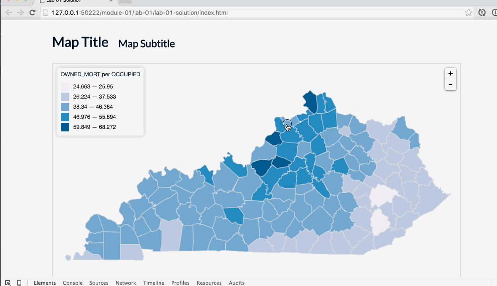  
**Figure 01.** Updating variables to see vacant housing units in Kentucky counties.

Think how much easier that was than if we needed to go through all the code and change values we've hard coded into the script (for instance, the variable `attribute` is used 6 times within the Lab 01 solution).

This flexibility provides for what you should be anticipating is our next steps: to give the user the ability to select various data attributes and have the map dynamically update. User interaction is one of the most important differences between traditional static maps and maps we now make for and use on the web. The ability to change the map not only offers new possibilities for understanding the information. It also makes engaging with a map more interesting and emotionally rewarding: it's fun!

Begin with the *index.html* file in the *lab-02/lab-02-data/* directory. This is the solution from Lesson/Lab 01. When rendered in the browser, it should look like this:

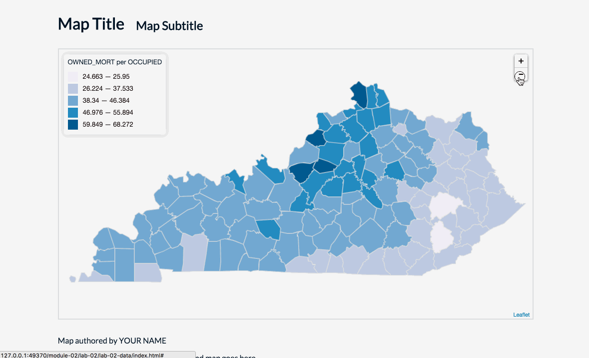  
**Figure 02.** Lab 02 solution or the Lab 03 starter template

In this lesson, we wish to continue the design and the development of this map in the following ways:

1. As we recognized within the *kentucky_counties_housing.json* data file, there were a number of data attributes that we could map. Rather than having to manually change the values of the  `attribute` and `norm` variables, wouldn't it be nice to give the user the ability to switch between these data sets and have the map update to reflect these changes?
2. The popup/tooltip we currently use to retrieve specific values from individual counties is a nice interactive feature of the existing map. However, we can make this more user-friendly by having such information display when mousing over a polygon. Furthermore, we can make better use of the popup by including additional information. Rather than a popup/tooltip, let's consider how to make a more robust information panel.

## Things to remember as you work through this module

We'll be declaring and defining even more functions within this module. Often, we're confused where we should write these functions. The answer isn't straightforward, but programmatically, as far as the computer is concerned, it doesn't really matter. It's common to write them vertically (down) through the coded script in the order in which they are called. So far, within the  script for this module, we see the functions follow this order as you read down through the code:

```javascript
$.getJSON( { ... });  // loads the data and draws the initial map
function drawMap() { ... } // updates the map with colors and adds the popup
function getClassBreaks() { ... }  // derives a range of data values and computers class ranges from these
function getColor(d, breaks) { ... }  // determines a particular color given a value and class ranges
function drawLegend(breaks) { ... }  // draws a legend using the class ranges
```

Though they could really be written in any order within the script, the placement of these functions within the script follows the flow of the execution of the program. This isn't always the case, but it's generally useful (i.e., good programming style) to do this (as is it to keep your indentations clean within your script). While we sometimes write functions within other functions, within this module we will not be doing that, although we will be calling Leaflet and JQuery methods from within the function bodies.

However, **what does matter, tremendously, is the order in which the functions are invoked or called.** This is something you need to think carefully about as you code. Think through the flow of the programs execution, from when the page loads to when functions get called, return values to their caller, etc.

Consider those same functions and which functions they're responsible for calling (as well as how many times):

```javascript
$.getJSON( { ... });  // calls the drawMap() function once
function drawMap() { ... } // calls the getClassBreaks() function once, the getColor() function 120 times, 
                                        //  and the drawLegend() function once
function getClassBreaks() { ... }  // doesn't call any functions, but returns the class break ranges
function getColor(d, breaks) { ... }  // doesn't call any functions, but returns a specific color value
function drawLegend(breaks) { ... }  // draws a legend using the class ranges
```

As we can see, the `drawMap()` function is where most of the function calls originate. And the order in which they are called within this function body matters. The `getClassBreaks()` function must be called before the `getColor()` function does. Why? Because the `getColor()` function needs the return values (the class break ranges) from the  `getClassBreaks()` function to pass as an argument. 

What about the call for `drawLegend()` function? This too needs to follow the call to the `getClassBreaks()` function because it too needs to pass the class break ranges as an argument. But can it be written above the `dataLayer.eachLayer()` method call, directly after the statement `var breaks = getClassBreaks();`? Move it there and test the code within the browser. This works just fine. Placing it toward the end of the `drawMap()` function body is fairly arbitrary, but again follows from the original development of the map (i.e., we created the choropleth before building the legend).

## Building a user interface for updating the map

At the end of the day, we want to host this map on a web server and share it with the world. Obviously, the user will be unable to edit the code directly to update the mapped data attributes. Rather, we want to provide a **user interface** for interacting with the code, which in turn will update the map. How do we go about building such an interface?

One solution would be to draw several Leaflet GeoJSON layers using different data attributes and use the Leaflet Layer Control (introduced in MAP672) to toggle the visibility of these layers on and off. This solution is okay, but we want to push ourselves to explore more flexible solutions for interface design.

Rather than use Leaflet's layer control, we're going to make use of HTML forms to enhance the user's interaction with our map. HTML forms are web standards, natively supported in modern browsers (i.e., not requiring additional JavaScript libraries) and used for user interaction. Read more about  [HTML forms](https://developer.mozilla.org/en-US/docs/Web/Guide/HTML/Forms) and  [**HTML form elements**](http://www.w3schools.com/html/html_form_elements.asp)  (seriously, they're really cool).

Within this lesson, we'll also be using more of JQuery's powerful functionality to select HTML elements and either "listen" for user interaction upon them (i.e., "did the user click on this button?") or modify these elements. So in this sense we're going to use the HTML form to provide the structured content and the JQuery to provide the interaction for the user to dynamically update the map and legend by selecting a different data attribute.

### Adding and positioning the dropdown menu to the map

We'll begin by first modifying our document to include a form element to our HTML. While either radio buttons or a dropdown list is suitable for this task, we'll go with the dropdown list for now. To do this, we'll use the [`<select>` element](https://developer.mozilla.org/en-US/docs/Web/HTML/Element/select), which represents a control presenting a menu list of options. Since we can dynamically place this element on or around our map, it doesn't matter so much where we write it within the HTML. For now, placing it just above our now very familiar `<div id="map"></div>` tags is sufficient.

Let's begin by creating a generic `<div>` wrapper for our user interface controls and give it with an `id` attribute value of of `ui-controls`. While optional, this `<div>` tag and id is handy because they can be used to apply CSS style rules specifically the UI elements (i.e., their appearance or placement), as well as to select the entire set of controls place it on our Leaflet map or somewhere on the page, later in the script. 

```html
<div id='ui-controls'>
        <!-- write form element in here -->
</div> <!-- end ui-controls -->
    
<div id='map'></div>
```

Next let's add our form element and with a few options. For this lesson example, let's say we're still offering the user a map showing the percentages of housing units that are occupied. Rather than just showing those units owned with a mortgage, we want to additionally allow the user to select the data attribute of those owned "free and clear" and those occupied by a renter (again, we're referencing the *ky_counties_housing.txt*) document for the meanings of the data attributes as they're encoded within the GeoJSON file.

Within the `<select>` tags, we write three `<options>` elements, one for each of the data attributes we wish to allow the user to map. Within the `<option>` tags, we've also provided a meaningful title (i.e., "owned with mortgage"). Obviously, this title can be changed as we see fit based on what we think would be most useful to the user. Here's how we build that form element with HTML:

```html
<div id='ui-controls'>
        <select id="occupied">
            <option value="OWNED_MORT" selected>owned with mortgage</option>
            <option value="OWNED_FREE">owned free and clear</option> 
            <option value="RENTER">rented</option>
        </select>
</div> <!-- end ui-controls -->
```

Note that we've provided the form elements with several attributes. We've given the `<select>` element an `id` value of `occupied`. We'll be using this later to allow JQuery to target this specific `<select>` element and listen for user-driven changes (we do this in case there are other `<select>` elements we add to the interface later). We've also given the `<option>` elements `value` attribute values of their specific keys as encoded within the GeoJSON file. Again, when the user later selects a particular option, we can use these values to redraw the map (i.e., if the user selects the option called "rented", our JavaScript code can derive the value of `RENTER` from this and use that to re-draw the map). 

If we save our file now we can see the form element added to the map (although visually it's just randomly floating off to the left side of the page):

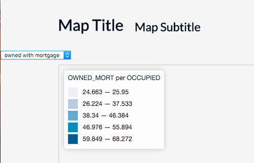  
**Figure 03.** An un-styled form element added to the HTML document.

You'll also notice that we've included the word `selected` on the first option, which is a Boolean value indicating that this option is initially selected. This is the text that the user will see in the drop down menu when the page loads. Switching it to the second or third option would result in a different default data attribute.

Let's add one additional HTML element to our user interface controls at this point: a `<label>` element, which will help the guide the user's actions.

```html
<div id='ui-controls'>
        <label>Choose a data attribute:</label>
        <select id="occupied">
            <option value="OWNED_MORT" selected>owned with mortgage</option>
            <option value="OWNED_FREE">owned free and clear</option> 
            <option value="RENTER">rented</option>
        </select>
</div> <!-- end ui-controls -->
```

Note: while I provide many useful links to resources describing these technologies, don't be afraid to search the web for them yourself. In this case, you could search for "html label element". Hint: prefixing your searches with "mdn" will help the search engine bring very professional Mozilla Developer Network resources top.

Save the file and refresh your browser. You should now see the HTML form within the web page:

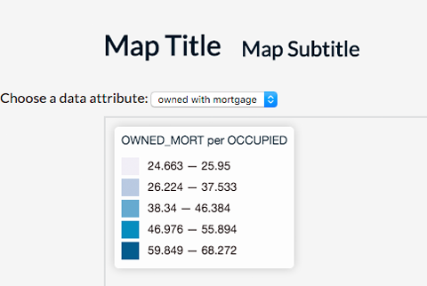  
**Figure 04.** Basic HTML select form added to the web page.

The form dropdown currently works in terms of being able to change the selection within the form, but obviously changing the selection doesn't do anything yet. We need to write code to listen for that change and execute further statements. Before we do that however, let's consider some basic CSS rules to better understand how we use them to style and position our elements?

First, with our web developer tools open, let's switch to the **Elements** tab, which we can use to inspect the rendered HTML elements within the browser window. Notice how when we mouse over the elements down in the web dev toolbar, they highlight up in the page itself. This animation shows how within the Elements tab of the developer toolbar we can mouse over DOM elements and they will be interactively highlighted in the page. This animation shows how we can dynamically add and test style rules to elements using the JavaScript developer toolbar and the Elements tab.

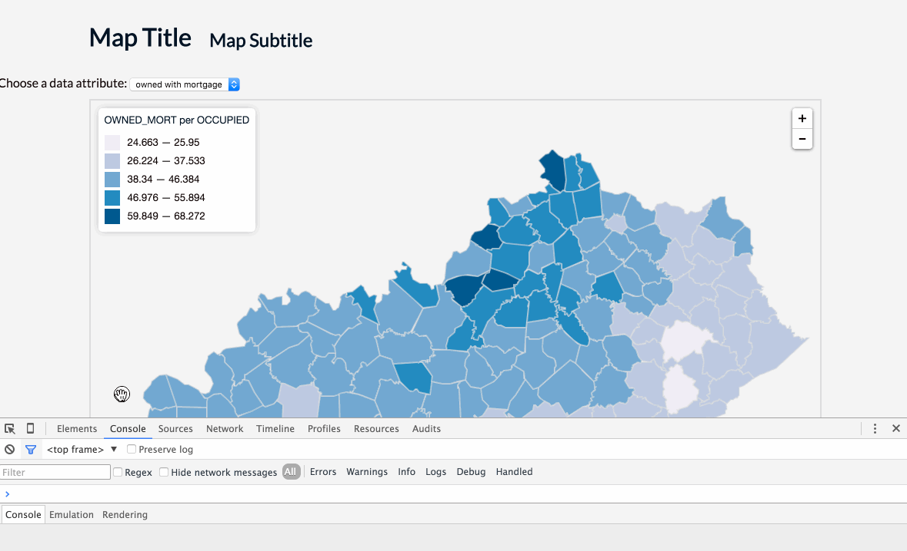  
**Figure 05.** Inspecting elements within the web developer toolbar.

Also, we can use the toolbar to temporarily edit the rendered HTML and/or to add and adjust CSS style rules that are applied to these elements. Say we wanted to experiment with the styles applied to our `<div id="ui-controls">`. With the **Styles** tab open on the right-side of our web developer tool bars, we can apply CSS rules dynamically.

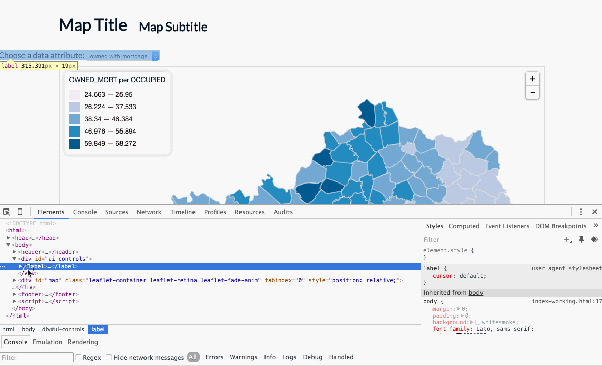  
**Figure 06.** Inspecting elements within the web developer toolbar.

In that short demo, we could see that the  `<div id="ui-controls">` element is filling the full width of the page (this is even easier to see when we apply that green background). We then constrained it's width to 300px, gave it a padding value of 20px (applied to all four sides, top right bottom left). We also provided a `margin-left` property the value of 300px, which pushed the element away from the left side of the window.

This is really for demonstration purposes here. We can use the developer toolbar to dynamically test out style rules quickly without having to code them and refresh the page. However, note that when we refresh the page these rules are no longer retained. The rules are not being written to our actual file.

Let's look more closely at the select element in particular and try to apply some style rules to it? This animation shows us trying (unsuccessfully) to apply various style rules to our select element. While changing the text size and color does seem to work, applying other rules seems to have no effect.

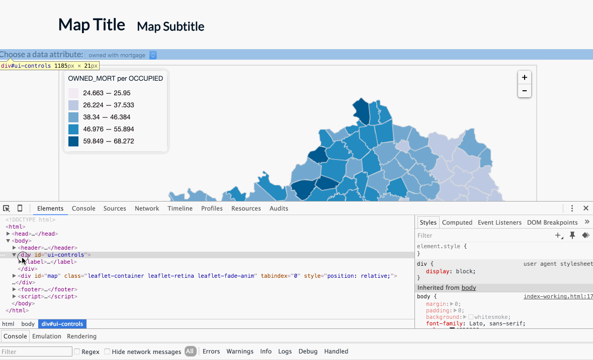  
**Figure 07.** Trying to apply style rules to the form element.

Here we attempted to adjust the size of the text within the `<select>` element and apply color and background color properties, with some rather strange results. Applying rules to the individual `<option>` elements was equally as frustrating. What's happening?

A quick web search turns up [this post](https://css-tricks.com/dropdown-default-styling/) by Chris Coyier of [CSS-Tricks](https://css-tricks.com), a great blog for learning web design and development techniques. Turns out this professional web designer has struggled with this very thing. We're not alone. In the end, Chris recommends just sticking with the default styles for such form elements, as they are very difficult to control cross-browser. As he writes, "Default form elements are familiar and work well." Perhaps an un-satisfying answer for now, but one we can live with and move on with our map development.

For now, let's simply write a couple style rules to visually align the form element with the left edge of the header elements and the map, and push the form element off the label a little bit. We'll write these CSS rule-sets more to select the elements. Later on, after we get the functionality working better, we can consider the overall design.

```css
#ui-controls {   
    margin-left: 10%;
}
#ui-controls label {
    font-size: 1em;
    margin-right: 5px;
}
```

Because the map and other elements we given a width of `80%` and centered, we know we can give the `ui-controls` a left margin of `10%` and it will align with the other elements. Notice here how we achieve a certain amount of **specificity** when we select that `label`. That is, rather than selecting all the labels there may be within the DOM, here we're only selecting the label whose parent has the `id` attribute of `ui-controls`. We're also pushing the `<select>` element off the right edge of the `<label>` element with a `margin-right` value of `5px`.

The result looks something like this:

  
**Figure 08.** Basic HTML select form added to the web page.

Let's now move on to get our UI functionality working within the JavaScript.

### Adding the functional interaction to the interface

Within our `$.getJSON()` callback function, after we've added our `dataLayer` to the map, let's call a new function to take care of this UI business. While we could write the code we'll be using in this function within this callback, we're beginning to write more "functional programming," that is, we're intentionally encapsulating code relating to specific functionally of the application within the scope of functions. So, we'll simply call a function we'll create next called `buildUI`. We don't need to pass any information into it an argument.

```javascript
$.getJSON("ky_counties_housing.json", function(data) {

    dataLayer = L.geoJson(data, {
            style: function(feature) {
                return {
                    color: '#dddddd',
                    weight: 2,
                    fillOpacity: 1,
                    fillColor: '#1f78b4'
                };
        }          
    }).addTo(map);

    drawMap();

    buildUI();
    });
```

Once we call a function, we of course need to immediately declare and define this function. So, below our `drawLegend()` function, we'll create a new function named `buildUI`:

```javascript
function buildUI() {

    // UI code goes here
    
}
```

We want this function to achieve three goals: 1). select our `#ui-controls` div, 2). add an event listener for when the user changes the selection, and 3). make a call to again redraw the map.

Let's first gain the ability to determine which option the user has selected when she had changed the select form option. Above, we briefly introduced JQuery's powerful capabilities to select DOM elements. Here again we'll begin by selecting the form element itself. We can do this easily with the code `$('select')`. However, what if we had multiple select forms in the DOM? We can be more specific in our selection by utilizing the name attribute of our select form, `$('select[id="occupied"]')`. Remember we gave this select form a `id` attribute of `occupied`  when we defined our dropdown form using HTML.

Once we have the form selected, we can then use the JQuery method *change()*, which in technical terms binds an event handler to a JavaScript change event. In other words, this method "listens" for when the user changes this select form in a similar way as we attached mouseover listeners to counties within Leaflet. Read more about JQuery's change method here : [http://api.jquery.com/change/](http://api.jquery.com/change/).

Our code for implementing this JQuery *change()* method then looks like this. We can `console.log()` a text message now to test and verify that it's in fact selecting our form element and detecting the user interaction.

```javascript
$('select[id="occupied"]').change(function() {

    // code executed here when change event occurs
    console.log('something changed');

});
```

This animation shows us logging to Console `'something changed'` every time JQuery detects a change in our select element:

  
**Figure 09.** The select form text message logged to the Console

The code within the callback function is executed every time a change occurs on that select form. Our goal here is to determine which of the options the user has selected. Notice that if we `console.log()` the mystifying word `this` within this callback, `this` refers to the "context" of the event, i.e., the select form element itself:

```javascript
$('select[name="occupied"]').change(function() {

    console.log(this);

});
```

Sure enough, when we log `this` to the console, we see in the console's output. This animation shows the entire select element being logged to console each time it is changed and we log `this` to Console.

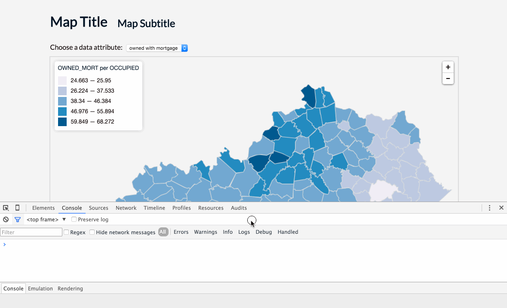  
**Figure 10.** The select form ('this') logged to the Console.

That's neat, but not immediately useful. We need to know which option has been selected by the user. The browser, by default, will change the selected attribute to true for an option that has been selected within the select form, and to false for a previously selected option. So how then can we determine which is selected?

To do this, we'll first select `this`, again using JQuery's powerful select method, and then use another JQuery method, *val()* ([http://api.jquery.com/val/](http://api.jquery.com/val/)) to this selection, which will return the attribute `value` of the currently selected option (remember when we write those value attributes into the `<option>` elements in the HTML above?). 

We can `console.log()` this to verify:


```javascript
$('select[name="occupied"]').change(function() {

    console.log($(this).val());

});
```

Changing the form selection multiple times verifies that we're able to access the attributes values of our selected options. The following animation shows us logging the specific value of the newly updated selection option to the Console.  

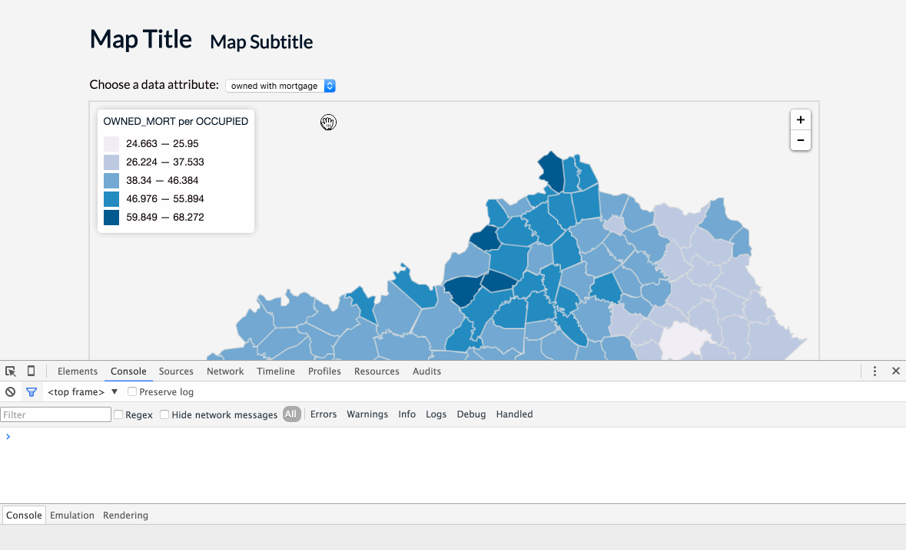  
**Figure 11.** The select option value logged to the Console.

Great! What do we now do with this information? Recall how at the beginning of our script we declared a global variable named `attribute` and first hard coded a value of `OWNED_MORT` to it? Because this variable is global, we can now simply reassign it the value the user has selected! So:

```javascript
$('select[name="occupied"]').change(function() {

    attribute = $(this).val();

});
```

Whoa! That's a little bit of JQuery Jiujitsu, and we're not expected to figure out something like that all on our own. How would one arrive at this solution though? Hopefully by now you've started to get into the habit of Googling questions. Often times, when dealing with JavaScript and web develop issues, good solutions are found within the website Stack Overflow ([http://stackoverflow.com/](http://stackoverflow.com/)).  In this case, a Google search for "jquery if selected true" landed us on this as the top result, which directly addresses our question and provides a variety of potential solutions (the answer checked in green on Stack Overflow is ): [http://stackoverflow.com/questions/10213620/how-to-check-if-an-option-is-selected](http://stackoverflow.com/questions/10213620/how-to-check-if-an-option-is-selected).

Keep this in mind. This is how you solve many problems with your maps moving forward and beyond the context of this class.

### Applying the user selected value to the map

Okay, back to our mapping process. Now that we've reassigned the value of our global variable `attribute` to the currently selected option, we want to redraw the map using this attribute. Thankfully, we wrote our initial code to draw the map in a very flexible manner, so this won't be very difficult at all! 

Recall how in the callback function of our `$.getJSON()` method, we first drew our Kentucky county geometries, and then we called another function, `drawMap()` which first calculated the classification break ranges, looped through all the layers (a.k.a. counties), and assigned them a color value based upon the global variable `attribute`? Well, what happens now, once we've reassigned the value of `attribute` to a new value, if we again call that `drawMap()` function? Let's try it!

```javascript
$('select[name="occupied"]').change(function() {

    attribute = $(this).val();
    drawMap();

});
```

The result is enormously pleasing! Just that easily we've connected the user-interface form to our code. Changing the selection multiple times indeed loops through our `dataLayer` and reassigns a color based upon the user selected data attribute value.

This animation shows us dynamically recalculating the class breaks and drawing colors to our map (and legend) by selecting a new data attribute. The legend is also created and drawn to the map with each new selection.

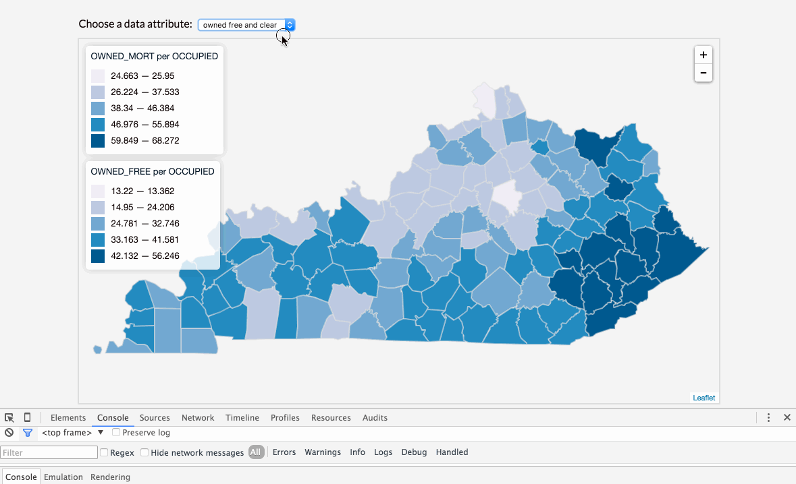  
**Figure 12.** Redrawing the map based upon user input.

There's a small problem though. Each time we call the `drawMap()` function, that function also calls the function which creates a new legend and adds it to the map. So we're going to need to rethink and revise our code a bit (again, as we learned in MAP672, "refactoring"). How do we solve this problem? 

## Refactoring the legend code

What if we used our map as an example for how to think about solving this problem with the legend. Note how our code to create the colored map involves two steps. 

1. First we drew the map within the `$.getJSON()` method's callback function. 
2. Then we called a second function which colored the counties (and now each time the selection changed, given our newly written user interface code).

Let's use this same logic here with the legend.

What if we first created the legend, but left it empty, and then called another function which updated that existing legend (and could be called again, repeatedly)? This would prevent a new legend from being added to the map every time.

Let's now modify our `drawLegend()` function in the following manner, making it simpler by stripping out the loop that populates the legend with the color `<span>` elements and range values:

```javascript
function drawLegend() {

    var legend = L.control({position: 'topleft'});

    legend.onAdd = function(map) {

        var div = L.DomUtil.create('div', 'legend');

        return div;

    };

    legend.addTo(map);
}
```

Note that we're no longer passing the `breaks` array into this function, so we can remove its parameter from the definition as well. Saving these changes and refreshing our web browser reveals that we can still see legend on the map as a small white square with no content in it. Not particularly useful. Refactoring often means temporarily breaking our map so we can make it better.

### Populating the empty legend

Now let's write a new function that 1) selects our legend and 2) populates it with the same information as before, based on the current (global) value of the `attribute` variable. We'll name this function `updateLegend()` and write it so it accepts our `breaks` array as a parameter. Within this function, first paste in the code we cut from our original `drawLegend()` function:

```javascript
function updateLegend(breaks) {

            div.innerHTML = "<h3>" + attribute + " per " + norm + "</h3>"; 

            for (var i = 0; i <= breaks.length-1; i++) {
                
                var color = getColor(breaks[i][0], breaks);
                
                div.innerHTML +=
                    '<span style="background:' + color + '"></span> ' +
                    '<label>'+(breaks[i][0]*100).toLocaleString() + ' &mdash; ' + 
                    (breaks[i][1]*100).toLocaleString() + '</label>';
            }
            
}
```

The `<div>` variable was created within the other function when we used Leaflet's `L.DomUtil.create()` method , so we'll need to replace that. Since we've already created that `<div>` element with a class of `legend` in the `drawLegend()` function, we can use JQuery to select it, and assign that to a variable. 

Let's call that variable `legend`, and let's select it using JQuery (i.e., `$('.legend')`). The property `innerHTML` is native JavaScript, not JQuery. JQuery's equivalent is a method `.html()`, so we can use this to add the `<h3>` header information to the legend first. Then, within the `for` loop below, rather than concatenating using this `innerHTML` property, we can use the JQuery method `.append()` to add the new elements to the legend `<div>`. This is all we should need to change within this function.

This animation demonstrates making those changes to the existing code within the `updateLegend()` function.

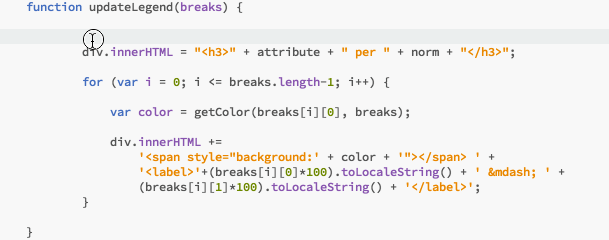  
**Figure 13.** Refactoring the code within the updateLegend function.

Let's run through this again, and say it in a different way. Study the example and practice writing the code yourself.

The first statement within the function body selects our already created legend using its class (`$('.legend')`) and then uses the JQuery method `.html()` to populate it with the name of our data attribute, enclosed by two h3 tags. JQuery's `.html()` method is convenient for inserting content into a selected DOM element (See [https://api.jquery.com/html/](https://api.jquery.com/html/)). We then assign this to a variable `legend` so we can use this selection below in the function.

Our for-loop is very similar to the one used previously in our `drawLegend` function. The main different is that instead of concatenating a string with the existing legend content using the `+=` operator, we're using yet another JQuery method, `append()`, to insert (or append) the content for each class break into the existing legend (See [https://api.jquery.com/append/](https://api.jquery.com/append/)). The `html()` method would clear all the content within the div before inserting the new content, so we'll use `append()` to continue adding new content into it.

If we save that code and test within our browser, what happens? It doesn't appear to be working yet. Why not. This animation shows us the map is still updating, but the legend is not being drawn nor updated.

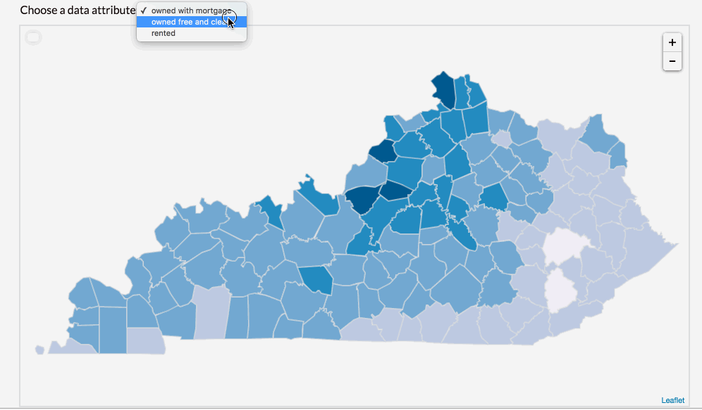  
**Figure 14.** Redrawing the map based upon user input.

Remember all we've done is written a function to update the legend. We always need to **think carefully about from where and when these functions are being called**.

Where is a good place to do this? It makes sense that we want the legend to update every time the map does. So let's stick the function call at the bottom of the function scope of the `drawMap()` function, after each of `dataLayer`'s layers (i.e., the counties) have been re-colored. Originally we called our `drawLegend()` here, but now we only want that called once (and not each time the `drawMap()` function is called), so let's move that to where we only call `drawMap()` once, in the bottom of our `$.getJSON()` function, along with the `ui()` and `drawMap()` function calls.

This animation shows us moving the call for the `drawLegend()` function from within the `drawMap()` function into the function where we also call the `drawMap()` and `buildUI()` functions. We then add a call to `updateLegend()` within the `drawMap()` function (because we want the legend to be updated every time the map is updated).

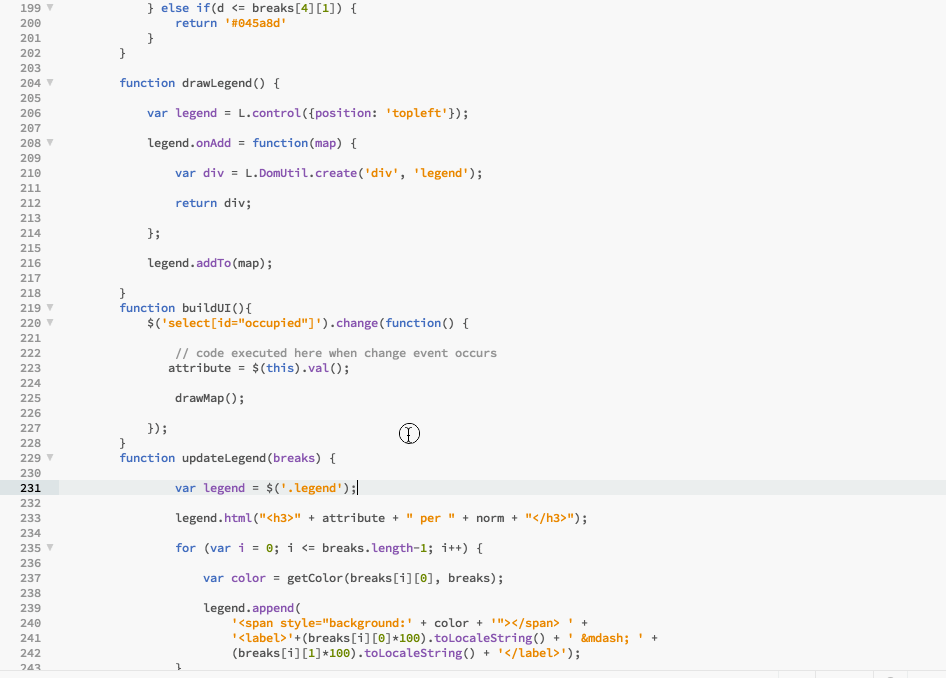  
**Figure 15.** Refactoring the code as to where the legend calls are placed.

That was good. The legend now appears to have been first created (although empty), and then the UI element updates the legend as it should. The problem is that when the page first loaded, there was an empty legend. We again need to think carefully about where to place our `drawMap()` and other function calls. 

If we call `drawMap()` first, it will attempt to make the call to update a legend that doesn't exist yet. So we have to make sure to call `drawLegend();` *before* we call `drawMap();`. In other words we still need to initially draw the legend (and do so before we call the function to update it).

Hence we've moved the `drawLegend();` function call above the call `drawMap()`.  Our updated code will now look like this:

```javascript
$.getJSON("ky_counties_housing.json", function(data) {

    dataLayer = L.geoJson(data, {
            style: function(feature) {
            return {
                    color: '#dddddd',
                    weight: 2,
                    fillOpacity: 1,
                    fillColor: '#1f78b4'
                };
        }          
    }).addTo(map);

    drawLegend();
    drawMap();
    buildUI();

});
```

Save the changes to test the results.

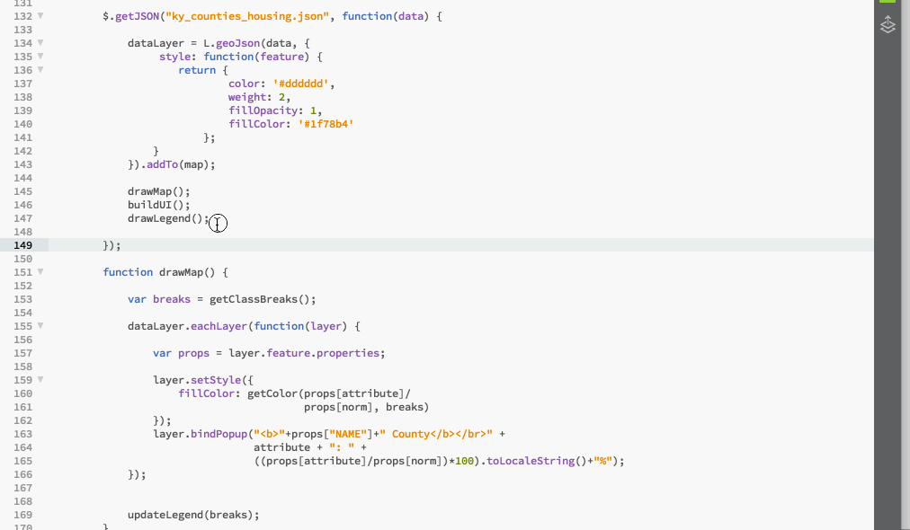  
**Figure 16.** Application is now updating the map and the legend.

Success! We've now extended our code and refactored the legend function to allow the user to dynamically update the map with a new data attribute.

## Adding an info panel.

Now lets add an info panel to the map with which we can update with additional information about each specific county. This is general summative information, and won't be updated when our user selects a different data attribute to re-color the map (which will simplify our code). Our goal is to add a new div element to the upper-right corner of the map and have this div be dynamically updated with specific content about each county as the user mouses over the counties.

Our strategy therefore is to first create an empty info window and then to update it the content (a similar coded strategy as our legend). Let's first add a function call beneath our call to `drawMap();` and name it `drawInfo()`. Then, below our other function definitions, we'll declare that function. We'll use a very similar process as when we created our legend for this, taking advantage of Leaflet's *L.DomUtil* and *L.control* classes. Note that we're giving this empty div element a class of `info` within this statement: `var div = L.DomUtil.create('div', 'info');`

```javascript
function drawInfo() {

    var info = L.control({position: 'topright'});

    info.onAdd = function(map) {

        var div = L.DomUtil.create('div', 'info');

        return div;  

    }
    info.addTo(map);
}
```

As always, once we define a function, we'll want to call it so its code executes. A good place for this is at the top of our script, within the *$.getJSON()* callback function (notice how we're using this function as a place to initially call a lot of our functions now, to set up the map application).

We can also anticipate wanting to style this info panel in a similar way as our legend, so we can include a CSS rule that selects the info div and applies similar styles:

```css
.info {
    padding: 6px 8px;
    font-size: 1em;
    background: rgba(255,255,255,0.8);
    box-shadow: 0 0 15px rgba(0,0,0,0.2);
    border-radius: 5px;
    text-align: right;   
}
```

Saving these changes and refreshing the web page will now reveal a small white box in the upper right corner of the map, similar as before with the legend.

Next we want to write a function that will update (or insert) content into this empty div element when we mouse over a county. Just as in the case of the legend there will be one function that initially creates the div `drawInfo()` and a second function that updates it, `updateInfo(layer)`.

```javascript
function updateInfo(layer) {

    var props = layer.feature.properties;

    var html = "<h3>"+props['NAME']+" County</h3>"+
                "total # occupied units: <b>"+ props["OCCUPIED"]+"</b><br>"+
                "# owned with mortgage or loan: <b>"+ props["OWNED_MORT"]+"</b><br>"+
                "# owned free and clear: <b>"+ props["OWNED_FREE"]+"</b><br>"+
                "# occupied by renters: <b>"+ props["RENTER"]+"</b>"

    $(".info").html(html);
}
```

There's really nothing too fancy going on here, nor anything we haven't seen before. We've written the function to accept one argument: the specific layer (or county) we're hovering over. Within the function's body, the first statement declares the variable `props` and assigns it the properties object of the layer we want information about (we've seen this shorthand before). We then declare another variable named `html` which we then pack full of our concatenated string information about that county. Finally, we use JQuery to select the div using its class 'info' and insert the string content into using the *.html()* method.

### Calling the info panel function

Now that we've written this function, the question is from where shall we call this function? We know we'll want to add some kind of event listener to each county (i.e., layer of `dataLayer`). Fortunately, our script is already looping through each county once when we initially draw the map, in the *drawMap()* function, so this is a good place to call our *updateInfo()* function. So we include the code, within the `dataLayer.eachLayer(function(layer) { }` callback function:

```javascript
layer.on('mouseover', function() {
    updateInfo(this);
});
```

The result is an info panel populated with county information upon mousing over the counties. This animation demonstrates adding a call to the `updateInfo()` function, passing the `this` context from a mouseover event on each layer. The result is that the info panel is updated when mousing over a new county.

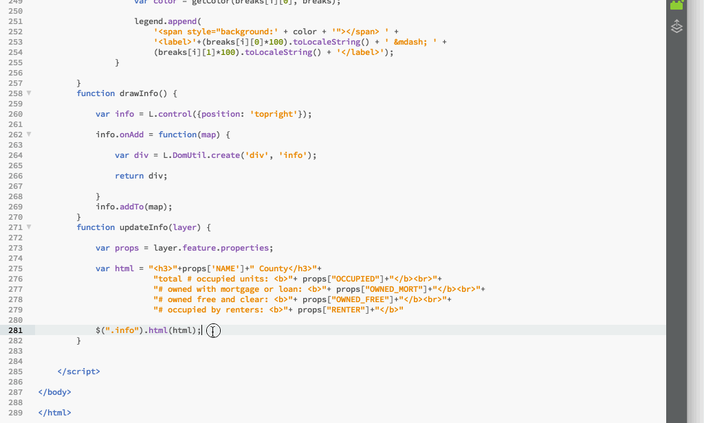  
**Figure 17.** Application is now updating the map and the legend.

### Cleaning up the info panel

The default margin and padding for the h3 header are creating some annoying space around that info heading, so we can do some pixel pushing with another CSS rule:

```css
.info h3 {
    margin: 0;   
}
```

However, we notice that the empty panel is first drawn on the map, and then, when the user mouses off Kentucky all together, the info panel remains populated with the last county's information. We can fix these issues using a couple more of JQuery's methods, *.hide()* ([http://api.jquery.com/hide/(http://api.jquery.com/hide/)]) and *.show()* ([http://api.jquery.com/show/](http://api.jquery.com/show/)).

When the map first loads, and the user hasn't moused over any counties yet, we don't want the empty info panel to appear yet. So, at the bottom of the *drawInfo()* function body, after we've created the blank div and added it to the map, let's then select the panel using JQuery and hide it.

```javascript
   info.addTo(map);
   $(".info").hide();
```

Then, when we hover over the Kentucky state (i.e., the counties) and want the info panel to appear, we'll again select the info panel and use the *.show() method to display it. While we could include the statement `$(".info").hide();` within the `on('mouseover', function() { }` callback function we placed on each layer, we really don't need to keep selecting and showing the info panel when mousing over the counties. Therefore, we'll write this code, before we make the call to update the legend and after the *.eachLayer()* method finishes:

```javascript
dataLayer.on('mouseover', function() {
    $(".info").show();
});
dataLayer.on('mouseout', function() {
    $(".info").hide();    
});
```

Also, consider Leaflet's default functionality to allow the user to pan and zoom (a.k.a., the 'slippy map'). Do we really need to provide the user with this type of user interaction? While we'll be digging into UI/UX in greater detail in Modules 04 and 05, for now we can ask ourselves what the user has to gain in terms of this map by panning and zooming? Not much. We may as well remove that functionality from the map (which consequently frees up that upper right corner for our info panel). We can simply add some more options to our initial map instantiation:

```javascript
var options = {
    center: [38.2, -85.8],
    zoom: 7.4,
    minZoom: 7.4,
    maxZoom: 7.4,
    dragging: false,
    zoomControl: false
}
```

### Final refinements to the legend and popup output

For the information panel, we hard-coded some meaningful labels for the output display. How do we achieve this for the property names we're using in the legend and the popup content though, especially since these will be changing as the user selects different attribute values? For instance, in this statement which inserts a heading into the legend:

```javascript
var legend = $('.legend').html("<h3>" + attribute + "</h3><ul>");
```

While we know what these property names mean, encoded within the GeoJSON file, it's not user-friendly to include these in the map. One solution is to create an object to associate the property names (e.g., "OWNED_MORT", "OWNED_FREE") with more meaningful labels for the user. At the top of our script, let's therefore create a global variable named `labels` and construct such an object:

```javascript
var labels = {
    "OCCUPIED": "occupied units",
    "OWNED_MORT": "% occupied housing units owned with mortgage",
    "OWNED_FREE": "% occupied housing units owned free and clear",
    "RENTER": "% occupied housing units rented"   
}
```

Now, with the both the legend and the Leaflet popup, we can access our more friendly label and use it, instead of the property name from the GeoJSON:

```javascript
        layer.bindPopup("<b>"+layer.feature.properties["NAME"]+" County</b></br>" +
                        labels[attribute] + ": " + ((layer.feature.properties[attribute]/
                                layer.feature.properties[norm])*100).toLocaleString());
```

and

```
    var legend = $('.legend').html("<h3>" + labels[attribute] + "</h3><ul>");
```

The result then should look something like this:

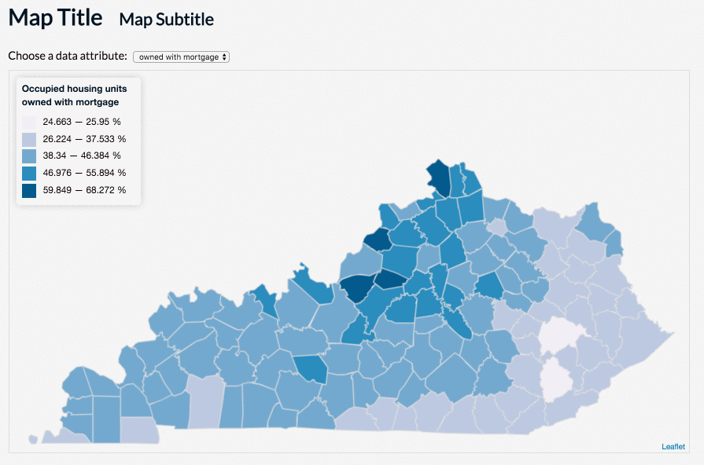  
**Figure 18.** The final map of the lesson.

Of course, many adjustments can be made to the overall page, and the HTML elements we've now included in the map, using additional CSS style rules. For now, you've made an impressive interactive choropleth map.