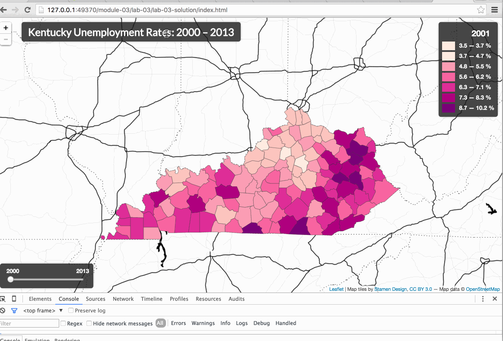

# Lab 03: Sequencing a Choropleth Map Through Temporal Data

Create an interactive web map of unemployment rates by county in the state of Kentucky. Use the maps created within Modules 01, 02, and 03 as a guide, as well as the two data files included within the *lab-03/lab-03-data/* directory (*ky-counties.json* and *ky-unemployment.csv*)  to complete the map . You will need to create the *index.html* file yourself.

Your map should fulfill the following requirements, covered explicitly within the previous modules (feel free to examine, cut, paste, and modify code from previous solutions):

* Load two external files (provided) at runtime.
* Process these data, binding attribute data to geometries.
* Draw a classed choropleth map of unemployment rates for Kentucky counties (you may choose the appropriate classification method, e.g., ckmeans or Quantile) using a sequential color scheme (hint: use [http://colorbrewer2.org/](http://colorbrewer2.org/)).
* Draw an accompanying legend with an appropriate legend title and class break labels.
* Display the map at 100% width and height of the browser window's viewport.
* Provide a meaningful title for the map, placed upon the map.

In addition to these requirements, your map should also provide the following UI enhancements for the user:

* A visual affordance when the user hovers over specific counties (e.g., making the stroke of the county yellow).
* An information panel made visible when the user hovers over specific counties. The informal panel should include information for that county including the county name and data for all the available years (2000 - 2013).
* A popup triggered when the user clicks on a specific county, which provides the name of the county and the specific unemployment rate for the currently displayed year.

Finally:

* Thoroughly comment your code.

Your final map should look and behave something like this:

**NOTE:** If you want to complete this assignment with a different dataset, of counties or units other than Kentucky, you may collect and assemble that data yourself. Be sure that the data are temporal and quantitative in nature, at that there are at minimum 7 timestamps of data.
