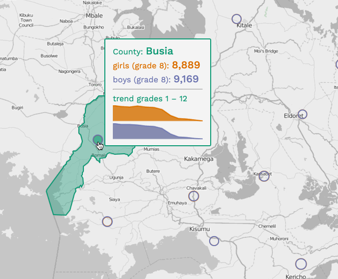

# Lab 05: Working through the Elements of User Experience to Achieve Interface Success

## Option 1 (9 points):

For this lab, complete the lesson as detailed in lesson 05 and push your completed map to your repository using the primary school enrollment provided. Include any mockups/sketches created in your process.

## Option 2 (10points)

Complete a finished map using the lesson process, using the new/unique dataset you collected for Lab 04.

## Additional challenges

1. Load an additional data layer showing the specific boundaries of the Kenyan counties. These may be invisible but represented upon the mouse over.
2. Consider how to make the hover window even more powerful by including a [sparkline graphic](https://en.wikipedia.org/wiki/Sparkline) within it. Consider using an additional library to help with this (e.g., [jQuery Sparklilens](http://omnipotent.net/jquery.sparkline/#s-about))

Example:

