# Lesson 05: Mapping Workflow Part II &ndash; Data Representation, UI Prototyping, and Refinement of the Map

This lesson continues from lesson 04 to guide us through a complete web mapping workflow. We left off in lesson 04 with the data organized in a particular way and loaded into the script. The next step is to provide the code that will represent these data in a cartographically thematic way. However, choosing particular paths and moving forward through a mapping process does not always guarantee success. At times there is a need get the data processed and visualized on the map quickly, which is what's known as a **prototype**, before committing to polishing and enhancing the map.

Note that an *index.html* file has been provided within the *lesson-05/* directory, as well as a the *kenya_education_2014.csv* data file correctly formatted. These two files pick up where lesson 04 left off. Feel free to use to practice through the lesson.

Also note that the [lab 05 assignment](lab-05/lab-05.md) has two options, the second of which is to complete this lesson using your own data.

## Introduction

By the end of module 04 we were making our way from the more abstract planes of project **strategy** and **scope** into the **structure** plane where we addressed questions of interaction design and information architecture. 

  
**Figure 01.** Product as function and information through the elements of experience plane.

Within the **strategy plain** we considered the wider goals of the project and asked, "Why are we making this?" In answering that question, we identified our objectives for the product and the addressed the needs of our target user. 

After articulating why were going to make the product, we moved into the **scope plane** to ask, "What are we going to make?" While of course we were hungry to make a map, the answer to this question may sometimes be another information graphic such as a chart. A consideration of the data prompted us to consider various thematic mapping types and develop a list of both the **functional specifications** and **content requirements** of the intended product.

We then moved into the **structure plane** where we asked, "How is it going to work"? For us, this involved closely examining our data and organizing it in a useful way for its incorporation into the web map. We also began building our boilerplate template of HTML, CSS, and JavaScript, and loading in some libraries we'll anticipate needing (i.e., JQuery, Mapbox.js). After this was complete, we loaded our data into the map itself, and plotted our county centroids as simple Leaflet markers. 

Bear in mind that these planes are not mutually exclusive, and not do the necessitate a strictly linear path through a design process. It's not as if we check one plane off the list and move on entirely into the next. Processes of design are always cyclical and iterative. Garrett himself recommends planning your project to have work on each plane finish *before* work on the next can *finish* &mdash; not before it begins! This will help ensure a positive, successful user experience. 

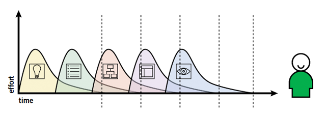  
**Figure 02.** Finishing work on each plane before the next can finish.

While we move into the **skeleton** plane next, it's important for us to continue to think through the interaction design in particular, as this is closely linked with the design of the interface itself. **User experience (UX)** design is the iterative set of design decisions that lead to a successful experience with the map, as framed and illustrated conceptually through Garrett's elements of the user experience we're using to guide our process. **User interface (UI)** design is the set of design decisions that lead to the successful implementation of an interactive map. Interface design becomes much more concrete yet brings with it important considerations of interaction design from the structure plane.

Before we move on to the **skeleton** plane and the details of this particular interface design, let's move through some cartographic concepts relating to UX and UI web map development.

## A brief digression into cartographic interaction

Following from Roth (2013), we can ask ourselves six fundamental questions of cartographic interaction:

1. **what** is cartographic interaction and how does it different than traditional static map development?
2. **why** do we provide cartographic interaction and what value does it provide for the user experience?
3. **when** do we provide cartographic interaction and how much?
4. to **whom** do we provide interaction?
5. **where** in a computing device is interaction provided?
6. **how** do we identify and implement an appropriate interaction solution?

### 1. What is cartographic interaction and how does it different than traditional static map development?

Cartographic interaction is a key component of a successful web map experience, and this is largely achieved through a user interface. We can think of the interface as facilitating a dialogue between the human and the map.

  
**Figure 03.** Roth's (2013) model of cartographic interaction.

According to Roth's schematic, this dialog occurs through the component medium of the computing device.

### 2. Why do we provide cartographic interaction and what value does it provide for the user experience?

The are many reasons we provide cartographic interaction for our user. Interactivity may aid in decision making, spark curiosity to engage with the map, or may simply make the map more fun to use. 

Academic cartographers have developed models to help conceptualize why we use cartographic interaction. One diagram suggests the reasons range from facilitating visual thinking and exploration of a data set to communication of a known pattern or data signature. The so-called "Swoopy" diagram (Figure 04), developed by David DiBiase in 1990, suggests that the number of possible map solutions is highest when we want to use a map to visually explore the data. Here we may introduce interaction solutions to help visualize the data in different ways and test, reject, or confirm certain hypotheses. 

As our understanding of the data and the "story" those data can tell becomes clearer (as both map makers and the users of these maps), we move from a zone of visual thinking into more one of communicating and presenting the information in a particular manner. The number of map solutions decreases, and constraints on the available interaction will help the user experience the map in a more purposeful manner.

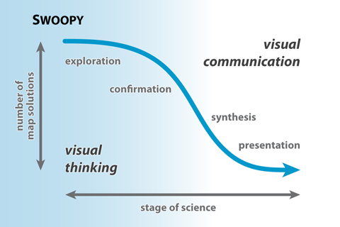  
**Figure 04.** Swoopy diagram showing visual thinking and visual communication.

This continuum from exploration to presentation is then incorporated into another classic diagram know as "cartography cubed,"  which considers mapping along three axes: 

1. like the Swoopy diagram suggests, map tasks range from exploring data and revealing unknowns to presenting or communicating knowns, 
2. the interaction provided may range from low to high, 
3. the intended users may range from the general public to a private audience (again, think how these users' goals may differ).

The success of a map lies in not trying to fill this entire cube, but rather a specific corner.

  
**Figure 05.** Cartography cubed, diagram modified by Roth from MacEachren (1994).

Let's consider some examples to clarify where various maps may fall within this cube. Say we have a very large dataset of climate data, consisting of many different attributes (e.g., temperature, wind speed, precipitation, humidity, air pressure) and encompassing many different temporal units (e.g., hourly data for all these attributes for a few decades). This is a very complicated dataset, and we may not yet know what these data can tell us. 

Therefore, we may wish to build a map and map interface located at the lower corner of the cube: in other words, our task is to reveal unknowns. We therefore provide a high level of interaction (e.g., the ability to filter the data in many ways, or perhaps using coordinated linked views to see the spatial data in a histogram or scatter plot to better compare trends). Furthermore, perhaps this map is built for some climate scientists to better understand their data. It's not necessarily a public map.

However, as such a map may allow us to pull out significant trends from the data and identify a more simple story, we may build another map (or scale back the existing one) as the task shifts from exploring the data to presenting a subset of it. As we do this, we need less interaction, and the map may come to serve more of a public audience (e.g., demonstrating fluctuations between heat indices and humidity in a particular region during El Nino).

In terms of learning some terminology, we can consider the use of interaction to enhance the visual communication and presentation of the information within the map as **interactive cartography**. Looking at the cube, these maps tend toward presenting knowns to a public audience and provide a lower level of map interaction. In other words, we only want to give the user the ability to manipulate the map in ways to further their understanding of the information we wish to present (that is, if it helps them reach their goal or objective). 

The term **geovisualization**, by contrast, refers to map interface designs that exist toward the opposite corner of the cube: maps that provide a high level of map interaction to explore the data with the purpose of revealing unknowns (and often to a private audience such as specialists or researchers).

Of course, this is an abstract schemata and our maps will typically fall somewhere within the cube. The point is that when we ask why we are providing cartographic interaction, thinking through these axes of cartography cubed can help clarify that answer. 

### 3. When do we provide cartographic interaction and how much?

Following closely from the question of why we're providing cartographic interaction, we then need to ask when we provide it and how much. Again the cartography cubed diagram is useful for identifying the times when we want to apply a high or low amount. 

Often when we begin building web maps, there's a desire to drop in as much functionality as we can (and sometimes a client wants "all the bells and whistles"). However, if the goal of the map is to simply show a pattern or distribution we've already identified, it's likely that adding more filters or coordinated visualizations are unncessary and may actually impede the user's goal. Remember that too cluttered or complex of an interface is challenging to understand and use, not matter how well it is designed.

Therefore there is a strong case for erring on the side of greater **interface constraint**, that is, to limit the available interaction provided to the user when we can. This constraint can reduce the complexity of the map and improve the user's experience. Remember, cartographic interaction is a means to an end: we want to facilitate visualization of data and communication of a message and not simply offer interaction for its own sake.

### 4. To whom do we provide cartographic interaction?

As we spent time in Lesson 04 discussing, taking into account the users (or personas) and their goals are key components of **user-centered design**. We won't run through all that again here, but we'll recall that we need to consider how various users have different degrees of experience using maps and motivations for learning how to use them.

  
**Figure 06.** User motivation vs Interface Complexity, from (2008) Roth and Harrower.

The greater the experience and motivation of a user, the higher the interface complexity may be (i.e., how much interaction to provide). The relative complexity of the interface in terms of our anticipated user then informs how we organize an interface to enhance the perception of the map, affordances and signals that tell the user how to interact with the map, and feedback that tells the user what has happened as a result of their actions.

### 5. Where in a computing device is interaction provided?

While much of our initial education here is focused on making interactive maps for a typical desktop computer with a mouse, we use the web (and presumably interact with web maps) through a variety of devices. This has two important implications for us: 1.) in a critical sense, we need to aware of **ubiquitious cartography**, or the increasing omnipresence of digital maps and geospatial information in our lives and the interconnectedness they provide; and 2.) in a practical sense, such aspects of computing devices as the input device, bandwidth, processing power, and display capabilities. I'll briefly provide a couple examples of the latter before moving on.

Throughout the maps we've built in map672 and now in map673, we've used a familiar interaction solution of a 'mouseover' to retrieve information about features (and perhaps trigger an affordance). But how do these hover actions respond to touch devices such as tables and mobile phones? If retrieving specific information is a key part of meeting the user's goals, and the hover is not supported through a touch operation instead, the map interface fails. Likewise, touch interfaces provide additional opportunities of varied user interaction. While a mouse point typically has one point of contact with a map, touch devices can support multiple points of contact, introducing possibilities for multi-touch interaction (e.g., pinching, three-finger swipes, etc.). Considerations of the various hardware and software possibilities greatly complicates strategies to build a successful web map interface.

It's also important to think about such aspects as bandwidth and processing power of computing devices (again, in terms of the anticipated user). While we in the developed world like to think that we have fast bandwidth and fast machines, these resources are not available to everyone. While taking care to trim data down for smaller downloads may appear unncessary, consider if your user lives in a place where bandwidth is not fast (such as in wireless settings or through cell towers). Additionally, some interaction processes that may perform well on a Macbook Pro with 16 GB of RAM and an independent graphics card may not do so well on slower computers or mobile devices.

### 6. How do we identify and implement an appropriate interaction solution?

Perhaps the most interesting aspect of cartographic interaction is how we choose a particular interaction design solution and implement it. Let's consider the range of possibilities. Again following from a UCD perspective, we first ask what are the objectives a user may have for wanting or needing cartographic interaction? Here are a handful, again identified by Roth (2013):

* **identifying** or examining a single map feature
* **comparing** to determine similarities and differences between two map features
* **ranking** to determine the order or relative position of 3 or more map features
* **associating** to determine the relationship between two more more map features
* **delineating** to organize map features into a logical structure (i.e., clustering)

Note that as we move from identifying features toward delineating, these objectives become increasingly sophisticated (and quite likely, the interface needed to support them becomes that much more complex).

Once we've established the user's objective, we can consider how the interface may then support them. In other words, how does a user manipulate the interface to do things?

Roth (2013) offers some fundamental " work operators" by which a user may interact with a web map:

* **reexpress**: changing the displayed representation of equivalent information (such as by changing the visual variable or the map type, such as from a choropleth to a prop symbol)
* **sequence**: generating an ordered set of related maps (such as by using a slider UI element to sequence through timestamps)
* **overlay**: adding additional content, or adding context to better understand, adding an overview (i.e., max, min, mean, etc), or visual benchmarks
* **resymbolize**: changing the design parameters, but keeping same map type (such as changing the number of classes in a choropleth map, or updating their fill colors to display a different data attribute)
* **zoom**: changing the map scale
* **pan**: changing the geographic center of the map
* **reproject**: dynamically changing the map's projection (see [Projection Transitions](http://bl.ocks.org/mbostock/3711652))
* **search**: querying the data or features given particular criteria and likely updating the map to reveal the result (such as zooming and panning to a searched address)
* **filter**: altering map to remove map features no meeting user-defined conditions/constraints (used more often in geovisualization than interactive cartography as defined above)
* **retrieve**: requesting details about a map feature (such as through popups, labels, tooltips, windows, information panels)
* **arrange**: manipulating the map layout (such as when this map switches from one to two when the user clicks the COMPARE WITH MEN button: [Where Working Women are Most Common](http://www.nytimes.com/interactive/2015/01/06/upshot/where-working-women-are-most-common.html))
* **calculate**: deriving new information about a map feature or a relationship between features (such as how far features are from a given location)

Think about how many of these operators we've used so far through MAP 672 and 673! And begin thinking about which of these will suit the user objectives of your final map for this course.

Beyond these "interaction primitives," Roth suggests there are other "enabling" tasks that interaction can support such as **importing** (or uploading) data, **exporting** data or a map, and **annotating** the map (likely then upload to a database), **editing** the map or map features, and **saving** information on a map (again, likely uploaded to a database).

As always, it helps for the interface design to offer strong **affordances** so the user knows functionality exists.

Now that we've covered the more conceptual ground of cartographic interaction, let's move forward through our mapping project to apply some of these concepts to practice.

## The skeleton plane: information design, interface design, and navigation design

According to Garrett, the skeleton plane further refines the structure of the application and makes the interface more tangible. Extending the question of, "How is this product going to work?", the skeleton plane asks, "What form will the functionality take?"

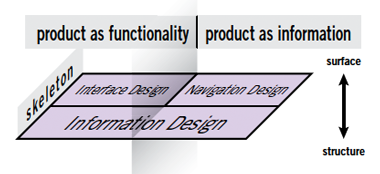  
**Figure 07.** Skeleton plane.

We can see that Garrett considers "information design" to stretch across both the product as functionality and product as information sides, and involves the the arrangement of elements on the interface to communicate information to the user. Interface design involves the arrangement of elements to enable interaction, while navigation design involves the arrangement of elements to enable movement through the product.

We don't need to overly concern ourselves with disambiguating the distinction between interface and navigation design. They are clearly related, and within web cartography they likely overlap more than many of the web applications Garrett has in mind within his work and design.

This section does a lot of work for us. Here's our roadmap moving through this section: 

1. To assist us in moving forward with the interaction/navigation design, we'll  consider the role of wireframes and paper prototyping.
2. We'll then dive back into the JavaScript to work on symbolizing our data as two distinct layers (in this case as proportional symbols), allowing us to both see the spatial distribution of the phenomena and make comparisons between the nominal categories of boys and girls
3. We'll then apply a slider UI element to sequence through the grades and the size of the proportional symbols
4. We'll consider solutions for displaying a temporal legend (i.e., the current grade level), as well as an advanced solution for dynamically drawing a proportional symbol legend
5. finally, we'll build a custom information window to display content (better than a popup!)

Roll up your tech sleeves ... we're about to get dirty! But first, grab a pencil and some paper.

### developing a wireframe mockup and paper prototyping

Given that we developed a map requirements list in the scope plane and organized our data and app structure in the structure plane, we can now consider the general layout of the map and the wider interface. While this is in part a series of aesthetic design decisions, the overall layout and interface design also must serve the objectives of the map (i.e., the user's needs). 

When beginning a new map project, or any information design for that matter, it's often helpful to utilize another set of technologies within the web mappers toolbox: pencil and paper! 

We are going to consider two versions of this technique. The first will be more of a **wireframe** which allows us to develop a coarse understanding of basic layout of our interface and provides a means for accounting for the placement of our content. For this example, I'm going to roughly mockup my design layout as follows:

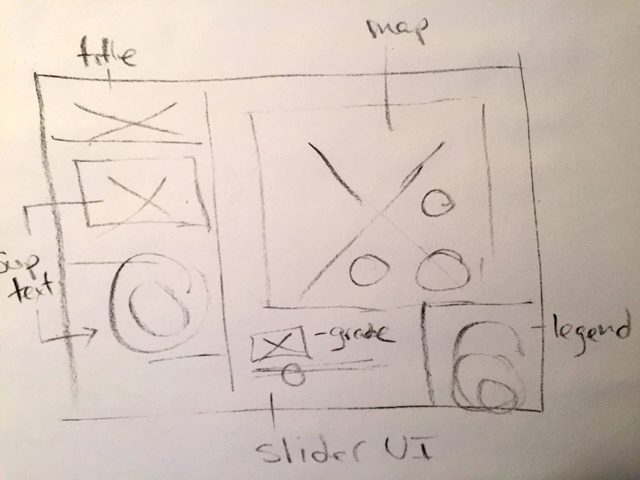  
**Figure 08.** A wireframe mockup of the intended map design and layout. 

Here I've labeled the major elements of the design (e.g., title, supplementary text, the map, legend, and slider UI widget), although this may not even be necessary. Additionally, you may wish to create several quick wireframes to consider various layouts (e.g., a sidebar on the right, or a vertical bar above or beneath the map).

Note that there are also many [web-based tools for rapid prototyping](https://hackdesign.org/toolkit/rapid-prototyping) as well, if you'd prefer these over pen/chalk and paper.

A second stage beyond a wireframe is known as **paper prototyping**. Read more about [Paper Prototyping](http://alistapart.com/article/paperprototyping). It may prove useful to do additional paper prototyping , even using colored pencils, to begin thinking even more concretely about how interface elements will eventually look and feel when brought into the digital environment.

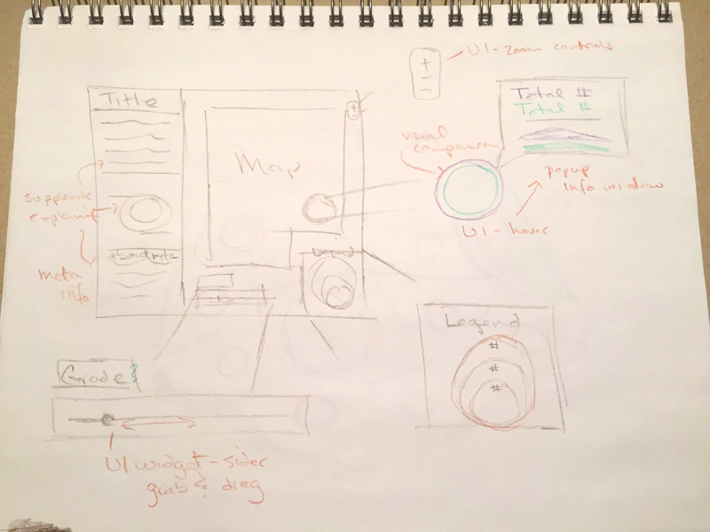  
**Figure 09.** More detailed prototype than the previous wireframe developed in the structure plane.

Additionally, consider reading this short article [The beginner’s guide to UX prototyping
](https://medium.com/@WebdesignerDepot/the-beginner-s-guide-to-ux-prototyping-a22afb58018d).

### Information design: symbolizing geographic data

While a web map may include a lot of information in various forms, and certainly this is the case with the more recently emerging and highly successful narrative form of embedding maps within stories (see the [NYT's *Snow Fall*](http://www.nytimes.com/projects/2012/snow-fall) for a great example), for this map we're going to focus on how we convey our information through more traditional cartography symbology. We can refer to some the scripts and techniques we used to draw proportional symbols in the latter lessons of MAP672 (i.e., there's no need to reinvent the coding wheel every time).

In Lesson 04 we discussed the ways we come to choose one form of cartography symbology over another, and in the case of this map we anticipated using a proportional symbol for county's enrollment levels. Let's now move into the JavaScript development needed to achieve this, as well as consider strategies for best allowing the user to compare the enrollment rates of girls vs boys.

We ended lesson 04 by loading our data into our script asynchronously using the [omnivore plugin](https://github.com/mapbox/leaflet-omnivore).

```javascript
omnivore.csv('kenya_education_2014.csv').addTo(map);
```
With the method call `addTo(map)`, this JavaScript statement also plotted our data to the map as simple Leaflet markers.

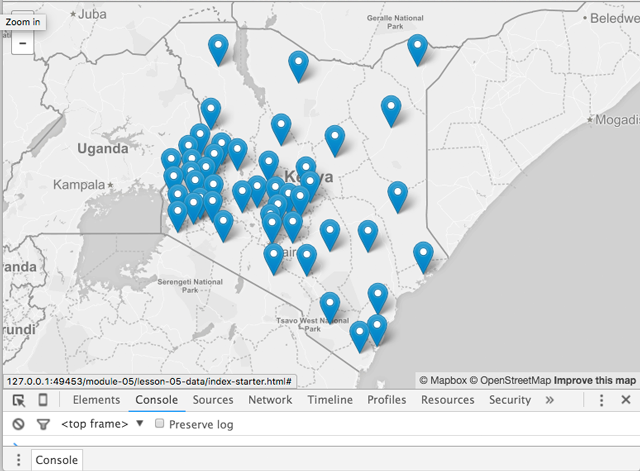  
**Figure 08.** Data loaded with the omnivore plugin and plotted as Leaflet markers.

With the inclusion of this one statement it appears we've successfully loaded the data and drawn them on the map as the default Leaflet markers! From experience though, we know we may to want to access these layers (recall that each feature in Leaflet is a "layer"). What happens if we try assigning the resultant Leaflet GeoJSON layer group to a variable and logging that to the Console for inspection?

```javascript
var countyCentroids = omnivore.csv('kenya_education_2014.csv').addTo(map);
console.log(countyCentroids);
```
The following animation demonstrations creating this variable and inspecting it in the Console. We wee that the output for the `countyCentroids` variable is the now familiar Leaflet GeoJSON layer we've been working with. 

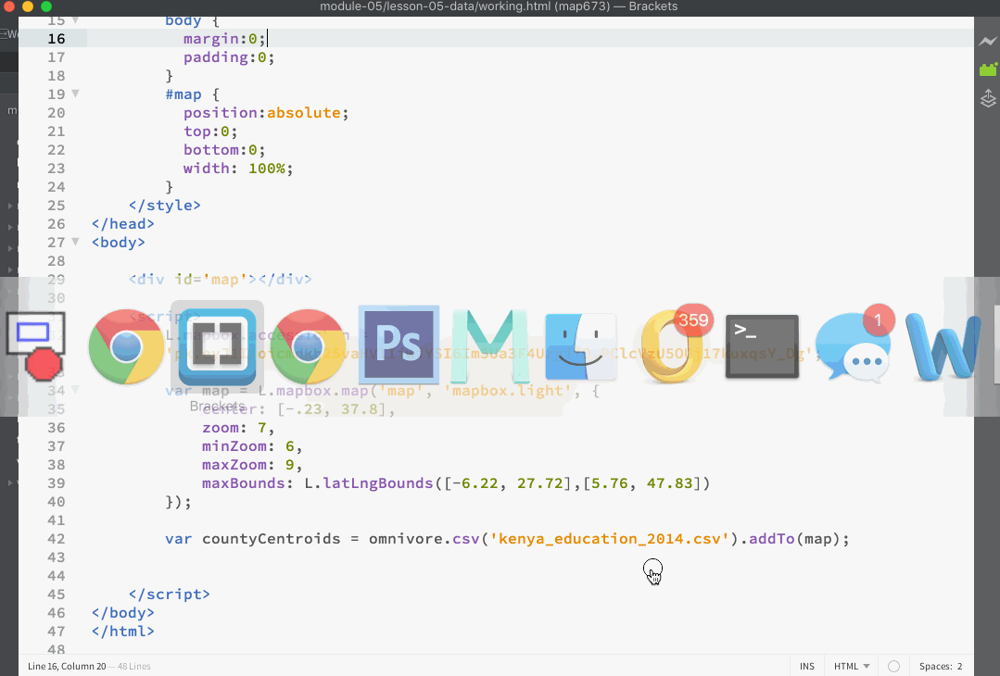  
**Figure 09.** Console log output of GeoJSON layer created through Omnivore plugin.

We can access each layer (presumably through a Leaflet `.onEachLayer()` method call) and access the individual data attributes for each layer through the now familiar `feature.properties` nested object structure.

However, while this may work on our local system without error, we have to be careful with the asynchronous method call omnivore is using. If there's a delay in the loading the file, a problem with loading the data such as poor format of the CSV, or it happens to be larger than it is, it's likely that this `console.log()` statement will execute before the data is loaded, resulting in an error, and we won't actually have access to those layers later on in the script. 

As the documentation for the [Leaflet Omnivore](https://github.com/mapbox/leaflet-omnivore) warns us:

> Each function returns an `L.geoJson` object. Functions that load from URLs are asynchronous, so they will not immediately expose accurate `.setGeoJSON()` functions.
>
>For this reason, we fire events:  
> * `ready :` fired when all data is loaded into the layer
> * `error: ` fired if data can't be loaded or parsed

```javascript
var layer = omnivore.gpx('a.gpx')
.on('ready', function() {
    // when this is fired, the layer
    // is done being initialized
})
.on('error', function() {
    // fired if the layer can't be loaded over AJAX
    // or can't be parsed
})
.addTo(map);
```
It's a good idea to use some error catching technique when you can, especially when dealing with asynchronous calls. Therefore, let's modify our script using this example.

```javascript
omnivore.csv('kenya_education_2014.csv')
    .on('ready', function(e) {
        console.log(e.target)
    })
    .on('error', function(e) {
        console.log(e.error[0].message);
});
```

Here we see that we're making use of the `e` parameter created within each callback function. In the case of the `.on('ready' .. )` method callback function, e.target will give us access to the resultant GeoJson layer. The  `e` parameter created within `.on('error' .. )` method gives us access to any errors the script reports. 

So, by using `console.log(e.target)` we have access to the Leaflet GeoJson layer, only with the security of knowing that the data has been properly loaded and ready for further use within our JavaScript code.

What's are next step now? We could move ahead and create another proportional symbol map based off our earlier maps. The Omnivore Plugin documentation even gives us a handy example for creating [Custom Layers](https://github.com/mapbox/leaflet-omnivore#custom-layers) when creating this GeoJson layer.  We could then use the `L.GeoJson` object's `pointToLayer` option to make each point feature a Leaflet `circleMarker` symbol (example drawn from [Custom Layers](https://github.com/mapbox/leaflet-omnivore#custom-layers)):

```javascript
var customLayer = L.geoJson(null, {
    // http://leafletjs.com/reference.html#geojson-style
    style: function(feature) {
        return { color: '#f00' };
    }
});
// this can be any kind of omnivore layer
var runLayer = omnivore.kml('line.kml', null, customLayer)
```

However, returning to our mockups and information design strategy resulting from our requirements list, we know *we want to compare* the boys and girls enrollment rates across this map. What are the range of possible interface design solutions for achieving this comparison? For one, we could create two layers to be toggled on and off (Roth's *overlay* work operator). Another (more static) solution would be to simply create two maps and place them side by side. Let's explore creating two layers, though question even the need for the toggling (again, how do we achieve our map objectives with the minimal amount of user interaction required?)

Even though the Omnivore Plugin conveniently converted the data into a map-ready Leaflet GeoJson layer, we actually want to create two separate GeoJson layers: one for girls and one for boys. Once we have these two separate layers, we'll consider strategies for comparing two map features.

Let's convert the Leaflet GeoJson layer back into regular GeoJSON data. Fortunately there is an easy method with which to do this, `.toGeoJSON()`, which is documented both within [Leaflet's LayerGroup](http://leafletjs.com/reference.html#layergroup-togeojson) methods and [Mapbox.js API documentation for the L.Layergroup](https://www.mapbox.com/mapbox.js/api/v2.3.0/l-layergroup/).

Therefore, if we append this method to our `e.target`, we have a GeoJSON representation of our CSV data available in our script.

```javascript
 omnivore.csv('kenya_education_2014.csv')
    .on('ready', function(e) {
        console.log(e.target.toGeoJSON())
    })
    .on('error', function(e) {
        console.log(e.error[0].message);
});
```
This looping animation shows the Leaflet GeoJson layer group in the Console, logged as `e.target`. We then add the `toGeoJSON()` method to it and can see the Console we have standard GeoJSON.

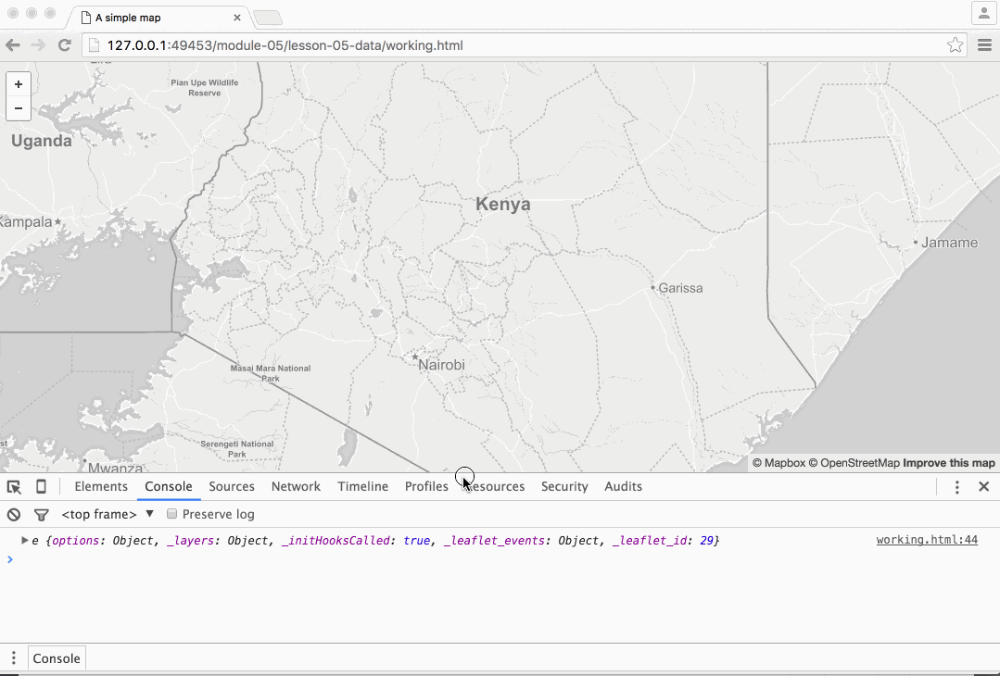  
**Figure 10.** Console log output of GeoJSON data converted back with toGeoJSON() method.

We're now we're working with a GeoJSON data structure as if we had loaded GeoJSON with Query's `getJSON()` method call (recall that because we've brought this data in as a CSV file, it's significantly smaller than a GeoJSON representation of the same data, so using the Omnivore plugin hasn't been a complete exercise in futility). How do we now go about create distinct features layer for girls and boys?

First, let's get the data out of that `.on('read' ..)` callback function. We can do this by simply calling a new function &ndash; let's name it `drawMap` &ndash; and sending our GeoJSON data to it. Modify the code then as follows (note that we're sending the argument as `e.target.toGeoJSON()` but the `drawMap` function accepts it as a parameter named `schoolData`):

```javascript
omnivore.csv('kenya_education_2014.csv')
    .on('ready', function(e) {
        drawMap(e.target.toGeoJSON());
    })
    .on('error', function(e) {
        console.log(e.error[0].message);
});

function drawMap(schoolData) {
    // access to schoolData here
}
```

Next, we wish to create two separate layers within the drawMap function. Recall how back in map672 we created separate layers for different types of power plants from the same GeoJSON data structure by filtering the coal plants from the hydro plants. Do we want to apply a similar technique here? These layers will have the same features (i.e., a circleMarker for each county), so we don't want to apply a filter in this case. Instead, let's try creating two Leaflet GeoJSON layers. Again, we need not re-write or puzzle through all this code again ourselves, but we can refer to earlier solutions and adapt the code as we need to. 

In this case, the main question is what information we send into the `calcRadius()` function to use as the radius for our circles. Recalling how we created our data in Lesson 04 with the pivot table and manual editing, we know the grade numbers for the girls begin with `G1` and for the boys `B1`. When we inspected the data above we also noted that the values appear to currently be encoded as string types, so we can use the Number function to convert them to numbers before the calculation.

Let's just leave the default Leaflet styles for the circleMarkers for now.

```javascript
function drawMap(schoolData) {
    var girls = L.geoJson(schoolData, {
            pointToLayer: function(feature, layer){
                return L.circleMarker(layer, {
                    radius: calcRadius(Number(feature.properties.G1))
                });
            }
        }).addTo(map);
    
    var boys = L.geoJson(schoolData, {
        pointToLayer: function(feature, layer){
            return L.circleMarker(layer, {
                radius: calcRadius(Number(feature.properties.B1))
            });
        }
    }).addTo(map);
}

function calcRadius(val) {
    var radius = Math.sqrt(val/Math.PI);
    return radius * .6;
}
```

We've also adjusted the scale factor (i.e., that number we're multiplying the radius by) so the circles fit appropriately across the map. This animation demonstrates accessing the respective feature property data within the two Leaflet geoJson layers when calling the `calcRadius` function, and the result rendered to the map within the browser.

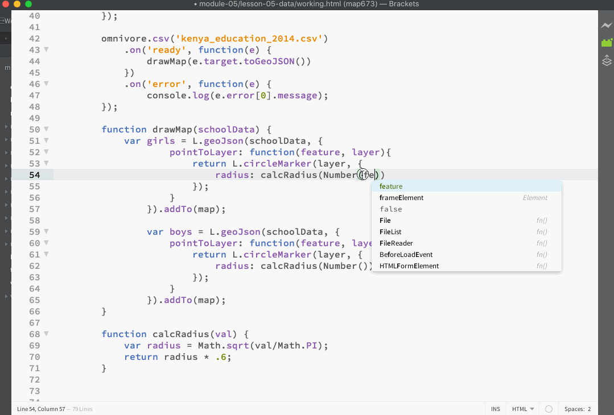  
**Figure 11.** Drawing circleMarkers with default Leaflet style options.

Upon visual inspection, the sizes of the circles appear very similar, and (simply) looking at the data earlier suggested the enrollment rates for girls and boys were nearly on parity. While the default .6 opacity of the Leaflet circleMarkers somewhat allows us to compare the two, currently it's very difficult to visually see any distinction between the two. How can we remedy this (again, simply toggling the two layers as overlays on and off is one inviting solution)?

For one, we can use a different color for girls and boys. Let's modify the code to accomplish this. But what colors do we choose? This is an instance of where design decisions (e.g., "Does this look good or function for distinguishing these two types?") are more than merely aesthetic decisions. 

Obviously there are cultural and historical associations with color. In this case, it would be cliche and problematic to choose pink for girls and blue for boys (right?). Let's go with a couple other colors and leave the gendered baggage behind? 

For this map, I'm going with an orange color girls (#D96D02) and a purple for boys (#6E77B0). Obviously these choices are neither simple nor easy. Beyond choosing colors that may be more or less politically correct, we need to also choose ones that work practically. I.e., we need to choose colors that allow the user to easily distinguish between the categories. Perhaps a 3rd-level priority is choosing ones that are then aesthetically pleasing.

```javascript
var girls = L.geoJson(schoolData, {

    pointToLayer: function(feature, layer){
        return L.circleMarker(layer, {
            color: '#D96D02',
            radius: calcRadius(Number(feature.properties.G1))
        });
    }
}).addTo(map);

var boys = L.geoJson(schoolData, {

    pointToLayer: function(feature, layer){

        return L.circleMarker(layer, {
            color: '#6E77B0',
            radius: calcRadius(Number(feature.properties.B1))

        });
    }
}).addTo(map);
```

Adding these colors helps somewhat. We can see the purple rings are slightly larger than the orange ones, in particular within county with greater difference between the two to the east.

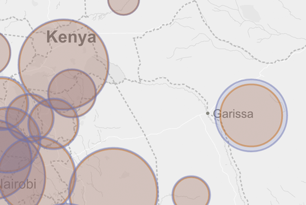  
**Figure 12.** Girls and boys distinguished by different color circles.

Let's further improve upon this visual design by changing the default stroke weight to 1 (100%), give each stroke a weight of 2, and make the fillOpacity value zero (who says we have to fill this circles?). So, our code for coloring the girls circles will look like this:

```javascript
color: '#D96D02',
opacity: 1,
weight: 2,
fillOpacity: 0,
radius: calcRadius(Number(feature.properties.G1))
```

Doing the same for the boys gives us a visual result that more easily allows for comparison of the two features.

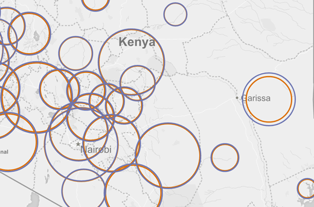  
**Figure 13.** Feature circles colored with fillOpacity at zero.

Pause for a moment now to consider this design solution for achieving the objective of comparing the two feature sets. While we could have imagined an interaction solution (giving the user the ability to toggle on and off &ndash; the overlay operator in Roth speak &ndash; these two layers for comparison), this was not necessary. A simple static design solution is more simple and potentially more effective! Recall the discussion of **when** to apply cartographic interaction above?

### Interface design: providing user enablement to sequence through the data

While our first map objective of comparing the girls' and boys' enrollment rates has been achieved through drawing hollow circles and giving each a distinct color, the second objective is also one of comparison: allowing the user to compare the rates across the grades. This is similar to earlier maps when we wanted the user to compare unemployment rates across time. Considering Roth's (2013) "work operators" described above, the **sequence** operator best allows us to achieve this particular objective. A slider widget is again a good choice for enabling this form of map interaction.

We've already run through the development of this form of interaction. We'll again consider three components of the design: 1.) the structural (HTML) element, in this case a native HTML `<input>` element; 2.) the CSS rules governing its position on the interface (and eventually its look and feel); and 3.) the behavioral (JavaScript) functionality that will make the interface do what the user wants (i.e., sequence through the grades and have the map update accordingly). Let's handle the first two first.

In this case, we'll add our markup to the HTML. While all we need for the most basic functionality is the `<input>` element itself, we'll wrap it in a `<div>` element and give it an `id` attribute so we can both style it with CSS rules (and potentially select it with JavaScript later).

```html
<div id="ui-slider">
     <input type="range" min="1", max="8", value="1", step="1" class="slider">
</div>
```
HTML and CSS are often good to develop in tandem, especially when we're going to use the CSS to help position the HTML element on the document (the actually look and feel of the design can wait until later). For now we'll select that element ui-slider using its `id` attribute and give it a `position` of `absolute`. This will place it at the x:0, y:0 (top left) of it's parent object (the page body itself). In other words, it sticks it up in the upper left corner along with the default Leaflet zoom controls. While we'll worry about where it will be placed within the interface later, for now let's move it to the right  and down a bit (with the `top` and `left` properties) so we can access it when testing the JavaScript. Add the following CSS rules to the map:

```css
#ui-slider {
    position: absolute;
    top: 20px;
    left: 60px;
}
```
The following animation demonstrates how the inactive the slider widget is placed on the map using absolute positioning. Note how when using absolute positioning there is no need to prevent the propagation of the panning functionality from the map underneath it, as we needed to when adding the slider using the Leaflet L.Control class.

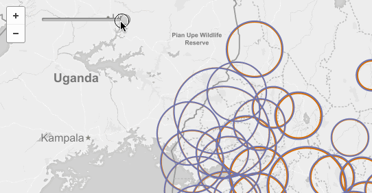  
**Figure 14.** Slider widget with no JavaScript functionality.

**Technical aside:** How is the slider placed *on top* of the map (i.e., why isn't it beneath it)? Our CSS rules have given both the map div and the ui-slider div elements absolute positioning. When HTML elements are written, elements lower down in the markup are rendered to the DOM after those above them (and hence on top within the visual stacking order). Be aware that CSS z-index property can be used to override this stacking order.

Now that our UI slider element is available, let's work on the JavaScript that will allow the user to slide the widget and sequence through the 8 grades to update the size of the circles. How do we go about approaching this, given our current script?

Currently, our program loops through all the features (for both girls and boys layers) within our `drawMap()` function and applies a Leaflet `Path` style option `radius` with the value returned from our `calcRadius()` function. In a similar way as we've seen before, we want to separate out the functionality that draws the circles and the functionality that (re)sizes them. In this way, we can repeat the latter (resizing) without having to remove and redraw the symbols each time we resymbolizes the map.

Modify the script by removing the options `radius: calcRadius(Number(feature.properties.G1))` and `radius: calcRadius(Number(feature.properties.B1)`) from within the `drawMap()` function. We're going to move this functionality into a new function we'll name `updateSymbols()`.

At the end of the `drawMap()` we'll call this new function, passing the variables `girls` and `boys` (which now reference our Leaflet GeoJson layers). Within that function, we'll simply loop through each of those GeoJson layers using Leaflet's `eachLayer()` method, and use the `setRadius()` method to resize each. We can continue using our function call to our `calcRadius()` function without modifying that function at all.

```javascript

function updateSymbols(girls, boys) {

    girls.eachLayer(function(layer) {
        layer.setRadius(calcRadius(Number(layer.feature.properties.G1)));
    });

    boys.eachLayer(function(layer) {
        layer.setRadius(calcRadius(Number(layer.feature.properties.B1)));
    });
}
```

Refreshing the map now gives us no noticeable difference on the UI end. We see the symbols are still draw with a particular radius (the later happening instead within this new function). We've successfully refactored our code and are now ready to attached an event listener to that UI slider.

Let's consider a couple more aspects of this refactoring process before moving on. For one, we see that the `updateSymbols()` function is currently using a hard-coded `G1` and `B1` to access the grade one data attribute values. Since we want our sequencing UI to access different grades, we need to substitute these with a variable. Let's start by creating a new global variable to store the currently displayed grade level (we can write this up above our function beneath the `map` variable) Let's call it `currentGrade` and give it an initial value of `1`. We'll plan on updating this variable when we sequence through the attributes using the UI slider.

How then do we access the girls AND the boys attributes below in the `updateSymbols()` function? We'll want to replace those property names with the variable, but we need the "G" and the "B" concatenated to it first. For this we'll shift our syntax from dot notation to bracket notation:

```javascript
girls.eachLayer(function(layer) {
    layer.setRadius(calcRadius(Number(layer.feature.properties['G'+String(currentGrade)]));
});

boys.eachLayer(function(layer) {
    layer.setRadius(calcRadius(Number(layer.feature.properties['B'+String(currentGrade)]));
});
```

Let's now continue by writing a new function named `sequenceUI()` (we can write this function at the bottom of our script). This code will be similar to scripts we've written in previous modules, so we can refer to that code, apply the same technique here, and change the necessary values and attributes.

Conceptually, within this function we want to do the following:

* select the slider widget
* listen for any change (i.e., the user sliding the widget)
* when the change occurs, use the current slider position to determine a new data attribute to use for the resizing
* call the necessary functionality to update these symbols.

The trick is, the way we've written our code so far, the `updateSymbols()` function is expecting to receive two arguments, our `boys` and `girls` variables created in the `drawMap()` function. While we could write this code in a way for those variables to be passed between all these functions, occasionally it's desirable to quickly move forward to get the working prototype working (we can always refactor to make the program more efficient later). 

So in this case, we'll create two more global variables for `boys` and `girls`, place these at the top of our script, and remove the `var` declaration within the `drawMap()` function. Instead of being declared here, they'll simply be reassigned the GeoJson layer values. We'll also modify the `updateSymbols()` function signature so it doesn't receive any parameters (the function will have access to the global variables `boys` and `girls`).

Our function for achieving the sequencing can now look like this:

```javascript
function sequenceUI() {

    $('.slider')
        .on('input change', function() {
            currentGrade = $(this).val();
            updateSymbols();
        });
}
```

We'll want to prepare an additional interface components at this time (likely  falling within Garrett's **information design** goal of the skeleton plane): an indication to the user of what current grade level they're looking at. 

Additionally, we may wish to include a legend indicating what the sizes of these proportional symbols mean. A solution for the legend is demonstrated below, but is optional for this map. Recall that by using a retrieve operator, the user can determine what the relative size of these circles represent. 

We can program both of these to update dynamically with changes in the slider widget.

#### Building a (temporal) slider legend

Let's tackle displaying the current grade level first. This is similar to a "temporal legend" we would provide if the user were cycling through data of days, months, years, etc. Again, like most of our web map development, we need to think about the HTML, the CSS, and the JS to make this design element work.

First let's add a simple `div` element to our HTML. We'll give it an `id` attribute of `grade` (so we can select it with the CSS and/or JS later). We can write a title for this output "Grade: " and follow that by opening and closing `<span></span>` tags (recall that span tags are like div tags but are [used to group inline elements, rather than block level elements](http://www.w3schools.com/tags/tag_span.asp)). We'll leave the contents of these span tags empty, because our goal is to use the JavaScript to insert the current grade level within these tags when we move the slider. We can also insert an initial value of `1` because we'll load the map displaying the first grade.

```html
<div id="grade">Grade: <span>1</span></div>
```

Before we get into the JavaScript, we need to use a couple CSS rules to give these div and span elements some width, height, and positioning on the page. Let's add the following CSS rules to our document.

```css
#grade {
        position: absolute;
        left: 60px;
        top: 50px;
        padding: 6px 15px 8px;
        background: whitesmoke;
        border: 2px solid #d3d3d3;
}
#grade span {
    /* future style rules here*/
}
```

Note that we're really just positing this on the page so it's *functional* for us at the moment. The background and padding properties add some basic aesthetic styling to it, but again we're mainly doing this so we can clearly see and test the output.

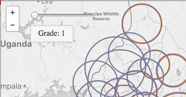  
**Figure 15.** A minimally-styled div element for the current grade placed on the map.

Now we can consider how to populate and update those span tags with the current grade level. If we recall, above we created a global variable named `currentGrade` to keep track of the current slider position and update the proportional symbol sizes (by accessing the associated data attribute values). We updated this variable within the `sequenceUI()` function, so let's go there within our JavaScript and consider how to achieve our goal.

Within this function, before we select the slider element and listen for changes, let's select the span tag within our div element using that id attribute of `grade` and assign it to a new variable:

```javascript
var output = $('#grade span');
```

We make this selection here and store it as a variable because we don't need the script making that selection every time we move the slider (though fast, selections to slow the performance of the application down). If we make the selection once here, it will already be available within the slider every time the user updates.

Now within the callback function of the input change of the slider, let's simply update the contents of those span tags with the current grade. Our entire `sequenceUI()` function should look like this now:

```javascript
function sequenceUI() {
    
    var output = $('#grade span');

    $('.slider')
        .on('input change', function() {
            currentGrade = $(this).val();
            updateSymbols();
            output.html(currentGrade);
        });
}
```

Saving these changes in the browser and testing should result in the grade level being updated as the slider moves.

#### Building a proportional symbol legend

**NOTE: The code within this section is challenging and should be considered an optional challenge.**

Now on to providing the user with a legend for those proportional symbols. 

Once again, let's provide some HTML to first structure our elements. We're again going to build this using some HTML div tags and give them an id attribute of `legend`. Within these tags, we'll provide a legend title within some header tags. Next, we'll write an sag element and give it a class attribute of `legend`, along with width and height values.

```html
<div id="legend">
    <h3>2014 enrollments per county</h3>
    <svg class="legend" width="200" height="200"></svg>
</div>
```

Now lets write a CSS rule for this legend, again very basic now just to position it on the page:

```css
#legend {
    position: absolute;
    right: 0;
    bottom: 30px;
}
```

Next we need to do some significant refactoring of our code (yes, once again) before we write a `drawLegend()` function. What we need to draw the legend is to know the max, min and some middle value (perhaps median or mean) with which we can draw 3 circles. We can expect to use the current `calcRadius()` function. How do we derive these values?

We could process the data somehow beforehand, or even have a separate function process the data for use when we first load it to derive a max, min, and median value for each grade level. However, if we think about the script we've written, we're already looping through all the features each time we update the map with the slider (within the `updateSymbols()` function). We can take advantage of this looping mechanism to store all the values for that grade level in an array, and then pass this array into a `drawLegend()` function. 

Let's modify our `updateSymbols()` function then to do that (remembering the call this new function and pass in the array we've just created). Note the comments within the code:

```javascript
function updateSymbols() {
          
    var radius,  // variable to hold each radius
        allRadii = [];  // empty array to hold all values

    girls.eachLayer(function(layer) {
                // store a reference to the radius value
                radius = calcRadius(Number(layer.feature.properties['G'+String(currentGrade)]));
                // use it to set the radius of the layer
                layer.setRadius(radius);
                // push it into the array
                allRadii.push(radius);
            });

            boys.eachLayer(function(layer) {
                radius = calcRadius(Number(layer.feature.properties['B'+String(currentGrade)]));
                layer.setRadius(radius);
                allRadii.push(radius);
            });   
             
    drawLegend(allRadii);
}
```

Recall how we hard-coded a "scale factor" value to multiply by our radius values within the `calcRadius()` function (to fit the circles appropriately to the map and screen size?). Our `drawLegend()` function is going to want to use this same number to reverse-calculate these radii values for displaying the raw numbers in the legend. Rather than hard-coding this value (`.06`) twice, let's create one more global variable and assign it there. Our global variables now look like this:

```javascript
    var currentGrade = 1,
        girls,
        boys,
        scaleFactor = .6;
```

We can than substitute the variable name for `.06` within `calcRadius()` and use it within our `drawLegend()` function.

We're also going to want a quick way to quickly pull the min, max, and median values from our `allRadii` array within this function. We could code a simple solution to this ourselves, or we could again load the Simple Statistics JavaScript file into our project and use that. So let's add that to the head of the document.

```html
<script src='https://cdnjs.cloudflare.com/ajax/libs/simple-statistics/1.0.1/simple_statistics.min.js'></script>
```

Next, let's write a function that achieves the following:

1. selects our svg element (by using it's class name of `legend`)
2. creates an object (assigned to a variable `circles`) to hold the calculated values of max, median, and min from the `allRadii` array
3. creates an empty string (stored as the variable  `svgCircles`) for us to write the HTML/SVG that we'll write the text to
4. create another function used within this function that will reverse calculate our radii for writing the raw numbers to our legend symbols
5. loop through our object holding our max, median, and min values to:
    a. concatenate a new SVG circle element to our `svgCircles` string using the value from the `circles` object
    b. concatenate a new SVG text element to our `svgCircles` string using the return values from the `reverseCalc()` function
6. finally, add the `svgCircles` string as html to the `legend` element

```javascript
function drawLegend(allRadii) {
            
    var legend = $('.legend');

    var circles = {
        max: ss.max(allRadii),
        median: ss.median(allRadii),
        min: ss.min(allRadii)
    }

    var svgCircles = '';
    
    var reverseCalc = function(radius) {
        return Math.round((Math.pow(radius/scaleFactor, 2) * Math.PI));
    }
    
    for (var circle in circles) {
        
        svgCircles += '<circle cx="'+ 100 +'" cy="'+ (circles[circle] - 180) * -1 +'" r="'+ circles[circle] +'" stroke="#d3d3d3" stroke-width="1" fill="ghostwhite" />';
        
        svgCircles += '<text x="'+ 80 +'" y = "'+ (circles[circle] - 160) * -1 +'" fill= "green">'+ reverseCalc(circles[circle]) +'</text>'
    }
    
    legend.html(svgCircles)
    
}
```

The legend code here is fairly complicated (see supplementary video). The key values to adjust within the statements creating the SVG `<circle>` and `<text>` elements are those of the `cx` attribute (how far the elements are moved right along the x axis form a top, right point of origin), and the negative numbers (`-180` and `-160`) within the `cy`'s values, which are moving the elements down the y axis after being flipped.

### Retrieving specific information with an info window

While the Leaflet.js/Mapbox.js libraries provide the nifty popups for easily allowing a user to access information in the default popup &ndash; and providing the means for this popup to be styled in different ways  &ndash; let's consider building a custom information window for 1.) holding structured content the way we wish, and 2.) behaving how we'd like when the user interacts with our features.

This is very similar to information panels we've built in previous lessons that display additional information about selected features. In those cases we merely placed the info panel somewhere within the interface layout using absolute positioning. In this case, we'll add some additional code that allows the position of the info window to follow the mouse (or to be placed where the user touches the screen).

Let's again start with the HTML and again use a div element and give it an id attribute of `info`. Within that we'll structure 3 lines of content using paragraph tags (you may also consider using a list element for this). We'll add some additional classes to the last two paragraph tags for styling (`girls` and `boys`), as well as two sets of empty span tags. We'll use these span tags to dynamically insert content on the mouseover: the first will hold the current grade level, and the second will be the raw totals.

```html
<div id="info">
    <p>County: <span></span></p>
    <p class="girls">girls <span></span>: <span></span></p>
    <p class="boys">boys <span></span>: <span></span></p>
</div>
```

We'll then provide some basic style rules, like our other elements, simply placing them in the window so we can get their functionality working. In this case, we'll also make the #info div display as `none` (we'll want it to appear only when we're mousing over the features, so initially it won't be visible on the interface).

```css
#info {
    position: absolute; 
    max-width: 200px;
    right: 15px;
    top: 15px;
    display: none;
    background: whitesmoke;
    border: 2px solid #d3d3d3;
    padding: 2px 6px;
}

#info p {
    margin: 3px 0 4px;
}
```

Now, let's call a new function named  `infoWindow()` (we only want to call this once, so we can write this call directly beneath where we call `sequenceUI()` at the end of the `drawMap()` function).

Now let's write this `infoWindow()` function. Within it, we're going to make use of one of [Leaflet's event methods](http://leafletjs.com/reference.html#events): the [`.on()`method](http://leafletjs.com/reference.html#events-on) which is an alias for adding an "event listener." This method will listen for two specific user interactions, the "mouseover" and the "mouse out" event.

We're going to add these to the (Leaflet GeoJson) layergroup we're using to represent the boys, partly because we added this layer last so we know it's on top (and therefore the mouse or touch event will reach it), and partly because we see the boys circles are larger than the girls (so again we know the mouse and touch events will hit the target).

Recall that both the `boys` and `girls` Leaflet GeoJson layers contain all the data, so even though we're using the boys features to pull the information, the user will simply experience the hover/retrieve functionality as if it were a single feature, but we'll be able to pull information for both the girls and the boys into our info window.

Within the callback function of the mouseover, we'll first access the properties of that specific feature using the event passed to the callback function (`e`) and create a shortcut to those properties assigned to the variable `props`. We can then select our infoWindow div using JQuery and display it (using the [JQuery method `.show()`](http://api.jquery.com/show)).

We then want to populate the infoWindow with the following information:

* the name of the current county the user is hovering over
* the current grade level selected by the slider widget
* the raw total for the girls for that county and current grade
* the raw total for the boys for that county and current grade

Note how we're able to differentiate between the two span tags within each paragraph using the CSS pseudo-selectors  of `first-child` and `last-child`.

We can also give this user an additional visual affordance that they've moused over that symbol by giving it a fill color.


```javascript
function infoWindow() {

    var info = $('#info');
          
    boys.on('mouseover', function(e) {
    var props = e.layer.feature.properties;
       info.show();
        $('#info span').text(props.COUNTY);
        $(".girls span:first-child").text('(grade '+String(currentGrade)+')');
        $(".boys span:first-child").text('(grade '+String(currentGrade)+')');

        $(".girls span:last-child").text(props['G'+String(currentGrade)].toLocaleString());
        $(".boys span:last-child").text(props['B'+String(currentGrade)].toLocaleString());
        
        e.layer.setStyle({ fillOpacity: .6 });
        
    });

    boys.on('mouseout', function(e) {
        info.hide();
        e.layer.setStyle({ fillOpacity: 0 });
    });
}
```

At this point in our design/development process, we now have a fairly rough working looking prototype. We've accounted for the interface design (i.e., we've enable the user to interact with the map), and this interface serves the information needs. This animation demonstrates the functionality of our working prototype.

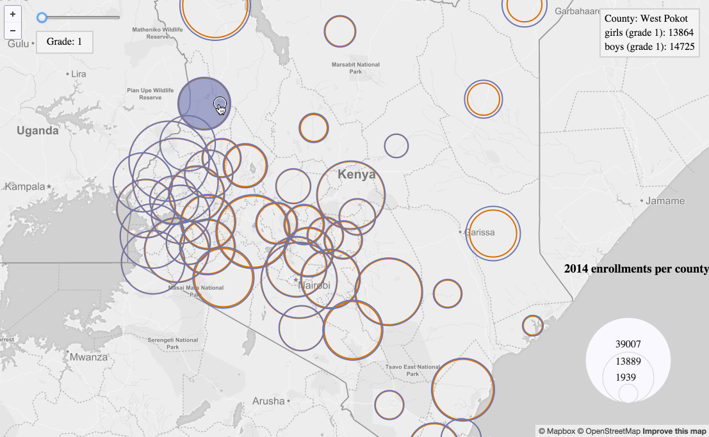  
**Figure 16.** Placing a minimally-styled div element for the current grade not the map.

We're nearly finished with our initial design work for the interaction requirements. One final enhancement we can consider is whether we want the info window to follow the mouse. This has the advantage of not drawing the user's eye from the target feature of interest. It can also feel like a smoother user experience.

To achieve this with JavaScript, let's again use JQuery to select the document itself and listen for any mouse movement. Note that this is a very "expensive" event listener, as the contents within the function will fire continuously as the mouse moves. Using the reference to the info window JQuery selection (i.e., the variable `info`), we use the [JQuery method CSS](http://api.jquery.com/css/) to position the info window relative to the mouse position (log to Console the value of `e` in this example, and `e.pageX` to better understand what's happening). We can also apply some nifty conditionals to make sure our info window does move off the page to the top or the right.

The comments within this example (which should be written within your `infoWindow` function) further explain how it works.

```javascript
 $(document).mousemove(function(e){
    // first offset from the mouse position of the info window
    info.css({"left": e.pageX + 6, "top": e.pageY - info.height() - 15}); 

    // if it crashes into the top, flip it lower right
    if(info.offset().top < 4) {
        info.css({"top": e.pageY + 15});
    }
    // do the same for crashing into the right
    if(info.offset().left + info.width() >= $(document).width() - 40) {
        info.css({"left": e.pageX - info.width() - 30});
    }
});
```

Once this is complete, we have a functional prototype. Hurray! But don't invoice the client quite yet. We still want to make this look good and improve the design to (again) facilitate an effective user experience.

## The surface plane: sensory design

As Garrett writes, at the top of our design model we have the **surface plane**, that which involves our design of "those aspects of the product our users will notice first." Within the surface plane the content, functionality, and aesthetics come together while "fulfilling all the goals of the other four planes." This is where we can start to make the map and interface look nice and a pleasure to use.

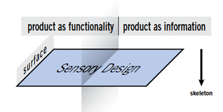  
**Figure 18.** Surface plane.

As we enter the surface plane we'll need to begin thinking more concretely about the specifics of the visual design. These will include commitments to color choices, typefaces, and whitespace.

We're currently starting with our complete though largely un-styled working prototype:

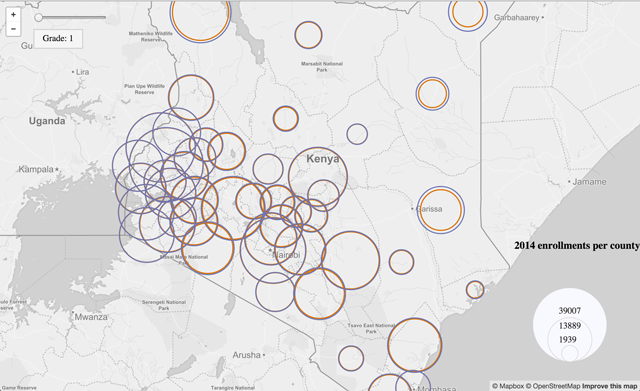  
**Figure 20.** The un-styled prototype map.

Through this sections we'll transform this rough looking prototype into a better looking and more usable page layout. Much of the visual design (the aesthetic "look and feel") of the map interface is handled by CSS. This section will walk us through transforming our rough working prototype into the finished product. Again, we need to refer back to our wireframes and prototypes for this section.

### choosing colors

Choosing colors are an important yet challenging part of any design process. In the case of this map, we need to think of colors in two sense: 1.) the colors we're for the data visualization itself (i.e., the proportional symbols), and 2.) supplementary colors used across the interface and for anecdotal text.

Earlier we identified a couple colors we used for encoding the girls and boys' circles (an orange `#D96D02` for girls and a purple `#6E77B0` for the boys). For the rest of the layout and design, we're going to try to limit ourselves to one other accent color, and then use an off-white (for backgrounds) and a muted black color for text. Let's go with a green `#1C9976` for the accent and a muted black color of `#d3d3d3`.

**Protip:** It's often handy to establish a color scheme and copy the hex values for the colors into commented CSS rules for easy access. For help picking good color schemes, consider [exploring some color schemes by Kuler](https://color.adobe.com/explore/newest/).

### choosing a typeface

Let's also address the typeface quickly at this point. The default text is a serif font. Let's instead apply a new web font to our entire document (we can also use another font on specific elements if we wish). Let's go to [Google fonts](https://www.google.com/fonts) and search for a font called [Work Sans](https://www.google.com/fonts/specimen/Work+Sans).

Let's give ourselves [3 different font weights to work with](https://www.google.com/fonts#UsePlace:use/Collection:Work+Sans:400,500,600), the normal (400), medium (500), and semi-bold (600). In the head of our document, we can load the new font when the page loads by placing this text within it:

```html
<link href='https://fonts.googleapis.com/css?family=Work+Sans:400,500,600' rel='stylesheet' type='text/css'>
```
Now let's make this the default font for our entire document by specifying it within the `body` tag:

```css
body {
    margin:0;
    padding:0;
    background: whitesmoke;
    font-family: "Work Sans", sans-serif;
}
```

Note that we're only using one typeface here. It's best to use no more than two if possible. Consider searching the web for [web font pairings](http://bfy.tw/5DOm) to get advice and ideas for what fonts work well together.

### adjusting the page layout

Let's first apply some styles for creating the large side panel to the left of the map. We'll need an HTML element for this, again built using div tags. It doesn't matter too much if we place this HTML above or below our map element and the other divs used to create the interface. For now I'll simply place it above, and give it an id attribute of `side-panel`.

```html
<div id='side-panel'></div>
<div id='map'></div>
```

Now we want to adjust the width of both the map and the side panel. While in the past we may have used a more "fixed-width" layout, we can use percentages here to create a more fluid layout.

We can apply the following styles. Note that we're giving the side panel absolute positioning as well, and sticking it to the left side. The top and bottom rules ensure that it fills the entire space (because without content within it, a div element has no height). We'll stick the map to the right side with a right property. Also notice how we're dividing the full 100% width of the screen between the two elements. Be careful with this though, because while the two div elements' widths together may sum to be 100%, other aspects of these elements such as borders and padding may push the width beyond 100% resulting in unexpected layout issues. Also, note here that I've simply given the side panel a temporary background of green to better see it's extent.

```css
#side-panel {
    position: absolute;
    left: 0;
    top: 0;
    bottom: 0;
    width: 33%;
    background: green;
}
#map {
    position:absolute;
    top:0;
    bottom:0;
    right: 0;
    width: 67%;
}
```

Re-rendering the page now will give us this layout.

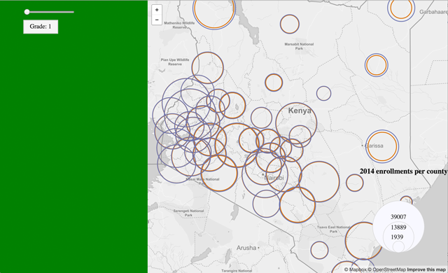  
**Figure 21.** Page layout with a side panel added.

### placing UI elements on the map/page

Next, let's work on placing those slider UI elements where we want them, as well as improving their visual appearance. We're currently using absolute positioning to take the slider and the grade level (temporal) legend div element out of the normal document flow. We can simply adjust the `left` property of the CSS. 

Since we're currently making that side panel 33% wide, we can give these elements a `left` property value a percentage a bit higher than that until they're placed where we want them. We'll also replace the `top` property with a `bottom` one to position the slider and output at the bottom of the window.

For instance, adjusting the CSS properties like this:

```css
#ui-slider {
    position: absolute;
    bottom: 20px;
    left: 36%;
}
#grade {
    position: absolute;
    bottom: 60px;
    left: 36%;
    padding: 6px 15px 8px;
    background: whitesmoke;
    border: 2px solid #d3d3d3;
}
```

This results in positioning the two div elements like this at the bottom left corner of the map:

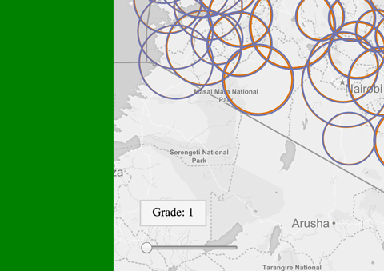  
**Figure 22.** Positioning the slider UI in the left corner of the map.

We'll then add a few styles to enhancing the visual design of the slider UI in accordance with our mockups above. Try entering each new style rule once at a time to see the resultant rendering (you can also try tweaking the property values to better understand how they're operating).

Also note a couple things here. We've changed the default width of the slider div element using the id selector `ui-slider` to be 200px wide. The actual input element (with a class id of `slider`) then also needs to be given a width of 100% to fill that div element. We've also chosen to style the span element content for the grade output to be larger (we want the user to clearly see which grade it current is). 

```css
#ui-slider {
    position: absolute;
    bottom: 20px;
    left: 36%;
    width: 200px;
    padding: 8px 15px 4px;
    background: #1C9976;
    border-radius: 3px;
    color: whitesmoke;
}
.slider {
    width: 100%;
}
#grade {
    position: absolute;
    bottom: 60px;
    left: 36%;
    padding: 6px 15px 8px;
    background: whitesmoke;
    border: 2px solid #1C9976;
    padding: 6px 15px 8px;
    border-radius: 3px;
    color: #1C9976;
    font-size: 1em;
}
#grade span {
    font-size: 1.3em;
    font-weight: 500;
}
```

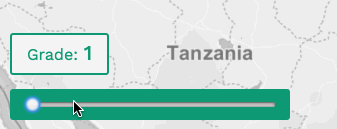  
**Figure 23.** The styled UI slider widget with legend.

### styling the info window

The slider UI is now in good shape. Let's turn our attention to styling the info windows. Again, experiment with applying the following styles to the elements we built for the hover info window (and perhaps look up these properties in such resources as the [MDN CSS reference](https://developer.mozilla.org/en-US/docs/Web/CSS/Reference) or the [w3cSchools CSS tutorial](http://www.w3schools.com/css/)).

An important thing is that we're seeking to establish some visual consistency between our UI elements. Thus we're using very similar rules for the font colors, background colors, typeface, padding, etc for this window as the UI slider output. Also notice how we're specifically styling the paragraph within the `#info` div element (so this style won't be applied to other paragraph elements in our document). This is known as [CSS specificity](https://www.smashingmagazine.com/2007/07/css-specificity-things-you-should-know/). We're also using this specificity to select and style the last span element within this div structure as well.

Additionally, we're going to color the output for the girls and boys with the same colors we use to encode the circles. While we'll make a legend further indicating this to the user later, this is a way to encode that same information, reinforcing to the user which color is which.


```css
#info {
    padding: 8px 15px;
    background: whitesmoke;
    border: 2px solid #1C9976;
    border-radius: 3px; 
    color: #1C9976;
    position: absolute;
    font-size: 1em;  
    max-width: 200px;
}
#info p {
        margin: 3px 0 4px;
}
.girls {
    color: #D96D02; 
}
.boys {
    color: #6E77B0;
}
#info span:last-child {
    font-size: 1.3em;
    font-weight: 500;
}
```

The result of these style rules will give us an info window that looks like this:

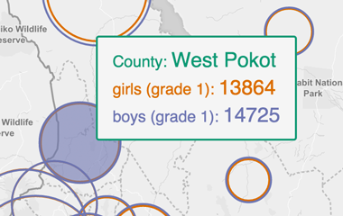  
**Figure 24.** The styled info window.

### Styling the proportional symbol legend

Now let's tackle that proportional symbol legend. We've already positioned it roughly where we want it in the lower right corner. Again, we're aiming for visual consistency here with these elements, so we can apply some CSS rules drawing from the elements we've already designed.

Styling the legend is a bit tricker, largely because we've written some JavaScript to dynamically build those SVG circles and place them within the div element. It therefore requires a bit of tweaking to get a result that looks like this:

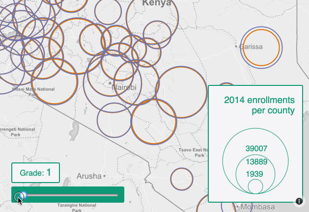  
**Figure 25.** The styled legend.

I achieved this result using the following CSS rules for styling the legend div element and its h3 element we're using for the legend title (note that I also wrote a `<br>` tag after the word `enrollments` within the h3 tag to get `per county` to break to the next line):

```css
#legend {
    position: absolute;
    right: 15px;
    bottom: 20px;
    padding: 8px 15px;
    background: whitesmoke;
    border: 2px solid #1C9976;
    border-radius: 3px; 
    color: #1C9976;   
    width: 160px;
    height: 220px;
}
#legend h3 {
    text-align: right;
    font-weight: 500;
    margin: 10px 0 20px;
}
```

I then returned to the fairly mystifying JavaScript code and changed the stroke color of the circles and the fill color of the text to match our `#1C9976` green. Importantly, I adjusted the `cx` values (which are placing our SVG circles and text a certain number of pixels to the right of the top,right origin), as well as the negative values we're moving the SVG circles and text from the top,right origin down the `cy` axis.

```javascript
svgCircles += '<circle cx="'+ 80 +'" cy="'+ (circles[circle] - 140) * -1 +'" r="'+ circles[circle] +'" stroke="#1C9976" stroke-width="1" fill="ghostwhite" />';

svgCircles += '<text x="'+ 60 +'" y = "'+ (circles[circle] - 120) * -1 +'" fill= "#1C9976">'+ reverseCalc(circles[circle]) +'</text>'
```
Our map UI elements and legend are now styled according to our specification.

### Styling the side panel content

For a final stage, let's now turn to styling the left side panel and contents within it.

First, let's build up some structured content for our map. We'll want to reserve the h1 tag for a meaningful (perhaps even catchy) title, and provide some sub titles using the h2 and h3 tags. Perhaps we want to provide some written anecdotal summaries of what the map takeaways are, and supplementary static graphics (produced in programs such as Adobe Photoshop/Illustrator, their open source equivalents [GIMP](https://www.gimp.org/)/[Inkscape](https://inkscape.org/en/)).

The following HTML markup (problematically) uses some lore ipsum text and an image named *legend.png* stored in a relative directory named *images*.

You can see that I've also chosen to move the `<div id='map'></div>` markup one line above the `<div id='side-panel'>` so that I may apply a thin green border to the side panel and ensure it sits above the map (again, recall when we said that borders and padding may push the elements beyond 100% width?).

```html
<div id='map'></div>
<div id='side-panel'>
<h1>Student attrition rates in Kenya</h1>
<h2>2014 enrollment rates for boys and girls</h2>
<p>Lorem ipsum dolor sit amet, consectetur adipiscing elit. Nam mollis laoreet elementum. Vestibulum ante ipsum primis in faucibus orci luctus et ultrices posuere cubilia Curae; Donec mi eros, rutrum sed orci eget, venenatis varius est. Pellentesque accumsan est vitae risus malesuada fringilla.</p>
<p></p>
<p>Cras at massa in leo aliquam fermentum. Nunc auctor vestibulum sagittis. Aliquam pulvinar, ipsum in pulvinar tincidunt, enim metus fermentum tellus, quis accumsan ex lorem ut ante. Phasellus fermentum orci eget interdum ultrices. Proin vitae magna id odio ultricies placerat quis id ex. Aenean volutpat volutpat gravida.</p>
<h2>About this map</h2>
<p>Phasellus in ante nec augue pulvinar pellentesque id vitae nunc. Donec tincidunt metus metus, sed rhoncus ex vehicula sed. Donec erat felis, dignissim bibendum metus ut, tincidunt dictum ligula. Aliquam interdum gravida enim id aliquet. Duis sed ex sed mi aliquam hendrerit. Nunc egestas in lorem ac consectetur. Donec quis rhoncus metus.</p>
<h2>About the data</h2>
<p>Phasellus in ante nec augue pulvinar pellentesque id vitae nunc. Donec tincidunt metus metus, sed rhoncus ex vehicula sed. Donec erat felis, dignissim bibendum metus ut, tincidunt dictum ligula. Aliquam interdum gravida enim id aliquet. Duis sed ex sed mi aliquam hendrerit. Nunc egestas in lorem ac consectetur. Donec quis rhoncus metus.</p>
</div>
```

We'll then modify the side panel's styles with the following CSS rules. Note that the `overflow-y` property allow us to fill this div with content extending beyond the bottom of the screen without creating a large white space beneath the map to the right. The map will remain locked to the extent of the window, and side panel content can scroll down.

```css
#side-panel {
    position: absolute;
    left: 0;
    top: 0;
    bottom: 0;
    width: 33%;
    background: whitesmoke;
    border-right: 2px solid #1C9976;
    overflow-y: scroll;
}
```

We'll then style the rest of the side panel as follows:

```css
h1 {
    padding: 8px 25px 8px 15px;
    margin: 0;
    background: #1C9976;
    color: whitesmoke;
    font-weight: 400;
    font-size: 1.5em;
    text-align: right;
}
h2 {
    margin: 0;
    padding: 8px 25px 8px 15px;
    color: #1C9976;
    font-weight: 500;
    font-size: 1.2em;
    text-align: right;
}
#side-panel p {
    margin: 8px 0 4px; 
    padding: 0 25px 0 15px;
    color: #3d3d3d;
    text-align: right;
    font-size: 1em; 
}
#side-panel p:after {
    content: '';
    display: block;
    clear: both;
}
#side-panel img {
    float: right;
    margin: 0 0 15px 15px;
}
```

These style rules result in the final visual improvements of the side panel and lend itself to an overall balanced map.

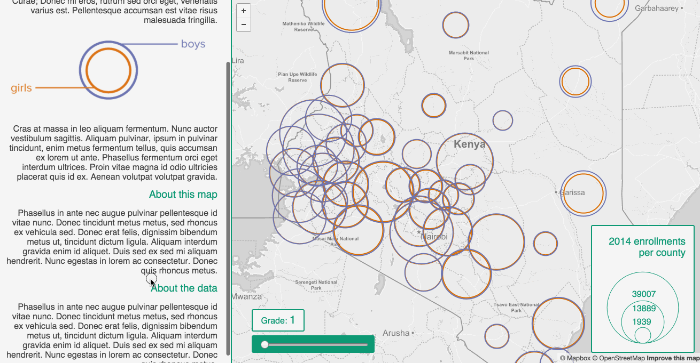  
**Figure 26.** A finished map.

While the processes described in Modules 04 and 05 can be formalized, good (successful) design comes as much through practice,  experience, and looking at good examples as it does from following a specific formula for achieving a user friendly interface. To conclude this lesson, consider some final principles of good cartographic interface design:
 
 * interaction and interface design is an iterative process
 * an interface should have clear point of entry (often a "call to action") and a suggestive layout
 * an interface should have a coherent design
 * the interface design should reinforce the map design (i.e., consistent colors, typeface, etc)
 * the interface should have economy of design and maximize the information-to-interface ratio (less is more)
 * as with all design, the interface should have a clear visual hierarchy and layout with proper visual balance


## Resources

* Roth (2013). "Interactive Maps: What we know and what we need to know." *The Journal of Spatial Information Science.* 6: 59-115. Accessible as PDF through [http://www.josis.org/index.php/josis/article/view/105/82](http://www.josis.org/index.php/josis/article/view/105/82).