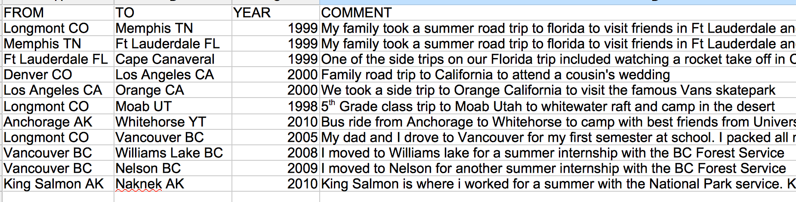

Final Project - Roads I've Travelled Diary Map
====================

General Concept
---------------
My concept for the final project is to create an interactive spatial diary cataloguing the roads I have travelled through my life. I've been very fortunate to criss-cross north America, and I think it would be a neat spatial visualization to see these roads catalogued by time period. I'd like to make it to share with family and friends so they can understand where I was in certain years. 

User Persona
--------------
The typical user would be a friend, relative, or stranger on the internet that is interested in learning more about me. They could load the map and see by the roads I was travelling at certain points of my life where I was living and what sort of things I was doing for vacation and work. Certainly the user would be novice, so the map would have to start running a timelapse showing roads travelled when the user clicked on it automatically. If users wanted to explore more a slider bar showing the cumulative roads would appear at the bottom and as it is slid from left to right the roads would cumulatively appear. Popup windows would provide more details and context to the curious user.

    
Data Source
-------------
The particularily interesting challenge with this map would be obtaining the vast network of line data. This project would use a hybrid approad to obtain this data:

####Data Source 1: Mapbox directions API

I would make a table detailing major road trips on highways I have taken during my life, and include a year column. For example the table would look like an extended version of this:

            
I will write a script to loop through these from and to values and append them to an Mapbox Directions API call, while storing the output in a library of geojson objects with the year and comments attribute appended as a geojson field. This would save a huge amount of time, as I could quickly build a table of all large road trips, feed it into the script, and then have a geoJSON file showing the routes. At this point I am guessing I will have 50-100 unique trips added to the table. I would assume that the route taken on the trip was the one that mapbox gives me (which would in most cases be correct). If an out of the ordinary route was taken, I would break it up into the separate destinations required to make the trip route correctly. For example see above where the trip to Florida is routed through Memphis to ensure that it does not take the default shorter route. It looks like the mapbox directions API does not work through Javascript, so I would loop throuh these values with a bash script in the command line.
            

####Data Source 2: Open Street Map Data
The second method of data capture would involve selecting the likely streets that I have traveled down while living in cities. This method would involve selecting an entire area of streets using data available from available layers in QGIS. For now I downloaded some generalized [Natural Earth road data](http://www.naturalearthdata.com/downloads/10m-cultural-vectors/roads/), and manually selected streets in Vancouver and Colorado. I then added a year column and exported this to the roadssample.geojson file contained in this folder. I would do this with about 5 more urban areas that I have lived in. I wouldnt be precise to the point where I individually selected every single road one by one within a city since that would be way too time consuming. Grabbing the general mass of an urban road network should convey to the user locations where I spent a lot of time and likley travelled all major routes.

Data Visualization and Appearance
------------------------
I would allow the user to sequence the map through time, with roads travelled appearing with an animation on the map and then fading to a static color. An example of the type of animation I would incorporate when each time sequence was introducted can be seen here: [cartodb twitter sunrise map](http://cartodb.s3.amazonaws.com/static_vizz/sunrise.html?title=true&description=true&search=false&shareable=true&cartodb_logo=true&layer_selector=false&legends=false&scrollwheel=true&sublayer_options=1%7C1&sql=&zoom=2&center_lat=22.917922936146045&center_lon=51.328125#) The map would gradually build to show the entire web of highways that I have travelled on. Areas with lots of infill would indicate places I had lived or spend considerable time in. Hopefully these areas would show as dense spots on the map just like this map of streets in North America: . Obviously each line would have to be a colour that contrasted the background, as I intend to use a simple base map to help the user orient themselves.

##User Interface
###Popup Windows
The comments descriptions in each line file could be fed into an info window that the user could click on. For the second data capture method I could write something like this for all values "I moved to Vancouver, BC when I was 18 to attend University. I lived there for 5 years and often return to visit." This would provide more contextual data and improve the diary function of the map.

###Time Sequencing and Slider Bar Implementation
To ensure that the user has success navigating the map, ideally the map would load and instantly start moving through the time periods (as in the twitter sunrise example), but also let the user adjust the slider bar at their own whim if they wanted to explore more. If this proves to be too difficult, I would likely start the map out at the last year of the sequence and allow the user who is more curious to adjust it back and forth in time. 