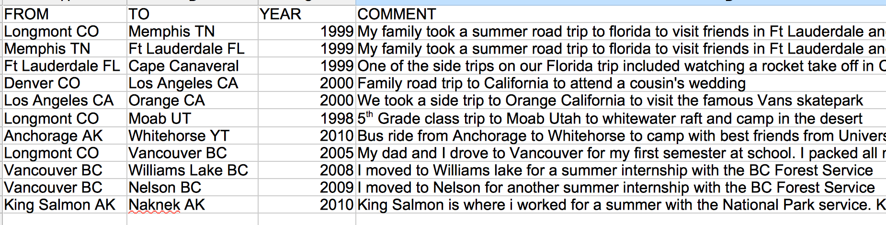

Final Project - Roads I've Travelled

#description of data topic (with an anticipated map title)

My map topic explores the concept of a spatial life diary - logging my movements in life over time and space. The idea for this concept originated from a life long realization that the human body is fragile, yet we are able to rocket it over vast expanses of geographical space rapidly and build up a substantial coverage of range over the time period of our lives. The locations you have travelled to and spent time in do in some ways fashion who you are as a person, so I think it is fitting that if someone would be interested in you they would also be intersted in exploring your life map.

Thus, I am creating a map that shows in the best ability possible all of the places I have been while embedding information about the time period I first visited those locations and my personal stories that accompny this information. I hope to show this to my friends and families, as well as present it as an idea that others can use to share stories about themselves.

#map objectives

The objective of this map is to very clearly illustrate where I have been in my life while providing an entertaining story. I hope that the user can quickly get an overall sense of the major locations I have been to in my life, while also gaining a better understanding of my past, stories, and personality. The map needs to be simple on the outset for anyone to get the overall picture, since I will be sharing it with people who are not very computer savvy. On the other hand, the map should provide functionality for those who are interested to dive into the embedded details to learn more.

#user needs articulated through a persona/scenario

Persona 1: An Elderly Relative
    This user needs the entire map to load on the page immediately and show the full map overview in a clear and concise picture. The user may not try exploring clicking, dragging, or panning without some encoragement. For example - I have heard many complaints from many that scrolling pages that are now in fashion like this one [this one](http://www.dangersoffracking.com/) are confusing because its not immediately clear for the new user how to move through the content, especially for those used to the old web where buttons and links were usually positioned at the top of the page and that scrolling down was only required when text that started at the top of the page ran off the bottom of the page. If this user is brave and takes the steps to interact with the map, there needs to be clear directions written on the map for buttons that would be intuitive to other web users (such as "Move this slider to change the Year", rather than just showing a slider with a "year" label).
    This user needs to also quickly understand what exactly the lines presented show, through use of a clear legend. In addition, the description of what the map is also needs to show as a side bar in clear view. Overall - the design needs to be simple without uneccesary functionality or flare that will cause confusion.
    Additionally, this user will want a quality base map to show location names and recognizable landmarks to provide geographical context for the data. This base map should provide enough detail to see topological features (like the Rocky Mountains) as well as major cities and country and state boundaries. 
    
Persona 2: A Tech Savvy Friend
    The tech savvy friend will also want to quickly be impressed by the initial map load, but will also be much more likely to try interacting with the map by clicking on items, dragging things around, and searching for new content. They will want to be rewarded for their curiosity by having the map respond to their interactions immediately and with little effort. Adding mouseover popups with content about each line file will help, as will including a slider bar that highlights the current year as it is moved. 

#data sources

    The particularily interesting challenge with this map would be obtaining the vast network of line data. This project would use a hybrid approad to obtain this data:

####Data Source 1: Mapbox directions API

I would make a table detailing major road trips on highways I have taken during my life, and include a year column. For example the table would look like an extended version of the screnshot below (also seen in the trips.csv file in this project folder):

            
I will use an existing [node.js script created by Winston Hearn](http://winstonhearn.com/gmaps-to-geojson/) that takes the origin and destination locations and sends it to the Google Directions API, and then translates the data into geoJSON format. I was not previously succesfully in getting a simular workflow to run through the Mapbox Directions API, and this library takes a large technical hurdle out of my map making process. 

Note: I have forked this repository, and succesfully got it to run through Node.js in my command line. The code I have made is visible here:  Currently I am working on modifying it to run through each of the values in my csv table of trips I have taken. At this point I am running into problems with the loop not fully executing and the script only outputting a GeoJSON file for one of the trips at a time. On a personal note, this has been a great excercize in using command line, node.js, and NPM.

I will write a script to loop through these TO and FROM values and append them to an Mapbox Directions API call, while storing the output in a library of geojson objects with the year and comments attribute appended as a geojson field. This would save a huge amount of time, as I could quickly build a table of all large road trips, feed it into the script, and then have a combined geoJSON file showing all the routes. I am guessing I will have 50-100 unique trips added to the table. I would assume that the route taken on the trip was the one that mapbox routing automatically gives me (which would in most cases be correct). If an out of the ordinary route was taken, I would break it up into the separate destinations required to make the trip route correctly. For example see above where the trip to Florida is routed through Memphis by breaking it into two segments to ensure that it does not take the default shorter route. It looks like the mapbox directions API does not work through Javascript, so I would loop through these values with a Bash script in the command line.
            

####Data Source 2: Open Street Map Data
The second method of data capture would involve selecting the likely streets that I have traveled down while living in cities. This method would involve selecting an entire area of streets using data available from available layers in QGIS. For now I downloaded some generalized [Natural Earth road data](http://www.naturalearthdata.com/downloads/10m-cultural-vectors/roads/), and manually selected major roads in Vancouver and Colorado. I then added a year column and exported this to the roadssample.geojson file contained in this folder. I would do this with about 5 more urban areas that I have lived in. I wouldnt be precise to the point where I individually selected every single road one by one within a city since that would be way too time consuming. Grabbing the general mass of an urban road network should convey to the user locations where I spent a lot of time and likley travelled all major routes.

    
    
#new this week

#identification of anticipate thematic representation (e.g., dot map, choropleth, prop symbols, etc)
#a content and requirements list (see Module 05)
#description of the anticipated user interaction (UI)
#a series of low fidelity wireframes, paper prototypes, or mockups (in addition to the 1-2 pages)

Final Project - Roads I've Travelled Diary Map
====================

General Concept
---------------
My concept for the final project is to create an interactive spatial diary cataloguing the roads I have travelled through my life. I've been very fortunate to criss-cross north America, and I think it would be a neat spatial visualization to see these roads catalogued by time period. I'd like to make it to share with family and friends so they can understand where I was in certain years. 

User Persona
--------------
The typical user would be a friend, relative, or stranger on the internet that is interested in learning more about me. They could load the map and see by the roads I was travelling at certain points of my life where I was living and what sort of things I was doing for vacation and work. Certainly the user would be novice, so the map would have to start running a timelapse showing roads travelled when the user clicked on it automatically. If users wanted to explore more a slider bar showing the cumulative roads would appear at the bottom and as it is slid from left to right the roads would cumulatively appear. Popup windows would provide more details and context to the curious user.

    
Data Source
-------------
The particularily interesting challenge with this map would be obtaining the vast network of line data. This project would use a hybrid approad to obtain this data:

####Data Source 1: Mapbox directions API

I would make a table detailing major road trips on highways I have taken during my life, and include a year column. For example the table would look like an extended version of the screnshot below (also seen in the trips.csv file in this project folder):

            
I will write a script to loop through these TO and FROM values and append them to an Mapbox Directions API call, while storing the output in a library of geojson objects with the year and comments attribute appended as a geojson field. This would save a huge amount of time, as I could quickly build a table of all large road trips, feed it into the script, and then have a combined geoJSON file showing all the routes. I am guessing I will have 50-100 unique trips added to the table. I would assume that the route taken on the trip was the one that mapbox routing automatically gives me (which would in most cases be correct). If an out of the ordinary route was taken, I would break it up into the separate destinations required to make the trip route correctly. For example see above where the trip to Florida is routed through Memphis by breaking it into two segments to ensure that it does not take the default shorter route. It looks like the mapbox directions API does not work through Javascript, so I would loop through these values with a Bash script in the command line.
            

####Data Source 2: Open Street Map Data
The second method of data capture would involve selecting the likely streets that I have traveled down while living in cities. This method would involve selecting an entire area of streets using data available from available layers in QGIS. For now I downloaded some generalized [Natural Earth road data](http://www.naturalearthdata.com/downloads/10m-cultural-vectors/roads/), and manually selected major roads in Vancouver and Colorado. I then added a year column and exported this to the roadssample.geojson file contained in this folder. I would do this with about 5 more urban areas that I have lived in. I wouldnt be precise to the point where I individually selected every single road one by one within a city since that would be way too time consuming. Grabbing the general mass of an urban road network should convey to the user locations where I spent a lot of time and likley travelled all major routes.

Data Visualization and Appearance
------------------------
I would allow the user to sequence the map through time, with roads travelled appearing with an animation on the map and then fading to a static color. An example of the type of animation I would incorporate when each time sequence was introducted can be seen here: [cartodb twitter sunrise map.](http://cartodb.s3.amazonaws.com/static_vizz/sunrise.html?title=true&description=true&search=false&shareable=true&cartodb_logo=true&layer_selector=false&legends=false&scrollwheel=true&sublayer_options=1%7C1&sql=&zoom=2&center_lat=22.917922936146045&center_lon=51.328125#) The map would gradually build through the time sequence to show the entire web of highways that I have travelled on. Areas with lots of infill would indicate places I had lived or spend considerable time in. Hopefully these areas would show as dense spots on the map just like this map of all the streets in North America:  Obviously each road line would have to be a colour that contrasts with the background, as I intend to use a very minimalistic base map to help the user orient themselves.

##User Interface
###Popup Windows
The year and comments descriptions in each line file could be fed into an info window that the user could click on. For the second data capture method I could write something like this for all values in an area "I moved to Vancouver, BC when I was 18 to attend University. I lived there for 5 years and often return to visit." This would provide more contextual data and improve the diary function of the map.

###Time Sequencing and Slider Bar Implementation
To ensure that the user has success navigating the map, ideally the map would load and automatically start moving through the time periods (as in the Twitter sunrise example), but also let the user adjust the slider bar at their own whim if they wanted to explore more. If this proves to be too difficult, I would likely start the map out at the last year of the sequence and allow the user who is more curious to adjust it back and forth in time. 