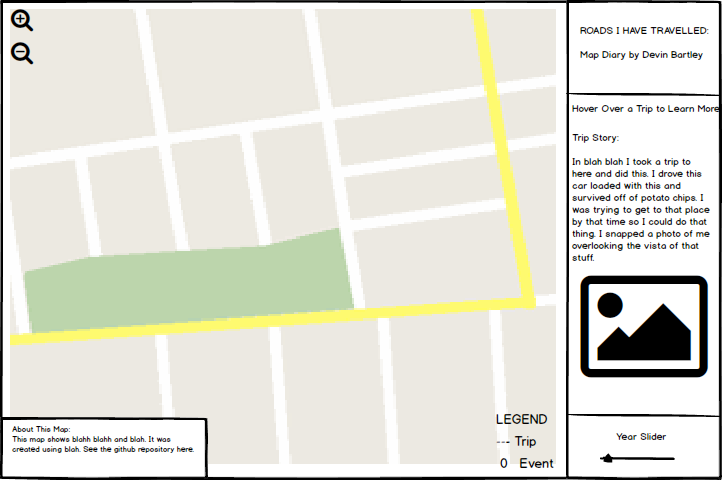

#Final Project - "Roads I've Travelled: A Map Diary"

##Data Topic

My map topic explores the concept of a spatial diary (or biography) and attempts to portray my movements in life over time and space. The idea for this concept originated from a realization that the human body is physically fragile, yet we are able to rocket it over vast expanses of geographical space rapidly and build up a substantial coverage of range over the time period of our lives. The locations you have travelled to and spent time in do fashion who you are as a person, so I think it is fitting that if someone would be interested in you they would also be interested in exploring your 'life map'.

Thus, I am creating a map that shows in the best ability possible all of the places I have been while embedding information about the time period I first visited those locations and my personal stories that accompany this information. I hope to show this to my friends and family, as well as present it as an idea that others can use to share stories about themselves.

##Map Objective

The objective of this map is to very clearly illustrate where I have been in my life while providing an entertaining story. I hope that the user can quickly get an overall sense of the major locations I have been to in my life, while also gaining a better understanding of my past, stories, and personality. The map needs to be simple on the outset for anyone to get the overall picture, since I will be sharing it with people who are not very computer savvy. On the other hand, the map should provide functionality for those who are interested to dive into the embedded details to learn more.

##User Needs Articulated Through Various Personas

####Persona 1: An Elderly Relative
This user needs the entire map to load on the page immediately and show the full map overview in a clear and concise picture. The user may not try exploring clicking, dragging, or panning without some encouragement. Any required scrolling or clicking must be explictly expressed as a direction in the map. I believe that if it is not immediately clear for user how to move through the content, this user persona will struggle with the map or not understand its full potential. This especially holds true for those used to the old web where buttons and links were usually positioned at the top of the page and that scrolling down was only required when text that started at the top of the page ran off the bottom of the page. If this user is brave and takes the steps to interact with the map, there needs to be clear directions written on the map for buttons that would be intuitive to other web users (such as "Move this slider to change the year", rather than just showing a slider with a "year" label).

It is important for this user to also quickly understand what exactly the lines presented show, and why some area highlighted through use of a clear legend. In addition, the description of what the map is also needs to show as a side bar in clear view. Overall - the design needs to be simple without unnecessary functionality or flare that will cause confusion.

Additionally, this user will want a quality base map to show location names and recognizable landmarks to provide geographical context for the data. This base map should provide enough detail to see topological features (like the Rocky Mountains) as well as major cities and country and state boundaries. 
    
####Persona 2: A Tech Savvy Friend
The tech savvy friend will also want to quickly be impressed by the initial map load, but will also be much more likely to try interacting with the map by clicking on items, dragging things around, and searching for new content. They will want to be rewarded for their curiosity by having the map respond to their interactions immediately and with little effort. Adding mouseover popups with content about each line file will help, as will including a slider bar that highlights the current year as it is moved. 

##Data Sources

The particularly interesting challenge with this map would be obtaining the vast network of line data. This project would use a hybrid approad to obtain this data:

####Data Source 1: Google Directions API

I made a table detailing major road trips on highways I have taken during my life, and include a year column. For example the table would look like an extended version of the screnshot below (also seen in the trips.csv file in this project folder):

            
I will use an existing [node.js script created by Winston Hearn](http://winstonhearn.com/gmaps-to-geojson/) that takes the origin and destination locations and sends it to the Google Directions API, and then translates the data into geoJSON format. I was not previously succesfully in getting a simular workflow to run through the Mapbox Directions API, and this library takes a large technical hurdle out of my map making process. 

Note: I have forked this repository, and successfully got it to run through node.js in my command line. The code I have made is visible here: https://github.com/DevinLeeBartley/roadtripData/blob/master/getRoute.js  Currently I am working on modifying the script to run through each of the values in my csv table of trips I have taken. At this point I am running into problems with the loop not fully executing and the script only outputting a GeoJSON file for one of the trips at a time. As a side note, this has been a great way to learn how to use command line, node.js, and NPM.

            

####Data Source 2: Open Street Map Data
The second method of data capture would involve selecting the likely streets that I have traveled down while living in cities.This method would involve selecting an entire area of streets using data available from available layers in QGIS. I will attempt to download [Mike Bostock's US Road Atlas](https://github.com/mbostock/us-atlas), run it through [Mapshaper](http://www.mapshaper.org/) to simplify the lines for reduced file size, and then edit the dataset in QGIS to pick out areas where I lived and travelled most of the main roads.

For now, I downloaded some generalized [Natural Earth road data](http://www.naturalearthdata.com/downloads/10m-cultural-vectors/roads/), and manually selected major roads in Vancouver and Colorado. I then added a year column and exported this to the GeoJSON file contained in this folder. I would do this with about 5 more urban areas that I have lived in. I wouldnt be precise to the point where I individually selected every single road one by one within a city since that would be way too time consuming. Grabbing the general mass of an urban road network should convey to the user locations where I spent a lot of time and likely travelled all major routes.

##Thematic Representation

This map will use vector lines to represent roads I have travelled. I will also incorporate points where certain events or incidents occured that I would like to draw to the users attention to. The lines and points will be always visible, but a slider menu at the bottom of the map will highlight the lines and point associated with the current slider year. This way all of the data is presented at the same time, but dragging the slider can easily show where I have been at certain times in life. 

##Content and Requirements List

The required content items are listed below:

<li>Individual long distance road trips I have taken</li>

<li>Specific places or stories I want to describe as points of interest on the map</li>

<li>Clusters of roads I have travelled down in places I have lived in or visited </li>

<li>Comments about each road trip line file and place cluster to provide a story an context</li>

<li>Photos I have from selected locations and road trips</li>

##Description of the Anticipated User Interaction (UI)
Anticipated user interaction will come from moving a cursor over the map to display popups with additional text stories and images from road trips, adjusting the slider bar to highlight which roads I travelled in certain years, and panning/zooming the map content.

#Project Mockups

The mockup below shows the general map layout. The middle box on the right hand side would dynamically update with a trip story based on the feature that the mouse is hovering over. The year slider in the bottom would allow for the user to highlight a certain year as they move through the data. I did include a legend in the map, assuming that the audience might not be super familiar with maps or web maps, but the necessity of this will be assessed at a later point.

