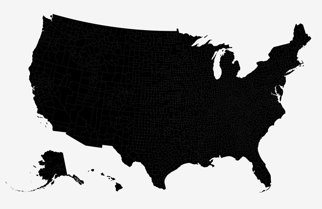
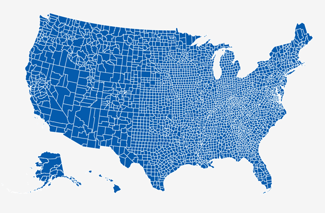
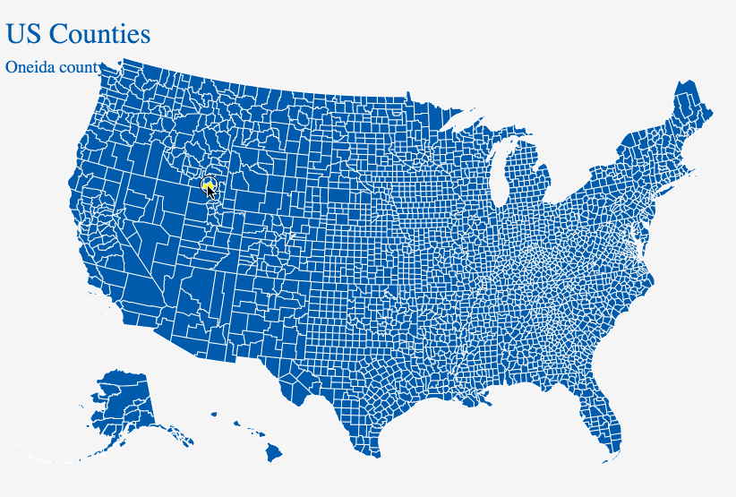
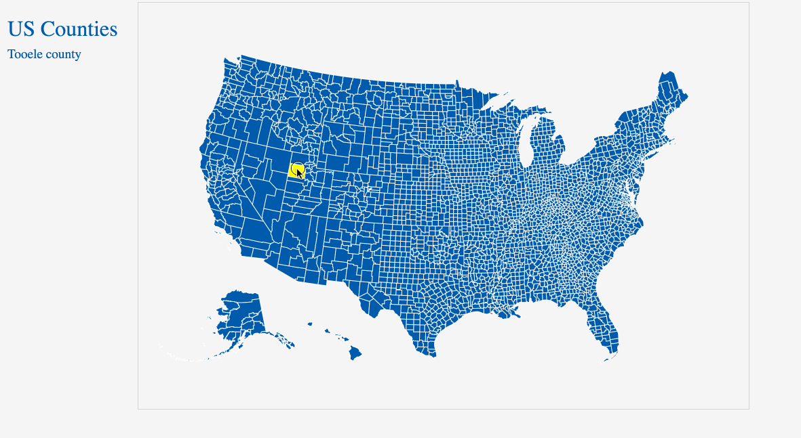
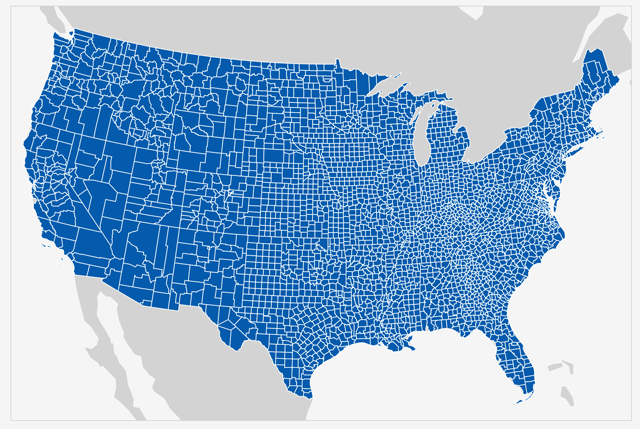
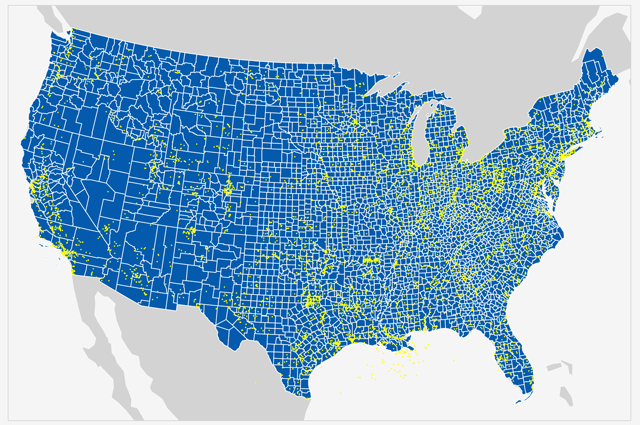
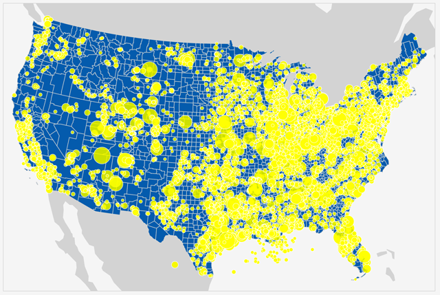
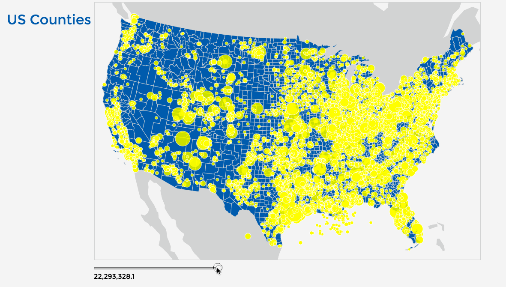
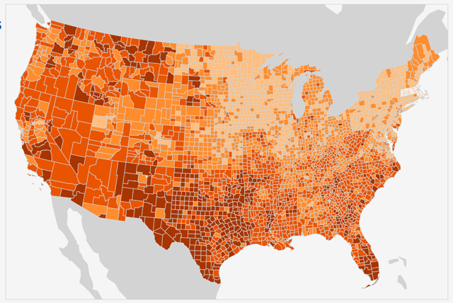

# Lesson 07: Data-driven thematic web mapping with D3.js

## Overview

* Introduces the D3 Javascript library (a thin W3C standards-compliant abstraction library) 
* Using D3js for DOM selection/manipulation and data binding
* Drawing SVG geometries and reprojecting a map
* Using Mapshaper to simplify geometries and create a topojson
* Drawing a map with Topojson
* Adding basic retrieve functionality to a map
*  Plotting point data and creating a proportional symbol map
*  Implementing a filter in D3
* Provides technique for classifying data for thematic representation within a choropleth

## Introduction: what is D3 and why is it cool for web cartographers?

D3 stands for Data Driven Documents. It's a JavaScript library written by [@mbostock](https://twitter.com/mbostock), with the help of [many other contributors](https://github.com/mbostock/d3/graphs/contributors). As Mike says:

<blockquote>
D3 is a JavaScript library for manipulating documents based on data. D3 helps you bring data to life using HTML, SVG, and CSS. D3’s emphasis on web standards gives you the full capabilities of modern browsers without tying yourself to a proprietary framework, combining powerful visualization components and a data-driven approach to DOM manipulation.
</blockquote>

In short, this means that you can take data and represent it within a web browser in [all sorts of fun and effective ways](https://github.com/mbostock/d3/wiki/Gallery).

D3 offers us the promise of complete control over the design and interaction of our maps, from dynamically updating data in thematic maps to achieving subtle nuance within its visual hierarchy.  And ... cartographers love to use [different map projections](http://axismaps.github.io/thematic-cartography/articles/projections.html). D3 is [really good at map projections](https://github.com/mbostock/d3/wiki/Geo-Projections).

##How do we learn to use D3?

There is a continually growing body of excellent tutorials and talks aimed at getting newbies to D3 over the initially steep learning curve. Among these I recommend:

* [Mapping with D3: A Friendly Introduction](http://maptimeboston.github.io/d3-maptime) (presentation by [@awoodruff](https://twitter.com/awoodruff))
* [A fun, difficult introduction to d3](http://www.macwright.org/presentations/dcjq/) (presentation by [@tmcw](https://twitter.com/tmcw))
* [Interactive Data Visualization for the Web](http://alignedleft.com/work/d3-book) (book by Scott Murray)
* [Interactive and Multivariate Choropleth Maps with D3](http://www.cartographicperspectives.org/index.php/journal/article/view/cp78-sack-et-al/) (an article published in *Cartographic Perspectives*, written by [@northlandiguana](https://twitter.com/northlandiguana) Carl Sack and Rich Donohue)

It's also helpful to look at examples:

* [http://bl.ocks.org/mbostock](http://bl.ocks.org/mbostock) (Mike Bostock's examples)
* [bl.ocksplorer.org](http://bl.ocksplorer.org/) (A web tool to help you search for more examples)
* [@mapsam](https://twitter.com/vancematthews) also has good examples in his [D3.geo Cookbook](https://github.com/mapsam/d3-geo)
* [The Big List of D3.js Examples](http://christopheviau.com/d3list/)

Let's get started with a basic map template.

##A very simple D3 map

Let's start with creating a very basic basemap consisting of US county polygons.  We're also going to project this map using an Albers Equal Area projection, which is highly suitable for making choropleth maps. 

Let's build a boilerplate/template from which to begin D3 web mapping. Let's first start with a basic HTML document. You can see I've specified the body to have zero padding and margin, and given it a background color of `white smoke`. I've also loaded in another fun 

```html
<html>
<head>
    <meta charset="utf-8">
    <title>D3 Starter Template</title>

    <link href="http://fonts.googleapis.com/css?family=Montserrat" rel="stylesheet" type="text/css">
    <style>
        body {
            padding: 0;
            margin: 0;
            background: whitesmoke;
            font-family: Montserrat, sans-serif;
        }
    </style>
</head>
<body>
  
<script>
    // custom JS written here
</script>
</body>
</html>
```
**Code Bank 01.** Starter template for D3 Web mapping.

Next, above our currently empty `<script></script>` tags where we'll write our custom JavaScript, we'll load two additional JS resources: the D3.js code and a GeoJSON data file.

The first here is the magical d3 JavaScript code, which here in minified and served from a content delivery network (CDN). The second is an external JavaScript file named _ky-counties.js_, being hosted locally (i.e., in the same directory as our _index.html_ file).

```html
<script src="https://cdnjs.cloudflare.com/ajax/libs/d3/3.5.5/d3.min.js"></script>
<script src="us-counties.js"></script>
```
**Code Bank 02.** Including the D3.js code and a locally-hosted JS file.

When we peer inside that _us-counties.js_ file, we'd see it's really information encoded as [GeoJSON](http://geojson.org/) (our county geometries, stored as a GeoJSON FeatureCollection) that's been assigned to a variable named `counties`. Also note that the GeoJSON properties include nominal data values such as NAME (the name of each county) and numerical data such a ALAND (the area of each county, which will be useful later for normalizing data for a choropleth map):

```javascript
var counties = {
"type": "FeatureCollection",
"crs": { "type": "name", "properties": { "name": "urn:ogc:def:crs:OGC:1.3:CRS84" } },                                                                             
"features": [
{ "type": "Feature", "properties": { "STATEFP": "20", "COUNTYFP": "175", "COUNTYNS": "00485050", "AFFGEOID": "0500000US20175", "GEOID": "20175", "NAME": "Seward", "LSAD": "06", "ALAND": 1655865960.000000, "AWATER": 2777350.000000 }, "geometry": { "type": "MultiPolygon", "coordinates": [ [ [ [ -101.0679, 37.3878 ], [ -100.6527, 37.3876 ], [ -100.6339, 37.3811 ], [ -100.6333, 37.0002 ], [ -100.8556, 36.9986 ], [ -100.9455, 36.9982 ], [ -101.0665, 36.9977 ], [ -101.0679, 37.3878 ] ] ] ] } },
```
**Code Bank 03.** A GeoJSON assigned to a variable within the _us-counties.js_ file.

These two files load before the rest of the JavaScript at the bottom of the page executes. 

Turning now to our custom JavaScript code at the bottom of the page, we'll first declared a couple variables for width and height (in this case 900 for width and 600 for height). These values will be used for creating SVG (not HTML elements), so we don't need to specific the unit value (e.g., px).

```javascript
var width = 900, height = 600;
```
**Code Bank 04.** Setting the width and height of the anticipated SVG element.

What follows are four very compact JavaScript statements that create an SVG element and append it to our document's `body` element. Comments are provided here for clarification.

Using method chaining (i.e., appending one method to the previous one) to call a series of D3 methods, these four statements:

1) create a new SVG element and append it to the document's body


```javascript
var svg = d3.select( "body" )        // select the document's body
        .append( "svg" )             // create and append a new svg element to it
        .attr( "width", width );     // give the svg width
        .attr( "height", height );   // give the svg height
 ```
**Code Bank 05.** Using D3 to select the body and append a new SVG element.

2) construct a new projection using the Albers Equal Area Conic projection, centered within and scaled somewhat arbitrarily to fit within the 900 x 600 wide SVG element. Note that D3's projection has a special one named `albersUsa()` which pulls Alaska and Hawaii down below the continent.

```javascript
var projection = d3.geo.albersUsa()     // create a new d3 projection function, albers equal area
    .scale(8000)                     // play with the scale until it's 'zoomed' about right
    .translate([width / 2, height / 2]);   // center the svg (0,0 is top, left)
```
**Code Bank 06.** Declaring a function to be used to project lat/lon coordinates to screen coordinates.

3) construct a "path generator" using the projection information, to be used to draw SVG paths from the GeoJSON information

```javascript
var geoPath = d3.geo.path()        //  create a new geo path generator
    .projection(projection);        // assign the project we just created to it
```
**Code Bank 07.** Creating an SVG path generator making use of the projection.

4) create and append a new SVG 'g' element (an SVG container element used for grouping other objects)

```javascript
svg.append("g")            // create and append a new SVG 'g' element to the svg
    .selectAll("path")     // selectAll the path features that haven't been created yet
    .data(counties.features)  // bind the GeoJSON features data to them
    .enter()                    // prepare to
    .append("path")        // append the newly create path elements to the 'g'
    .attr( "d", geoPath )  // define the screen coordinates of the new path(s)
    .attr("class", "county");  // give each a class name of 'county'
```
**Code Bank 08.** Creating an SVG group of path element based on the GeoJSON data and projected.

Saving that code and running within our browser quickly generates the following map:

  
**Figure 01.** Counties GeoJSON data drawn as SVG with D3.js.

Wow, okay. There's a lot to understand there, and it's alright if you're a little confused by what's going on with all those chained method calls. People say learning D3 is difficult, and part of the reason is that it's written very concisely. 

Many of us begin making maps by looking at examples, copying the code, and hacking around with it a bit until it fits our use-case. These basic code examples, however, are pretty standard across D3 maps. So keep playing with them and it'll come around to make more sense.

Before we turn to that code, we'll note that we can add a CSS rule assigning stroke and fill properties to that class name we added `county`.

```css
.county {
    stroke: #fff;
    fill:#005DAA;
}
```
**Code Bank 09.** Using CSS to set the stroke and fill of the county SVG elements.

These are SVG-specific CSS rules, remember. The result applies a stroke and fill to our map:

  
**Figure 02.** GeoJSON data drawn as SVG and styled with CSS.

##A D3 map with basic interaction

Simply drawing a static map isn't super exciting. As we know, much of the awesomeness of web mapping comes from giving the user the power to interact with the map, such as deriving specific information when mousing over or touching map elements. Let's run through another simple example.

We wish to accomplish two things. We want the user to be able to retrieve the name of a specific county when hovering, and we want the map to provide a visual affordance of which county is being selected. Before we edit our JavaScript, let's create a couple HTML elements (within the body of our document, of course) and style these with CSS.

```css
h1, h2 {
    position: absolute;
    left: 20px;
    top: 10px;
    font-size: 2em;
    font-weight: 100;
    color: #005DAA;
}
h2 {
    top: 60px;
    font-size: 1.2em;
}
```
**Code Bank 10.** CSS rules for styling heading elements.

```html
<body>
    <h1>US Counties</h1>
    <h2></h2>
```
**Code Bank 11.** HTML heading elements.

Within the JavaScript, we append two new methods to our selected group of SVG paths, an [_.on()_ method](https://github.com/mbostock/d3/wiki/Selections#on) which adds a listener to the objects. In this case, we're listening for a `'mouseover'` and and `'mouseout'` event.

```javascript
svg.append("g")
    .selectAll("path")
    .data(counties.features)
    .enter()
    .append("path")
    .attr( "d", geoPath )
    .attr("class","county")
    .on("mouseover", function(d){
        d3.select("h2").text(d.properties.NAME + ' county');
        d3.select(this).attr("class","county hover");
    })
    .on("mouseout", function(d){
        d3.select("h2").text("");
        d3.select(this).attr("class", "county");
    });
```
**Code Bank 12.** Adding mouseover and mouseout interaction to the map.

When triggered, the callback function for the `'mousover'` event does two things:

1. selects the h2 element we've included within the document's HTML and inserts the name of the selected county within it
2. selects 'this' &ndash; that magic keyword allowing access to the context of the event, in this case the SVG path we're hovering over &ndash; and applies two CSS class rules to it, our county class and the new hover class we created.

If you're puzzlingly over how the value of NAME is accessed through this code, it'd be useful for you to console.log() that d variable within the callback, and inspect the output in your browser's console:

```javascript
.on('mouseover', function(d){
     console.log(d);
})
```
**Code Bank 13.** Accessing the data properties of elements within a callback function.

The `d` within that callback function gives us access to the data attached to the geometries (similar to Leaflet's `layer.feature.properites`).

Finally, we can add another CSS rule, for our affordance, which will color the unit yellow when applied:

```css
.county {
    stroke: #fff;
    fill:#005DAA;
}
.hover {
    fill: yellow;
}
```
**Code Bank 14.** Applying a hover style to class added to element on a mouseover.

This result is a very fast interaction affordance and retrieval of the county's name:

  
**Figure 03.** Adding mouseover interaction to SVG elements.

However, we can see that the positioning of the h2 element is crashing into our SVG map. Above, we simply appended the SVG element to the document's body. However, if we want more control, we can create a specific div element, position it how we like, and append the new SVG to that. Let's make these minor modifications before moving on. Here I'll create a div element with an id attribute of `map` (sound familiar?) and style that with CSS.

```css
#map {
    width: 900px;
    height: 600px;
    margin: 10px auto;
    border: 1px solid #d3d3d3;
}
```
**Code Bank 15.** Styling a map div element for appending the SVG to.

```html
<body>
    <h1>US Counties</h1>
    <h2></h2>
    <div id="map"></div>
```

These are just some quick example CSS rules. Then, instead of selecting the body element, we'll use D3 to select the element with the id attribute of `map`:

```javascript
var svg = d3.select( "#map" )
          .append( "svg" )
          .attr( "width", width )
          .attr( "height", height );
```
**Code Bank 16.** Appending the SVG to a map div element instead of the body.

The result isn't dramatically different. We just have more control over the positioning of this SVG element.

  
**Figure 04.** Appending the SVG to a div element instead of the body.

Next let's consider an alternative way to get our data into the map.

##A D3 map using queue.js

In the previous two maps we simply loaded our GeoJSON information as an external JavaScript file when the page loaded. In MAP673 we've explored some approaches to using an asynchronous JavaScript and XML (AJAX) request to load the GeoJSON. We've explored Query's `.getJson()` method and the Omnivore plugin.

Another convenient approach is to use [Queue.js](https://github.com/mbostock/queue), a helper library written by Mike Bostock (this library can actually be used by itself without D3 to load data files).

We can include a call to load the very small queue.js minified file within our HTML document, along with the D3 code:

```html
<script src="https://cdnjs.cloudflare.com/ajax/libs/d3/3.5.5/d3.min.js"></script>
<script src="https://cdnjs.cloudflare.com/ajax/libs/queue-async/1.0.7/queue.min.js"></script>
```
**Code Bank 17.** Loading the queue.js library.

We can remove the line that loads our GeoJSON data as a JavaScript file (`<script src="counties.js"></script>`). Instead, we want to load our GeoJSON, written within a file named named _us-counties.json_ (rather than using a _.js_ file extension), using an AJAX request handled by the queue.js library. A peek at the contents of this file reveals that it is not JavaScript, but simply our delicious GeoJSON FeatureCollection:

```javascript
{
"type": "FeatureCollection",
"crs": { "type": "name", "properties": { "name": "urn:ogc:def:crs:OGC:1.3:CRS84" } },
                                                                                
"features": [
{ "type": "Feature", "properties": { "STATEFP": "20", "COUNTYFP": "175", "COUNTYNS": "00485050", "AFFGEOID": "0500000US20175", "GEOID": "20175", "NAME": "Seward", "LSAD": "06", "ALAND": 1655865960.000000, "AWATER": 2777350.000000 }, "geometry": { "type": "MultiPolygon", "coordinates": [ [ [ [ -101.0679, 37.3878 ], [ -100.6527, 37.3876 ], [ -100.6339, 37.3811 ], [ -100.6333, 37.0002 ], [ -100.8556, 36.9986 ], [ -100.9455, 36.9982 ], [ -101.0665, 36.9977 ], [ -101.0679, 37.3878 ] ] ] ] } },
{ "type": "Feature", "properties": { "STATEFP": "28", "COUNTYFP": "141", "COUNTYNS": "00695791", "AFFGEOID": "0500000US28141", "GEOID": "28141", "NAME": "Tishomingo", "LSAD": "06", "ALAND": 1098939230.000000, "AWATER": 52359814.000000 }, "geometry": { "type": "MultiPolygon", "coordinates": [ [ [ [ -88.3635, 34.9957 ], [ -88.2581, 34.9955 ], [ -88.2001, 34.9956 ], [ -88.1546, 34.9224 ], [ -88.0979, 34.8922 ], [ -88.1343, 34.6227 ], [ -88.1396, 34.5817 ], [ -88.1549, 34.463 ], [ -88.3292, 34.4636 ], [ -88.3307, 34.7407 ], [ -88.3655, 34.7556 ], [ -88.3635, 34.9957 ] ] ] ] } },
```
**Code Bank 18.** A GeoJSON file (not assigned to a JS variable).

Now let's use the queue methods to load our GeoJSON data.

After we've declared and defined such variables as `width`, `height`, `svg`, `projection`, and `geoPath` at the top of our custom JS, let's issue the call to load our GeoJSON:

```javascript
queue()
    .defer(D3.json, 'us-counties.json')
    .await(makeMap);
```
**Code Bank 19.** Using queue.js to defer D3's method for loading JSON data.

We use the D3 `.defer()` method to invoke D3's [capabilities for requesting JSON files](https://github.com/mbostock/d3/wiki/Requests#d3_json), which loads our file into the document. The `.await()` method waits until the file is finished loading before calling a custom function named `.makeMap()`, which passes any generated error messages as the first argument and the GeoJSON object as the second.

As we'll see later on, the power of the Queue.js helper library is that we can include multiple `.defer()` methods  to load as many files into our document as we wish.

We declare a function `.makeMap()`, and define it to accept two parameters: the error message(s) and the GeoJSON object. We then move our code appending the GeoJSON group element to our SVG within this function.

```javascript
function makeMap(error, counties){

         svg.append('g')
            .selectAll('path')
            .data(counties.features)
            .enter()
            .append('path')
            .attr( "d", geoPath )
            .attr('class','county');
    }
```
**Code Bank 20.** Moving the code to create the map within a makeMap() function to wait for the data to load.

Remember, the statements contained within this function's body are not executed until the external GeoJSON file has finished loading. Once that happens, our map is drawn exactly as before.

Let's load one more GeoJSON layer into our script before moving on. Begin by chaining another `.defer()` method to our `queue()` method, this time loading in the *na_land_clipped.json* file.

```javascript
 queue()
    .defer(d3.json, "us-counties.json")
    .defer(d3.json, "na_land_clipped.json")
    .await(makeMap);
```
**Code Bank 21.** Making multiple requests for additional GeoJSON data files.

We then need to modify our `.makeMap()` function to accept this additional argument. Then, before we create the county SVG element, we'll use a similar approach to draw this geometry to the SVG as well.

```javascript
function makeMap(error, counties, na) {
    
    svg.append("g")
        .selectAll("path")
        .data(na.features)
        .enter()
        .append("path")
        .attr("d", geoPath)
        .attr("class", "land");
```
**Code Bank 22.** Creating SVG from the North America land geometry data.

Additionally, we've given these geometries a class name of `land`, and can supply some CSS rules for styling:

```css
.land {
    fill:#d3d3d3;
}
```
**Code Bank 22.** CSS rule styling the land SVG.

The result is a multi-layered basemap.

  
**Figure 05.** Two GeoJSON layers loaded with queue.js and drawn as SVG.

Next we'll introduce a new file format useful for mapping in D3.

##4. A D3 map using TopoJSON

Before we start working with real data to make some thematic maps, let's cover one more important component of mapping with D3: the [TopoJSON format](https://github.com/mbostock/topojson).

GeoJSON is a super cool format. However, one drawback, like its ShapeFile counterpart, is that shared borders between polygons are encoded twice. This leads to file bloat. To this end, Mike Bostock figured out a way to encode topology (i.e., the relation between entities) and thereby eliminate the redundancy encoded with a GeoJSON.

If we examine the file included with this map, we see that is is encoded not according to the GeoJSON specification, but rather as TopoJSON.

```javascript
{
"type": "FeatureCollection",
"features": [
{ "type": "Feature", "properties": { "COUNTYFP": "007", "NAME": "Ballard", "ALAND": 638843907 }, "geometry": { "type": "MultiPolygon", "coordinates": [ [ [ [ -89.1719, 37.0682 ], [ -89.03, 37.2111 ], [ -88.9334, 37.2252 ], [ -88.816, 36.9541 ], [ -88.9888, 36.9195 ], [ -89.1008, 36.944 ], [ -89.1327, 36.9822 ], [ -89.1719, 37.0682 ] ] ] ] } },
{ "type": "Feature", "properties": { "COUNTYFP": "011", "NAME": "Bath", "ALAND": 722081626 }, "geometry": { "type": "MultiPolygon", "coordinates": [ [ [ [ -83.9779, 38.1921 ], [ -83.8484, 38.2969 ], [ -83.7323, 38.2835 ], [ -83.6352, 38.1875 ], [ -83.5072, 38.0863 ], [ -83.4988, 38.0506 ], [ -83.5774, 38.0132 ], [ -83.6593, 38.0283 ], [ -83.7594, 37.9987 ], [ -83.8814, 38.1365 ], [ -83.9779, 38.1921 ] ] ] ] } },
```
**Code Bank 23.** The *us-counties* data used in previous maps, encoded as GeoJSON (2.3MB).

```javascript
{"type":"Topology","objects":{"counties":{"type":"GeometryCollection","geometries":[{"type":"Polygon","properties":{"COUNTYFP":"007","NAME":"Ballard","ALAND":638843907,"oil_wells":0,"gas_wells":0},"arcs":[[0,1,2]]},{"type":"Polygon","properties":{"COUNTYFP":"011","NAME":"Bath","ALAND":722081626,"oil_wells":45,"gas_wells":18},"arcs":[[3,4,5,6,7]]},{"type":"Polygon","properties":{"COUNTYFP":"013","NAME":"Bell","ALAND":929806591,"oil_wells":23,"gas_wells":593},"arcs":[[8,9,10,11,12,13]]},
```
**Code Bank 24.** The same *us-counties-topo.json* data used in this maps, encoded as TopoJSON (701KB)

Notice the difference between the two file sizes, 2.3MB and 701KM  (though in honesty some of the necessary data properties were stripped from the TopoJSON in the conversion process).

To use TopoJSON, we need to first make sure its functionality is accessible within our JavaScript by including a request to load it. Our document is now loading three separate JavaScript libraries:

```html
<script src="https://cdnjs.cloudflare.com/ajax/libs/d3/3.5.5/d3.min.js"></script>
<script src="https://cdnjs.cloudflare.com/ajax/libs/queue-async/1.0.7/queue.min.js"></script>
<script src="https://cdnjs.cloudflare.com/ajax/libs/topojson/1.6.19/topojson.min.js"></script>
```
**Code Bank 25.** Loading the topojson.js code.

We can simply use the `d3.json()` method to load the new file (though remember to change the name: `.defer(d3.json, "us-counties-topo.json")`).

To access our TopoJSON data and draw our same simple map with D3, we only need to change one line within our JavaScript. Whereas previously we were simply passing `counties.features`within the `.data()`method (i.e., `.data(counties.features)</code>), this time we need to invoke a topojson method named `.feature</code>:

```javascript
svg.append('g')
    .selectAll('path')
    .data( topojson.feature(counties, counties.objects.counties).features)
    .enter()
    .append('path')
    .attr( "d", geoPath )
    .attr('class','county');
```
**Code Bank 26.** Changing the data method's parameter values for the TopoJSON structure.

Note that the first argument passed when calling `topojson.feature`is a reference to our TopoJSON object. The second argument digs into this object to access the specific objects contained within it. Note the object keys `objects` and `counties` encoded within the _us-counties-topo.json_ TopoJSON itself (pasted above).

The `topojson.feature()`method converts our TopoJSON back into GeoJSON (whew! GeoJSON I thought you were gone forever!). The final `.features` is a property that allows us to use the returned GeoJSON's features as our data. Our script then continues as it has and, once again, we have a pretty boring (but highly efficient!) static basemap of US counties.

How do we create TopoJSON files? Eventually you'll want to get into [command line reference](https://github.com/mbostock/topojson/wiki/Command-Line-Reference). For now though, there's a great web-based tool called [MapShaper](http://www.mapshaper.org/). MapShaper not only allows you to simplify the lifework of your geometries (greatly reducing the file size), but also allows you export Shapefiles and GeoJSON as TopoJSON.

##A D3 map plotting direct emitters of 

Let's now work with some real data to do some thematic web mapping!

In my ongoing efforts to better understand our changing environment , I've dug up some [fun data on oil and gas wells in Kentucky](http://kgs.uky.edu/kgsweb/DataSearching/oilsearch.asp), maintained by the [EPA](). The data are stored within a CSV and have a data attribute of either "OIL" or "GAS". For this map we're going to try to plot these wells using D3.

For this map we're first going to load in our CSV data, in addition to our US county polygons, again using Queue.js's awesome asynchronous power. We'll pass the resultant CSV data into our `.makeMap()`function along with the county data, modifying the functions signature to accept the third parameter referencing our wells data:

```javascript
queue()
    .defer(d3.json, "us-counties-topo.json")
    .defer(d3.json, "na_land_clipped.json")
    .defer(d3.csv, "direct-emitters.csv")
    .await(makeMap);

function makeMap(error, counties, na, emitters){

    // sweet JS code here
}
```
**Code Bank 27.** Loading facilities emissions data as CSV with the d3.csv() method.

Note that the `d3.csv()`method has converted the CSV data to an array of JavaScript Objects. We could `console.log(wells)`and inspect the result in the JavaScript console.

Instead of drawing SVG 'path' elements, we're going to create [SVG 'circle' elements](https://developer.mozilla.org/en-US/docs/Web/SVG/Element/circle) to represent each of the emitters.

Let's look at the code to see how this is done:

```javascript
svg.append("g")
    .selectAll("circle")
    .data(emitters)
    .enter()
    .append("circle")
    .attr("cx", function(d) {
        d.position = projection([d.lon, d.lat])
    	return d.position[0];
    })
    .attr("cy", function(d) {
        return d.position[1];
    })
    .attr("r", 1)
    .attr("class","emitter");
```
**Code Bank 28.** Drawing the CSV data as SVG circles.

Similar to drawing SVG 'path' elements with D3, we apply a sequence of chained methods to select all the 'circle' elements (that don't exist yet), bind the data, and enter and append the new elements.

SVG 'circle' elements require 'cx' and 'cy' attributes to be placed within screen coordinates. However, we need to translate our longitude ('lon') and latitude ('lat') values into screen coordinates. How do we do this? We've already been doing it to draw our 'path' elements, using the powerful _d3.projection_ functionality. So, we simply need to pass that function an array of our two coordinates and assign the translated values as the 'circle' element's 'cx' and 'cy' attributes, respectively. We'll also give the circle a radius ('r' attribute) of 1 for now.

Additionally, we've added a class to these elements and can give that a CSS rule:

```css
.emitter {
    fill: yellow;
}
```
**Code Bank 29.** CSS style rule for coloring the circles.

The result is that D3 has quickly loaded and drawn nearly 8000 svg circle elements to the map.

  
**Figure 05.** Circles loaded as a CSV file and drawn as SVG circle elements by D3.

There's a definite spatial pattern we can recognize (i.e., where these direct emitters exist). Let's make one final adjustment to make it a more useful thematic map. Let's consider a technique for creating a proportional symbol map, let's encode the amount of emissions (`total_emissions` within the CSV file) using the visual variable of size. See Mike's tutorial on [Let's make a Bubble Map](https://bost.ocks.org/mike/bubble-map/).

To achieve this with D3 JavaScript code, we'll modify the result for the `r` attribute (the radius). Rather than giving each circle a radius of 1, we want to scale it based on the value of  `total_emissions`.

In previous lessons we've written a custom function to return a radius value based on an attribute value. D3 comes built in with [all sorts of useful scales](https://github.com/d3/d3/wiki/Scales) with which we can use for this purpose.

Toward the top of our `makeMap()` function, let's quickly sum up our max and min values for our data and then create a declaration function making use of D3's scales:

```javascript
var data = [];
		
emitters.forEach(function(emitter) {
    data.push(Number(emitter.total_emissions));
});

var min = Math.min.apply(Math, data),
      max = Math.max.apply(Math, data);
    
var radius = d3.scale.sqrt()
    .domain([min, max])
    .range([3, 20]);
 ```
 **Code Bank 28.** Determining min and max values and building a radius function.
 
D3's scales map a given range of values (passed as an argument through the `.domain()` method) to a range of output values (designated through the `.range()` method). In this case, we're simply telling the square root method to take a range of values from our min to our max and return a size between  3 and 20 based on specific values. We'll then assign the result of this to our radius for each circle.

Additionally, we'll apply a quick sort method to stack the larger ones on the bottom of the smaller ones (you may remember this technique from the prop symbol maps back in MAP672).

```javascript
svg.append("g")
    .selectAll("circle")
    .data(emitters)
    .sort(function(a, b) { 
        return b.properties.total_emissions - a.properties.total_emissions; 
    })
    .enter()
    .append("circle")
    .attr("cx", function(d) {
        d.position = projection([d.lon, d.lat])
    	return d.position[0];
    })
    .attr("cy", function(d) {
        return d.position[1];
    })    
    .attr("r", function(d) {
        return radius(d.total_emissions)
    })
    .attr("class","emitter"); 
```
**Code Bank 29.** Sorting the SVG circle elements based on total emissions and assigning a radius value.

The result is a dynamically drawn proportional symbol map:

  
**Figure 07.** Circles symbolized as proportional symbols by D3.

For one more trick before we move on, let's introduce another interaction operator (see Module 06): a filter operator.

First we're going to make use of our now familiar HTML `<input>` element with an attribute `type` of `range` (i.e., a slider element). Let's build this in the HTML, leaving out the `min`, `max`, and `value` attributes for now. We'll also create an output element (here with an `id` attribute of `emmission-value`) and style both with some CSS rules:

```css
.slider {
    width: 300px;
    margin-left: 223px;
}
#emmission-value {
    margin-left: 223px;
}
```
**Code Bank 30.** Basic CSS rules for positioning a UI slider element and output div.

```html
<div id="map"></div>
<input type="range" class="slider">
<div id="emmission-value"></div>
```
**Code Bank 31.** HTML elements for a UI slider element and output div.

Next, we'll create a reference to our emitters SVG circles by assigning the appended group to a variable. Doing so means we don't need to re-select the elements later.

```javascript
var facilities = svg.append("g")
        .selectAll("circle")
        .data(emitters)
            ....
```
**Code Bank 32.** Assigning a variable to the group of circle elements.

Now we can select our `#emmission-value` div element and update it with the max value we calculated earlier. Then we can select the slider element and update its attribute values with the min, max values. We'll also chain an `.on()` listener to detect any user-generated change, sending the updated value to a function we'll create called `update()`.

```javascript
var output = d3.select('#emmission-value').text(max.toLocaleString()); 
    
d3.select(".slider")
    .attr("min", min)
    .attr("max", max)
    .attr("value", max)
    .attr("step", (max-min)/300)
    .on("input", function() {
        update(this.value);
    });
```
**Code Bank 33.** Adding attribute values to the slider and an event listener.

Finally, we'll write a function to accept this value and update the `display` attribute of all the circles with a simple conditional statement. Remember to make sure you're comparing numbers to numbers, otherwise you may get some odd results:

```javascript
function update(val){
    output.text(Number(val).toLocaleString());
    
    facilities.attr("display", function(d) {
        if(val <= Number(d.total_emissions)) {
            return "none";
        }
    })
}
```
**Code Bank 34.** Updating the value output and changing the display properties of elements filtered out.

The result is an effective slider UI operator.

  
**Figure 08.** A slider filter in D3.

Let's move on to explore an additional thematic technique.

##A D3 county choropleth map

Obviously one of the main appeals of D3 is the ability to project our map into an equal area projection, so let's make a projected choropleth map.

Let's take further advantage of coupling some of these amazing web mapping technologies. At the end of lesson 06 we saw how we can store our data in CartoDB's database and request these data as GeoJSON. We can do the same thing here using the `d3.json()` method. I'll begin by modifying the code to request the uninsured data used in Lesson 06:

```javascript
queue()
        .defer(d3.json, "https://rgdonohue.cartodb.com/api/v2/sql?format=GeoJSON&q=SELECT * FROM uninsured_adults_county")
        .defer(d3.json, "na_land_clipped.json")
        .await(makeMap);
```
**Code Bank 35.** Requesting data from CartoDB with D3's JSON AJAX method.

Editing the D3 code to change the fill color of our county 'path' elements isn't very hard (we just did it for the radius of the circles). We know we can access the data values for each element (e.g., (`d.properties.uninsured`) and simply need to modify our d3-map04 code like so:

```javascript
svg.append("g")
    .selectAll("path")
    .data(counties.features)
    .enter()
    .append("path")
    .attr( "d", geoPath )
    .attr("class","county")
    .attr( "fill", function(d){
        // return some color here return based upon an attribute value  
        return 'blue'; // temp value so the script doesn't pooch  
     });
```
**Code Bank 36.** Changing the data method back to handle GeoJSON format.

How do we then assign a color based upon that value to each polygon? We need to classify the data in some way.

[D3's Quantitate Scales](https://github.com/mbostock/d3/wiki/Quantitative-Scales) make this pretty easy, and you can play with a variety of options including logarithmic, quantile-based, and even linear (i.e., continuous) scales with which to determine what color is applied to what unit. There are numerous examples from which to draw upon:

* [Population Choropleth](http://bl.ocks.org/mbostock/6320825)
* [Projected Choropleth](http://bl.ocks.org/mbostock/5925375)
* [Kentucky Population Density](http://bl.ocks.org/mbostock/5737662)
* [Area Choropleth](http://bl.ocks.org/mbostock/4206573)
* [Choropleth](http://bl.ocks.org/mbostock/4060606)
* [Threshold Choropleth](http://bl.ocks.org/mbostock/3306362)

We're gunna make things a little trickier though, and use [Jenks natural breaks optimization](https://en.wikipedia.org/wiki/Jenks_natural_breaks_optimization), a classification method that minimizing within-group variance and maximizes between-group differences (huh? [read more ...](http://axismaps.github.io/thematic-cartography/articles/classification.html)).

For this example we're going to use a Jenks method available in older versions (< 0.9.2) of JavaScript library called [Simple Statistics](http://www.macwright.org/simple-statistics/). Tom even provides an example of using it with D3: [Jenks Natural Breaks with simple-statistics and d3](http://bl.ocks.org/tmcw/4969184)

So then, once we include the Simple Statistics library in our document, we're ready to rock in roll:

```html
<script src="https://cdnjs.cloudflare.com/ajax/libs/simple-statistics/0.9.0/simple_statistics.min.js"></script>
```
**Code Bank 37.** Loading in an older version of simple statistics to access the ss.jenks() method.

Before we draw our map, we want to determine the class breaks using the Simple Statistics method. To achieve this, we'll use the [native JavaScript method `.map()`](https://developer.mozilla.org/en-US/docs/Web/JavaScript/Reference/Global_Objects/Array/map) to derive an array of all our values, and then use `ss.jenks()`to return a given number of 'natural' class breaks (in this case 5).

Note that the `ss.jenks()`method returns the min and max values of the range, which [we don't need for the `d3.scale.threshold().domain()`](http://bl.ocks.org/rgdonohue/823a0c67087e0a66d171). So we'll use JavaScript methods of `.shift()`and `.pop()`to remove the first and last elements from this array.

For the `d3.scale.threshold().range()`values we'll simply hard-code 5 color values into an Array. We then use these two Arrays to construct a function for returning a specific color based upon a value falling within the derived class breaks.

```javascript
var breaks = ss.jenks(counties.features.map(function(d) { 
    return d.properties.uninsured; 
}), 5);


breaks.shift(); // remove min value from breaks Array before applying to domain
breaks.pop(); // same for max

console.log(breaks);

var colors = ["#feedde","#fdbe85","#fd8d3c","#e6550d","#a63603"];

var jenks = d3.scale.threshold()
    .domain(breaks)
    .range(colors);
```
**Code Bank 38.** Calculating breaks to use within the d3.scale.threshold() function.

We can then send our calculated wells density value to this function and assign the return value to the 'fill' attribute of each polygon. 

```javascript
 svg.append("g")
    .selectAll("path")
    .data(counties.features)
    .enter()
    .append("path")
    .attr( "d", geoPath )
    .attr("class","county")
    .attr("fill", function(d) {
        return jenks(d.properties.uninsured);
    });
```
**Code Bank 39.** Assigning a fill color based on the result from the jenks function.

Wha-la ... in a few terse lines of code we have a choropleth map classified according to Jenks optimal classification breaks.

  
**Figure 09.**  projected choropleth map made with D3.js.

The power of D3 lies not only in it's ability to make great maps. The general idea behind it is to take data and represent it in a variety of forms. For this reason D3 is broader than web mapping and is a great tool for data visualization in general. The learning curve is steep, but it's a good tool to work on development and have in your repertoire. 
